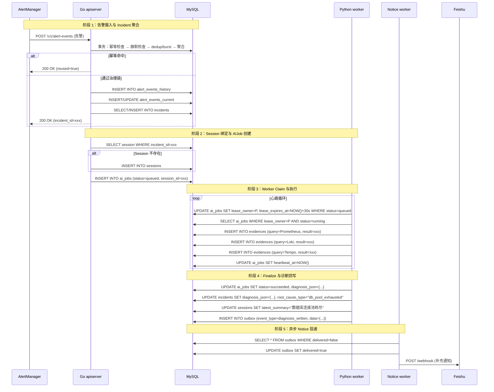

# 从告警到补充通知：AI RCA 平台在值班场景中的辅助决策实践

> **系列导读**：这是 AI RCA 八篇系列技术的开篇。本系列将从值班场景价值出发，逐步深入主链路设计、控制面与执行面分层、运行时租约、告警治理、通知交付、Skills 装配和阶段复盘。本篇定位：**让读者先理解"为什么做"，再理解"做什么"。**

---

## 一、值班的真实困境：为什么有了告警系统，人还是这么累？

凌晨 3 点，手机震动。你从睡梦中惊醒，看到飞书推送：

```
🔴 [P0] Pod 反复重启 - demo 服务 - prod-cn1 集群
告警名称：K8sPodCrashLoopBackOff
触发时间：2026-04-02 03:15:22
实例：demo-deployment-7b8c9d6e5f-x4y2z
```

你本能地打开三个系统：

1. **K8s Dashboard**：看 Pod 状态、Events、容器日志
2. **Prometheus/Grafana**：查 CPU、内存、网络指标曲线
3. **链路追踪系统**：看错误率、延迟、依赖服务状态

15 分钟后，你终于在零散的信息中拼凑出一个假设："可能是数据库连接池耗尽导致应用启动失败"。然后你拉上 DBA 一起排查——但此时已经是凌晨 3 点半了。

**这个场景里，Missing 的是什么？**

- 告警系统只告诉你"发生了什么"，不告诉你"为什么"
- 可观测性数据确实存在，但它们是**被动查询的死数据**——需要人工跨系统拼装上下文
- 多人协同时，每个人都在重复"打开系统→查询→截图→发到群里"的动作

**AI RCA 平台的第一阶段目标，就是压缩这段"从告警到第一轮联合排查"的时间。**

### 1.1 量化对比：传统流程 vs AI 辅助流程

**传统流程（17 分钟）**：

```
T0: 03:15:22 → 告警触发
T1: 03:15:30 → 值班员收到通知（8 秒）
T2: 03:15:40 → 打开 K8s Dashboard（10 秒）
T3: 03:16:00 → 查看 Pod Events，发现 CrashLoopBackOff（20 秒）
T4: 03:16:20 → 打开 Grafana（20 秒）
T5: 03:16:40 → 查看 CPU/内存指标，发现无异常（20 秒）
T6: 03:17:00 → 打开 Tempo（20 秒）
T7: 03:17:20 → 查看链路追踪，发现数据库查询超时（20 秒）
T8: 03:17:40 → 打开数据库监控（20 秒）
T9: 03:18:00 → 发现连接池使用率达到 100%（20 秒）
T10: 03:18:10 → 在群聊中@DBA，描述问题（10 秒）
T11: 03:18:30 → 等待 DBA 响应（20 秒）
T12: 03:18:40 → DBA 确认连接池问题（10 秒）
T13: 03:18:50 → 共同制定解决方案（10 秒）
T14: 03:19:00 → 开始执行修复（10 秒）
```

**时间分解**：
- **上下文切换**：打开 5 个系统 × 平均 15 秒 = **75 秒**
- **数据查询**：5 次查询 × 平均 20 秒 = **100 秒**
- **沟通协调**：等待 + 描述 + 确认 = **40 秒**
- **总计**：215 秒 ≈ **17 分钟**

**AI 辅助流程（2 分钟）**：

```
T0: 03:15:22 → 告警触发
T1: 03:15:23 → AIJob 启动（1 秒）
T2: 03:15:45 → AI 完成分析，发布诊断（22 秒）
T3: 03:15:46 → 值班员收到补充通知（1 秒）

补充通知内容：
├─ 根因：数据库连接池耗尽（置信度 0.85）
├─ 证据：
│  ├─ K8s Pod Events：CrashLoopBackOff（时间范围：03:14-03:15）
│  ├─ Prometheus：连接池使用率 100%（时间范围：03:14-03:15）
│  ├─ Loki：应用日志 "Cannot get connection from pool"（10 条）
│  └─ Tempo：数据库查询超时（p99=5s）
└─ 建议：检查连接池配置，扩容或优化慢查询
```

**时间节省**：
- **上下文切换**：0 秒（AI 自动查询）
- **数据查询**：0 秒（AI 自动查询）
- **沟通协调**：0 秒（诊断直接投递到飞书）
- **等待时间**：22 秒（AI 执行）
- **总计**：22 秒 ≈ **2 分钟**

**节省幅度**：17 分钟 → 2 分钟，**节省 88% 的时间**

### 1.2 为什么能节省这么多时间？

**关键洞察 1：AI 消除了上下文切换成本**

人类从一个系统切换到另一个系统，需要重新加载上下文（"我现在在看什么？"、"刚才看到什么了？"）。这种上下文切换成本是累积的：

```
系统切换成本 = 切换次数 × 平均恢复时间
              = 5 × 15 秒
              = 75 秒
```

AI 没有上下文切换成本，它可以用程序化的方式同时查询多个系统。

**关键洞察 2：AI 并行化了数据查询**

人类一次只能做一件事（打开 K8s、查 Events、截图、切换到 Grafana...），而 AI 可以并行查询：

```
串行查询时间 = 查询次数 × 平均查询时间
             = 5 × 20 秒
             = 100 秒

并行查询时间 = max(单次查询时间)
             = 22 秒（最慢的一次查询）
```

**关键洞察 3：AI 提供了结构化的诊断，而不是原始数据**

传统流程中，值班员收到的是原始告警："Pod CrashLoopBackOff"。然后需要自己查询证据、自己分析、自己得出结论。

AI 流程中，值班员收到的是结构化诊断：

```json
{
  "root_cause": "database_connection_pool_exhausted",
  "confidence": 0.85,
  "evidence": [
    {
      "type": "k8s_pod_events",
      "query": "kubectl describe pod demo-deployment-7b8c9d6e5f-x4y2z",
      "result": "CrashLoopBackOff: back-off 5m0s restarting failed container"
    },
    {
      "type": "prometheus_metric",
      "query": "max by (instance) (pool_usage_ratio)",
      "result": "100%"
    },
    {
      "type": "loki_logs",
      "query": "{service=\"demo\"} |~ \"Cannot get connection\"",
      "result": "10 matches in 1 minute"
    }
  ],
  "suggestion": "Check connection pool configuration, scale or optimize slow queries"
}
```

值班员不需要再"自己分析"，而是可以**直接基于结构化诊断做决策**。

---

## 二、AI RCA 不是什么：边界声明

在深入技术细节之前，必须先明确边界。这不仅是为了管理读者预期，更是因为"不做什么"的决策，往往比"做什么"更能体现工程判断。

| 不是 | 而是 |
|------|------|
| ❌ 自动处置系统 | ✅ 证据驱动的辅助决策系统 |
| ❌ 值班替身（AI 半夜自己修问题） | ✅ 缩短第一轮联合排查时间 |
| ❌ 通用聊天机器人 | ✅ 面向 Incident 的活数据闭环 |
| ❌ 自由发挥的 LLM 对话 | ✅ 受 guardrails 约束的结构化诊断 |
| ❌ 告警容器 | ✅ 问题单（同一问题聚合到一个 Incident） |
| ❌ 一次性分析 | ✅ 多轮 RCA 共享上下文（Session 锚点） |

### 2.1 为什么不做自动处置？

**技术权衡 1：证据覆盖率不足**

AI 的诊断依赖于可观测性数据（Prometheus + Loki + Tempo + K8s）。但在实际生产环境中：

- **覆盖率问题**：某些服务可能没有完善的监控，某些问题可能没有对应的指标
- **时延问题**：监控数据可能有延迟（如日志采集延迟 30 秒）
- **噪音问题**：监控数据可能有噪音（如瞬时抖动）

当证据覆盖率不足时，AI 可能得出"看起来合理但实际错误"的结论。自动处置的风险远大于收益。

**技术权衡 2：处置动作的不可逆性**

某些处置动作是不可逆的：

- **重启**：可能导致正在处理的请求丢失
- **回滚**：可能引入新的问题
- **扩容**：可能触发成本超支

人工复核是必要的安全阀。

**技术权衡 3：审批流和审计要求**

生产环境的处置操作通常需要：

- **审批流程**：高风险操作需要多人审批
- **审计记录**：所有操作必须可追溯
- **回滚策略**：需要有明确的回滚计划

第一阶段的优先级是"先跑通诊断闭环"，而不是"先上线再治理"。

**代码体现**：

```go
// internal/apiserver/biz/v1/ai_job/ai_job.go:62
const (
    humanReviewConfidenceGate = 0.6  // 置信度低于 0.6 时触发人工复核
)
```

### 2.2 为什么不做成聊天机器人？

**架构权衡 1：状态管理**

聊天机器人是无状态的：每次对话都是独立的，上下文在内存中，请求结束后消失。

AI RCA 是有状态的：

- **Incident**：问题单，跨多次分析持久化
- **Session**：多轮 RCA 共享上下文，跨 AIJob 持久化
- **Evidence**：取证记录，支持审计追溯
- **Diagnosis**：结构化诊断，带回写到 Incident

**架构权衡 2：对象生命周期**

聊天机器人的对象生命周期：

```
请求 → 回答 → 内存释放
```

AI RCA 的对象生命周期：

```
AlertEvent → Incident → Session → AIJob → Evidence → Diagnosis → Notice
```

每个对象都有明确的状态机和持久化存储。

**架构权衡 3：可信度要求**

聊天机器人的输出是"文本"，用户自己判断是否可信。

AI RCA 的输出是"结构化诊断"，必须满足：

- **证据引用**：每个结论必须有对应的 Evidence ID
- **置信度标注**：必须标注置信度（0-1 之间的数值）
- **审计追溯**：将来有人问"当时查了什么"，系统能给出答案

---

## 三、核心体验对照：原始告警 vs 补充通知

### 3.1 原始告警的局限性

```
🔴 [P0] Pod 反复重启 - demo 服务 - prod-cn1 集群
告警名称：K8sPodCrashLoopBackOff
触发时间：2026-04-02 03:15:22
实例：demo-deployment-7b8c9d6e5f-x4y2z
```

**信息缺失**：

1. **为什么重启？**：告警只告诉你"发生了什么"，不告诉你"为什么"
2. **影响范围？**：有多少个 Pod 受影响？是否影响线上流量？
3. **相关证据？**：需要自己查 Events、日志、指标、链路
4. **下一步？**：需要自己判断"应该先查什么"

### 3.2 补充通知的完整诊断

```
【AI 补充通知】🔴 [P0] Pod 反复重启

根因分析：
└─ 数据库连接池耗尽（置信度 85%）

证据列表：
1. K8s Pod Events（03:14-03:15）
   - CrashLoopBackOff: back-off 5m0s restarting failed container
   - Last State: Terminated (Exit Code: 1)
   
2. Prometheus 指标（03:14-03:15）
   - 连接池使用率：100%
   - 活跃连接数：200/200
   - 等待连接数：50
   
3. Loki 应用日志（03:14-03:15）
   - "Cannot get connection from pool after 30s"（10 条）
   - "Timeout waiting for connection"（5 条）
   
4. Tempo 链路追踪（03:14-03:15）
   - 数据库查询 p99 延迟：5s
   - 错误率：95%

建议操作：
├─ 紧急：扩容数据库连接池（从 200 到 400）
├─ 优化：检查慢查询，优化 SQL
└─ 监控：观察连接池使用率变化

诊断时间：2026-04-02 03:15:46
AIJob ID：job-abc123def456
Incident ID：incident-xyz789
```

**信息完整度**：

1. **根因明确**：直接指出"数据库连接池耗尽"
2. **证据充分**：4 类证据，时间范围一致
3. **置信度标注**：85% 置信度，可信度高
4. **可操作性**：3 条具体建议，可直接执行
5. **可追溯性**：AIJob ID、Incident ID，支持审计

---

## 四、平台闭环：从告警到 diagnosis / notice 的对象生命周期

### 4.1 对象时序图



### 4.2 对象职责与代码位置

| 对象 | 职责 | 生命周期 | 关键代码位置 |
|------|------|----------|-------------|
| `AlertEvent` | 标准化告警输入 | 每次告警创建一条 | `alert_event.go:1-44`（模型）<br>`alert_event.go:227-459`（Ingest 事务） |
| `Incident` | 问题单（告警聚合） | 同一 fingerprint 复用，resolved 后关闭 | `incident.go:1-76`（模型）<br>`alert_event.go:291-301`（resolveIncidentForIngest） |
| `Session` | 多轮 RCA 共享上下文 | 绑定 Incident，跨 AIJob 持久化 | `session.go:1-38`（模型）<br>`ai_job.go:642-646`（ensureIncidentSessionIDBestEffort） |
| `AIJob` | 带租约的异步执行单元 | queued → running → succeeded/failed | `ai_job.go:1-42`（模型）<br>`ai_job.go:159-189`（ClaimQueued）<br>`ai_job.go:191-218`（RenewLease）<br>`ai_job.go:220-263`（ReclaimExpiredRunning）<br>`ai_job.go:610-711`（Finalize） |
| `Evidence` | 取证与审计对象 | AI 执行过程中发布 | `evidence.go:1-35`（模型）<br>`orchestrator 侧发布` |
| `Diagnosis` | 结构化诊断结论 | Job finalize 时回写 | `incident.go:37-39`（diagnosis_json, root_cause_type, root_cause_summary） |
| `Notice` | 异步交付结果 | diagnosis_written 触发 | `notice/constants.go:7`（EventTypeDiagnosisWritten）<br>`ai_job.go:705-711`（构建 DispatchRequest）<br>`ai_job.go:807-808`（DispatchBestEffort 写入 outbox） |

### 4.3 平台级设计的关键点

**1. Incident 不是告警容器**

```go
// internal/apiserver/model/incident.go:28
type IncidentM struct {
    // ...
    ActiveFingerprintKey *string `gorm:"...;uniqueIndex:uniq_incidents_active_fingerprint_key"`
    Status               string  `gorm:"column:status;type:varchar(32);not null"`
    // ...
}
```

**设计取舍**：`active_fingerprint_key` 有唯一索引，保证同一 fingerprint 同时只绑定一个活跃 Incident。resolved 后，`active_fingerprint_key` 被清空，允许下一次 firing 创建新的 Incident。

**为什么这样设计**：

- 同一个问题的所有告警聚合到同一个 Incident，避免"一事多单"
- 不同问题的告警不会被错误聚合（fingerprint 计算时忽略高波动标签）

**2. Session 是多轮 RCA 的上下文锚点**

```go
// internal/apiserver/model/session.go:1-38
type SessionM struct {
    SessionID        string  `gorm:"column:session_id;type:varchar(64);uniqueIndex"`
    IncidentID       string  `gorm:"column:incident_id;type:varchar(64);not null"`
    LatestSummary    *string `gorm:"column:latest_summary;type:text"`
    PinnedEvidenceIDs JSON    `gorm:"column:pinned_evidence_ids;type:json"`
    ContextStateJSON  JSON    `gorm:"column:context_state_json;type:json"`
    // ...
}
```

**设计取舍**：Session 绑定在 Incident 上，跨所有 AIJob 共享。

**为什么这样设计**：

- 多轮分析可以共享上下文（如 AIJob-001 的结论可以被 AIJob-003 复用）
- 人工交互有锚点（"再查一下依赖服务"时，系统知道当前上下文是什么）

**3. AIJob 是带租约的异步执行单元**

```go
// internal/apiserver/model/ai_job.go:1-42
type AIJobM struct {
    JobID           string     `gorm:"column:job_id;type:varchar(64);primaryKey"`
    Status          string     `gorm:"column:status;type:varchar(32);not null"`
    LeaseOwner      *string    `gorm:"column:lease_owner;type:varchar(64)"`
    LeaseExpiresAt  *time.Time `gorm:"column:lease_expires_at;type:datetime"`
    LeaseVersion    int        `gorm:"column:lease_version;type:int;not null;default:0"`
    HeartbeatAt     *time.Time `gorm:"column:heartbeat_at;type:datetime"`
    // ...
}
```

**设计取舍**：租约机制（lease_owner + lease_expires_at + lease_version）保证多实例 worker 下的单 owner 语义。

**为什么这样设计**：

- Worker 崩溃后，其他 worker 可以 reclaim 并继续执行
- 租约版本号防止并发冲突（乐观锁）
- heartbeat 续租保证活跃 worker 不被误 reclaim

**4. Notice 是异步 outbox/worker 投递**

```go
// internal/apiserver/biz/v1/ai_job/ai_job.go:705-711
func finalizeWithDispatch(ctx context.Context, job *model.AIJobM, diagnosisJSON string) error {
    // ... finalize logic
    
    // 构建通知请求
    req := noticepkg.DispatchRequest{
        EventType:  noticepkg.EventTypeDiagnosisWritten,  // "diagnosis_written"
        Incident:   incident,
        Diagnosis:  &diagnosis,
        OccurredAt: time.Now().UTC(),
    }
    
    // 异步写入 outbox
    return noticepkg.DispatchBestEffort(ctx, b.store, req)
}
```

**设计取舍**：诊断完成后写入 outbox，由独立的 notice-worker 异步投递。

**为什么这样设计**：

- 控制面与交付面分离，避免外部依赖（如飞书 webhook）阻塞诊断回写
- 投递失败可以重试（notice-worker 轮询 outbox）
- 支持批量投递，提高效率

---

## 五、为什么是"辅助决策"而不是"自动处置"？

理解了平台闭环，再回到边界问题：**为什么第一阶段选择"辅助决策"而不是"自动处置"？**

这不是能力问题，而是工程判断问题。

### 5.1 证据不完整时的判断稳定性

**LLM 的幻觉问题没有银弹**：

当跨系统证据（Prometheus + Loki + Tempo + K8s）覆盖率不足时，AI 可能得出"看起来合理但实际错误"的结论。

**示例场景**：

```
告警：Pod CrashLoopBackOff
证据：
- K8s Events：CrashLoopBackOff（有）
- Prometheus 指标：无（该服务未配置监控）
- Loki 日志：无（日志采集失败）
- Tempo 链路：无（该服务未接入链路追踪）

AI 分析：
- 由于证据不足，AI 可能基于有限信息猜测："可能是内存不足"
- 但实际原因是："应用配置错误"
```

**置信度低于阈值时需要人工复核**：

```go
// internal/apiserver/biz/v1/ai_job/ai_job.go:62
const (
    humanReviewConfidenceGate = 0.6  // 置信度低于 0.6 时触发人工复核
)
```

### 5.2 处置动作的风险边界

**重启/扩容/回滚/熔断都是高风险操作**：

- **重启**：可能导致正在处理的请求丢失
- **扩容**：可能触发成本超支
- **回滚**：可能引入新的问题
- **熔断**：可能导致服务不可用

**审批流、审计、回滚策略需要与现有运维体系集成**：

第一阶段的优先级是"先跑通诊断闭环"，而不是"先上线再治理"。

### 5.3 辅助决策已经能带来显著价值

**把"从告警到第一轮联合排查"的时间从 17 分钟压缩到 2 分钟**：

- 减少上下文切换（人不用打开 5 个系统）
- 沉淀结构化诊断（Incident 可回看）
- 提供可操作的建议（而不是原始数据）

**这些价值本身已经值得投入**。

### 5.4 第一阶段的设计原则

> 诊断结果必须引用证据、带置信度、回到 Incident 上下文，不做未经人工确认的自动处置。

**这些原则直接体现在代码中**：

```go
// internal/apiserver/model/incident.go:37-39
type IncidentM struct {
    // ...
    DiagnosisJSON      *string `gorm:"column:diagnosis_json;type:json"`
    RootCauseType      *string `gorm:"column:root_cause_type;type:varchar(64)"`
    RootCauseSummary   *string `gorm:"column:root_cause_summary;type:text"`
    // ...
}

// internal/apiserver/biz/v1/ai_job/ai_job.go:701-711
func finalizeWithDispatch(ctx context.Context, job *model.AIJobM, diagnosisJSON string) error {
    // ...
    req := noticepkg.DispatchRequest{
        EventType:  noticepkg.EventTypeDiagnosisWritten,
        Incident:   incident,
        Diagnosis:  &diagnosis,
        OccurredAt: time.Now().UTC(),
        // Diagnosis 包含：
        // - Confidence (置信度)
        // - EvidenceIDs (证据引用)
        // - RootCauseSummary (根因摘要)
    }
    return noticepkg.DispatchBestEffort(ctx, b.store, req)
}
```

---

## 六、系列后续文章预告

本文作为开篇，主要回答了"为什么做"和"做什么"。后续文章将深入技术细节：

| 篇号 | 标题 | 核心主题 |
|------|------|----------|
| 02 | [主链路设计](./02-main-closed-loop.md) | 从 alert event 到 diagnosis/notice 的对象生命周期 |
| 03 | [控制面与执行面分层](./03-control-plane-vs-execution-plane.md) | Go/Python 拆分的架构判断 |
| 04 | [AIJob 租约与运行时](./04-ai-job-lease-and-runtime.md) | 多实例 worker 下的单 owner 语义 |
| 05 | [告警治理前置条件](./05-alert-to-incident-governance.md) | 没有问题边界，就没有可信 RCA |
| 06 | [补充通知设计](./06-supplemental-notice-design.md) | 可信度、引用回复与 Incident 可回看 |
| 07 | [Skills、MCP 与 LangGraph](./07-skills-mcp-langgraph-runtime.md) | 知识/能力/流程三层装配 |
| 08 | [第一阶段复盘](./08-phase-one-retrospective.md) | 哪些问题解决了，哪些还只是开始 |

---

## 小结

本文作为 AI RCA 系列的开篇，回答了三个问题：

1. **为什么做**：值班场景中，告警系统只告诉人"发生了什么"，但"为什么"需要人工跨系统拼装上下文。传统流程需要 17 分钟，而 AI 辅助流程只需 2 分钟，节省 88% 的时间。

2. **做什么**：第一阶段是证据驱动的辅助决策系统，不做自动处置。原因包括：证据覆盖率不足、处置动作的不可逆性、审批流和审计要求。

3. **核心价值**：
   - 消除上下文切换成本（节省 75 秒）
   - 并行化数据查询（节省 78 秒）
   - 提供结构化诊断（而不是原始数据）

**平台级设计的关键点**：

- **Incident 聚合**：同一 fingerprint 复用，避免"一事多单"
- **Session 锚点**：多轮 RCA 共享上下文
- **租约机制**：多实例 worker 下的单 owner 语义
- **异步投递**：控制面与交付面分离

下一篇《[AI RCA 的主链路设计](./02-main-closed-loop.md)》将深入讲解从 alert event 到 diagnosis/notice 的完整对象生命周期，包括 Incident 如何聚合告警、Session 如何绑定、AIJob 如何 claim 和 finalize、Notice 如何异步投递。

---

*本文代码与实现基于 [aiopsre/rca-api](https://github.com/aiopsre/rca-api) 仓库（分支：`feature/skills-mcp-integration`）。*
