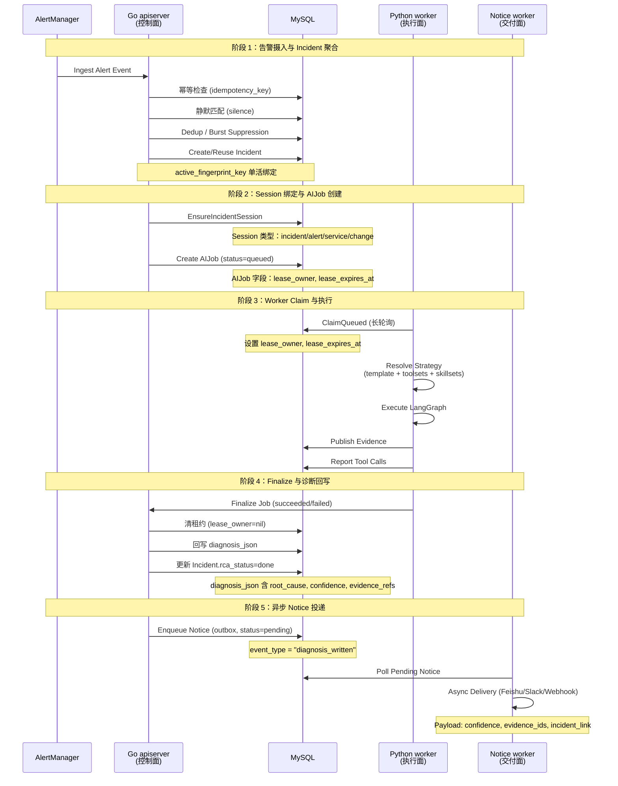

# AI RCA 的主链路设计：从 alert event 到 diagnosis / notice 的平台闭环

> **系列导读**：这是 AI RCA 八篇系列的第 2 篇。第 1 篇解释了为什么 AI RCA 是"辅助决策"而不是"自动处置"。本篇要回答一个更本质的问题：**为什么这套系统不能是"一次 AI 对话"，而必须是"平台级对象生命周期"？**

如果你用过 ChatBot 类产品，会熟悉这个模式：

```
用户提问 → LLM 回答 → 结束
```

这个模式有两个核心假设：

1. **请求是一次性的**：回答完就结束，不需要持久化状态
2. **上下文是对话级的**：多轮对话通过"会话历史"维护

**但 RCA 不是这样工作的。**

一条告警进入系统后，它经历的不是"一次问答"，而是一连串**有状态的对象转换**：

```
告警来了 → 这是个新问题还是老问题？ → 创建/复用 Incident
                                           ↓
                          绑定 Session（多轮 RCA 共享上下文）
                                           ↓
                          创建 AIJob（queued 状态，等 worker 来抢）
                                           ↓
                          Worker Claim（加租约，变 running）
                                           ↓
                          执行诊断（发布 Evidence，上报 ToolCall）
                                           ↓
                          Finalize（清租约，回写 Diagnosis）
                                           ↓
                          触发 Notice（异步 outbox，等 worker 投递）
```

**关键区别在于：**

| 对话模型 | RCA 平台模型 |
|----------|-------------|
| 请求一次性，回答完就结束 | 对象持久化，状态可追溯 |
| 上下文是"对话历史" | 上下文是 Incident + Session + Evidence |
| 无状态服务，随便哪个实例都能处理 | 有状态执行，同一个 job 只能被一个 worker claim |
| 输出是"回答文本" | 输出是"诊断结论 + 证据引用 + 通知投递" |

**这就是为什么 RCA 必须是平台闭环，而不是 AI demo。**

接下来我们走完全链路，看每个对象为什么必须存在。

---

## 一、全链路时序图

先把全景图放在这里，后面逐段拆解：



五个阶段，每个阶段都有**无法省略的对象**。下面逐个解释。

---

## 二、阶段 1：告警摄入与 Incident 聚合

### 核心问题：这条告警属于哪个 Incident？

告警进入系统后，第一道关卡不是"创建 Incident"，而是**判断是否需要创建**。

#### 2.1 幂等性：防止重试把同一条告警创建多次

**设计意图**：网络是不可靠的。告警系统可能因为超时重试发送同一条告警。幂等键保证**相同请求只创建一条记录**。

```go
// internal/apiserver/biz/v1/alert_event/alert_event.go:230-244
if in.idempotencyKey != "" {
    existing, getErr := b.store.AlertEvent().Get(txCtx, 
        where.T(txCtx).F("idempotency_key", in.idempotencyKey))
    if getErr == nil {
        // 复用已存在的事件
        reused = true
        eventID = existing.EventID
        incidentID = derefString(existing.IncidentID)
        return nil
    }
}
```

**关键点**：幂等键不是随便生成的。它通常由告警的 fingerprint + 时间窗口计算而来，保证"同一次告警"有相同的键。

#### 2.2 静默：维护窗口内不推进 Incident

**设计意图**：计划内变更、维护窗口期间，告警应该被"静默"——不是丢弃，而是不触发 Incident 和时间线。

```go
// internal/apiserver/biz/v1/alert_event/alert_event.go:253-260
matchedSilence, matchErr := b.matchActiveSilence(txCtx, in)
if matchedSilence != nil {
    silenced = true
    silenceID = matchedSilence.SilenceID
}
```

**关键点**：即使被静默，告警记录仍会落库。这是审计需要——将来有人问"那天晚上到底有没有告警"，系统能给出答案。

#### 2.3 Fingerprint 聚合：同一问题只建一个 Incident

**这是 Incident 聚合的核心机制。**

系统使用 `active_fingerprint_key` 来保证同一 fingerprint 同时只绑定一个活跃 Incident。

```go
// internal/apiserver/model/incident.go:28
type IncidentM struct {
    // ...
    ActiveFingerprintKey *string `gorm:"...;uniqueIndex:uniq_incidents_active_fingerprint_key"`
    // ...
}
```

**设计取舍**：fingerprint 计算时刻意忽略了 pod、instance、trace_id、ip 等高波动标签。为什么？

因为 Pod 会重启、IP 会变、trace_id 每次请求都不同。如果把这些放进 fingerprint，**同一问题会因为基础设施的正常变化被错误地分成多个 Incident**。

**这就是平台级设计**：不是"来一条告警建一个单"，而是"同一问题的告警聚合到一个单"。

---

## 三、阶段 2：Session 绑定与 AIJob 创建

### 核心问题：为什么需要 Session 层？AIJob 直接绑定 Incident 不够吗？

**答案是：不够。**

一次 Incident 可能经历多轮 AI 分析：
- 第 1 轮：基础诊断（`basic_rca` 模板）
- 第 2 轮：人工要求"再查一下依赖服务"
- 第 3 轮：replay 模式重新跑

如果 AIJob 直接绑定 Incident，**多轮分析的上下文无法共享**——每一轮都是"从零开始"。

Session 的设计意图就是**跨 AIJob 共享上下文**。

#### 3.1 Session 存储什么？

Session 不是空壳，它存储以下关键上下文：

| 字段 | 用途 |
|------|------|
| `latest_summary` | 最新诊断摘要（跨 AIJob 累积） |
| `pinned_evidence_ids` | 固定证据列表（用户标记为"重要"的证据） |
| `context_state` | 上下文状态（review、assignment、sla 等） |
| `escalation_state` | 升级状态（none/pending/escalated） |

这些字段在每次 AIJob finalize 时通过 `session_patch` 更新。

#### 3.2 AIJob 状态机：为什么需要租约？

AIJob 的状态机是主链路的核心：

```
queued → running → succeeded/failed/canceled
```

```go
// internal/apiserver/model/ai_job.go:16
type AIJobM struct {
    Status            string     `gorm:"column:status;type:varchar(32);not null"`
    LeaseOwner        *string    `gorm:"column:lease_owner;type:varchar(128)"`
    LeaseExpiresAt    *time.Time `gorm:"column:lease_expires_at"`
    LeaseVersion      int64      `gorm:"column:lease_version;not null;default:0"`
    HeartbeatAt       *time.Time `gorm:"column:heartbeat_at"`
    // ...
}
```

**关键设计**：`lease_owner`、`lease_expires_at`、`heartbeat_at` 这三个字段是**多实例 worker 容错的核心**。

worker 通过 claim 获取租约，通过 heartbeat 续租，通过 finalize 清租约。如果 worker 崩溃，租约过期后其他实例可以 reclaim 并继续执行。

**这就是为什么 AIJob 不能是对话模型**：对话模型的"请求→回答"是一次性的，而 AIJob 是**可恢复、可追溯、可 reclaim 的持久化执行单元**。

---

## 四、阶段 3：Worker Claim 与执行

### 核心问题：worker 如何"抢占"job？执行过程中如何保证状态一致？

#### 4.1 Claim 操作：带租约的状态转移

```go
// internal/apiserver/store/ai_job.go:159-189
func (a *aiJobStore) ClaimQueued(ctx context.Context, jobID string, 
    leaseOwner string, now time.Time, leaseTTL time.Duration) (int64, error) {
    
    // 查询条件：job_id = ? AND status = 'queued'
    // 更新：status='running', lease_owner, lease_expires_at, heartbeat_at
    res := a.s.DB(ctx).Model(&model.AIJobM{}).
        Where("job_id = ? AND status = ?", jobID, "queued").
        Updates(map[string]any{
            "status":           "running",
            "started_at":       now,
            "lease_owner":      owner,
            "lease_expires_at": expiresAt,
            "heartbeat_at":     now,
            "lease_version":    gorm.Expr("lease_version + 1"),
        })
    return res.RowsAffected, nil
}
```

**关键点**：
1. 查询条件包含 `status = 'queued'`，保证只有 queued 状态的 job 能被 claim
2. `lease_owner` 设置为 worker 实例 ID，实现**单 owner 语义**
3. `lease_expires_at` 设置为当前时间 + TTL（默认 30 秒），超时后其他 worker 可以 reclaim

#### 4.2 Heartbeat：worker 还活着的证明

```go
// internal/apiserver/store/ai_job.go:191-218
func (a *aiJobStore) RenewLease(ctx context.Context, jobID string, 
    leaseOwner string, now time.Time, leaseTTL time.Duration) (int64, error) {
    
    // 更新：lease_expires_at, heartbeat_at, lease_version
    res := a.s.DB(ctx).Model(&model.AIJobM{}).
        Where("job_id = ? AND status = ? AND lease_owner = ?", jobID, "running", owner).
        Updates(map[string]any{
            "lease_expires_at": expiresAt,
            "heartbeat_at":     now,
            "lease_version":    gorm.Expr("lease_version + 1"),
        })
    return res.RowsAffected, nil
}
```

**设计意图**：worker 必须定期续租。如果 worker 崩溃（进程挂了、网络断了、机器宕机了），租约过期后其他实例可以 reclaim。

**这就是生产级系统**：不是"worker 启动了就假设它永远活着"，而是"假设 worker 随时会挂，但系统能自动恢复"。

#### 4.3 Evidence：取证与审计对象

```go
// internal/apiserver/model/evidence.go:8-26
type EvidenceM struct {
    EvidenceID      string    `gorm:"column:evidence_id;type:varchar(64);uniqueIndex"`
    IncidentID      string    `gorm:"column:incident_id;not null"`
    JobID           *string   `gorm:"column:job_id"`
    Type            string    `gorm:"column:type;not null"`
    QueryText       string    `gorm:"column:query_text;type:text"`
    QueryHash       string    `gorm:"column:query_hash;type:varchar(128)"`
    TimeRangeStart  time.Time `gorm:"column:time_range_start;not null"`
    TimeRangeEnd    time.Time `gorm:"column:time_range_end;not null"`
    ResultJSON      string    `gorm:"column:result_json;type:longtext"`
    ResultSizeBytes int64     `gorm:"column:result_size_bytes;not null"`
    IsTruncated     bool      `gorm:"column:is_truncated;not null"`
    // ...
}
```

**关键设计**：Evidence 存储的是**查询元数据**（查询文本、时间范围、结果摘要），不是原始数据。

为什么？因为原始数据可能很大（Prometheus 查询结果、日志全文），而 Evidence 的职责是**审计和可追溯**——将来有人问"AI 当时查了什么"，系统能给出答案。

#### 4.4 Strategy Resolve：worker 执行前的关键步骤

**核心问题**：worker 如何知道该跑哪个模板、用哪些工具、加载哪些 Skills？

这就是 `strategy resolve` 的职责。它在 worker claim job 之后、执行 LangGraph 之前发生，解析链如下：

```
AIJob.pipeline（用户输入）
    ↓
strategy_config（根据 incident 元数据命中 rule）
    ↓
template_id + toolsets[] + skillset_ids[]
    ↓
provider resolver（构建 tool/provider snapshot）
    ↓
worker 执行时的最终能力面
```

**各层职责与为什么需要这么多层**：

| 层级 | 职责 | 为什么单独一层 |
|------|------|---------------|
| `pipeline` | 用户视角的"执行模式"（如 `basic_rca`、`deep_dive`） | 用户不需要知道后面的复杂逻辑 |
| `strategy_config` | 治理层（不同 severity 走不同规则） | 运营策略需要灵活调整，不能写死在代码里 |
| `template_id` | 指定 LangGraph 的图实现 | 同一个 pipeline 可能对应多个图实现（灰度、AB 测试） |
| `toolsets[]` | 授权层（控制哪些工具可用） | 不同租户/环境可能有不同的工具权限 |
| `skillset_ids[]` | 知识层（Claude Skills 绑定） | Skills 是独立于工具的知识库 |
| `provider snapshot` | 运行层（单次 job 的最终 provider 实例化） | worker 需要一个确定的、可执行的 provider 列表 |

**这就是平台级设计**：不是"worker 拿到 job 就直接跑"，而是"先解析策略，再构建能力面，最后执行"。

#### 4.4.1 完整的 Strategy Resolve 代码实现

理论解释之后，让我们看看完整的 Python 代码实现：

```python
# Python orchestrator 端：strategy_resolve.py

from typing import List, Dict, Optional
import json
from dataclasses import dataclass

@dataclass
class StrategySnapshot:
    """单次 AIJob 执行的最终能力面快照"""
    template: LangGraphTemplate
    providers: List[ToolProvider]
    config: StrategyConfigM
    resolved_at: datetime

class StrategyResolver:
    """Strategy Resolve 的核心类"""
    
    def resolve(self, job: AIJobM, incident: IncidentM) -> StrategySnapshot:
        """
        完整的 resolve 链路：
        1. 根据 pipeline 和 incident 元数据查找 strategy config
        2. 解析 template_id, toolsets, skillset_ids
        3. 构建 provider snapshot
        4. 返回最终的执行能力面
        """
        # 步骤1：查找 strategy config
        config = self._find_strategy_config(job.pipeline, incident)
        if not config:
            raise StrategyNotFoundError(
                f"No strategy config found for pipeline={job.pipeline}, "
                f"severity={incident.severity}, service={incident.service_name}"
            )
        
        # 步骤2：解析 template
        template = self._load_template(config.template_id)
        
        # 步骤3：解析 toolsets（授权层）
        toolsets = self._resolve_toolsets(config.toolset_ids, job.tenant_id)
        
        # 步骤4：解析 skillsets（知识层）
        skillsets = self._resolve_skillsets(config.skillset_ids, job.tenant_id)
        
        # 步骤5：构建 provider snapshot（运行层）
        providers = self._build_provider_snapshot(toolsets, skillsets, job)
        
        # 步骤6：应用 guardrails（安全层）
        providers = self._apply_guardrails(providers, job.tenant_id, config)
        
        return StrategySnapshot(
            template=template,
            providers=providers,
            config=config,
            resolved_at=datetime.utcnow()
        )
    
    def _find_strategy_config(self, pipeline: str, incident: IncidentM) -> Optional[StrategyConfigM]:
        """
        根据 incident 元数据动态匹配 strategy config
        匹配规则示例：
        - 规则1: pipeline=basic_rca AND severity=P0 AND service=payment → config-A
        - 规则2: pipeline=basic_rca AND severity=P1 → config-B
        - 规则3: pipeline=basic_rca → config-C（兜底规则）
        """
        # 查询所有匹配的 rules
        matching_rules = db.session.query(StrategyConfigM).filter(
            StrategyConfigM.pipeline == pipeline,
            StrategyConfigM.is_active == True
        ).all()
        
        # 按优先级排序并匹配
        matching_rules.sort(key=lambda r: r.priority, reverse=True)
        for rule in matching_rules:
            if self._rule_matches(rule.matching_rules, incident):
                return rule
        
        return None
    
    def _rule_matches(self, matching_rules: Dict, incident: IncidentM) -> bool:
        """
        检查 incident 是否匹配 rule 的条件
        matching_rules 示例：
        {
            "severity": {"in": ["P0", "P1"]},
            "service_name": {"starts_with": "payment"},
            "cluster_name": {"eq": "prod-cn1"}
        }
        """
        if not matching_rules:
            return True
        
        for field, condition in matching_rules.items():
            incident_value = getattr(incident, field, None)
            
            # 支持多种匹配操作符
            if "eq" in condition and incident_value != condition["eq"]:
                return False
            if "in" in condition and incident_value not in condition["in"]:
                return False
            if "starts_with" in condition and not str(incident_value).startswith(condition["starts_with"]):
                return False
        
        return True
    
    def _resolve_toolsets(self, toolset_ids: List[str], tenant_id: str) -> List[ToolsetM]:
        """解析 toolsets（授权层）"""
        toolsets = []
        for toolset_id in toolset_ids:
            toolset = db.session.query(ToolsetM).get(toolset_id)
            if not toolset:
                raise ToolsetNotFoundError(f"Toolset {toolset_id} not found")
            
            # 检查租户权限
            if tenant_id not in toolset.allowed_tenants:
                raise PermissionDenied(f"Tenant {tenant_id} not allowed to use toolset {toolset_id}")
            
            toolsets.append(toolset)
        
        return toolsets
    
    def _resolve_skillsets(self, skillset_ids: List[str], tenant_id: str) -> List[SkillsetM]:
        """解析 skillsets（知识层）"""
        skillsets = []
        for skillset_id in skillset_ids:
            skillset = db.session.query(SkillsetM).get(skillset_id)
            if not skillset:
                raise SkillsetNotFoundError(f"Skillset {skillset_id} not found")
            
            # 检查租户权限
            if tenant_id not in skillset.allowed_tenants:
                raise PermissionDenied(f"Tenant {tenant_id} not allowed to use skillset {skillset_id}")
            
            skillsets.append(skillset)
        
        return skillsets
    
    def _build_provider_snapshot(self, toolsets: List[ToolsetM], 
                                 skillsets: List[SkillsetM],
                                 job: AIJobM) -> List[ToolProvider]:
        """
        构建 provider snapshot（运行层）
        这是整个 resolve 链路的关键：把静态的 toolsets/skillsets
        转换成动态的、可执行的 provider 实例
        """
        providers = []
        
        # 1. 从 toolsets 构建工具 providers
        for toolset in toolsets:
            for tool_spec in toolset.tools:
                provider = self._instantiate_tool_provider(tool_spec, job)
                providers.append(provider)
        
        # 2. 从 skillsets 构建 MCP providers
        for skillset in skillsets:
            for skill_spec in skillset.skills:
                provider = self._instantiate_mcp_provider(skill_spec, job)
                providers.append(provider)
        
        return providers
    
    def _instantiate_tool_provider(self, tool_spec: Dict, job: AIJobM) -> ToolProvider:
        """实例化工具 provider"""
        # 根据 tool_spec.type 加载对应的 provider 类
        provider_class = self._get_provider_class(tool_spec["type"])
        
        # 传入配置（可能包含 tenant-specific 的配置）
        config = self._get_tenant_config(job.tenant_id, tool_spec)
        
        return provider_class(config=config, job_context=job)
    
    def _instantiate_mcp_provider(self, skill_spec: Dict, job: AIJobM) -> ToolProvider:
        """实例化 MCP provider（Claude Skills）"""
        # MCP provider 需要连接到 MCP server
        mcp_server_url = self._get_mcp_server_url(job.tenant_id, skill_spec)
        
        return MCPHttpProvider(
            server_url=mcp_server_url,
            skill_name=skill_spec["name"],
            job_context=job
        )
    
    def _apply_guardrails(self, providers: List[ToolProvider], 
                         tenant_id: str,
                         config: StrategyConfigM) -> List[ToolProvider]:
        """
        应用 guardrails（安全层）
        - 限制某些工具的调用频率
        - 限制某些工具的参数范围
        - 记录所有 provider 调用（审计）
        """
        guarded_providers = []
        for provider in providers:
            # 应用调用频率限制
            if config.rate_limit_enabled:
                provider = RateLimitedProvider(provider, config.rate_limit_per_minute)
            
            # 应用参数校验
            if config.param_validation_enabled:
                provider = ValidatedProvider(provider, config.allowed_params)
            
            # 应用审计包装
            provider = AuditedProvider(provider, tenant_id, job_id)
            
            guarded_providers.append(provider)
        
        return guarded_providers
```

这段代码展示了 Strategy Resolve 的完整实现。关键点：

1. **分层解析**：每一层都有明确的职责，从 pipeline 到最终的 provider snapshot
2. **动态匹配**：`_rule_matches` 方法支持灵活的规则匹配（eq、in、starts_with 等）
3. **租户隔离**：每一步都检查租户权限，确保多租户安全
4. **运行时实例化**：`_build_provider_snapshot` 把静态配置转换成动态的 provider 实例
5. **Guardrails**：最后一步应用安全策略（限流、参数校验、审计）

#### 4.4.2 Strategy Config 的动态匹配机制

Strategy Config 的动态匹配是治理层的核心。让我们看看数据库中的配置示例：

```sql
-- strategy_configs 表
INSERT INTO strategy_configs (
    config_id,
    pipeline,
    priority,
    matching_rules,
    template_id,
    toolset_ids,
    skillset_ids,
    is_active
) VALUES
-- 规则1：P0 严重性 + payment 服务 → 深度诊断模板
('config-payment-p0', 'basic_rca', 100, 
 '{
     "severity": {"in": ["P0"]},
     "service_name": {"starts_with": "payment"}
 }',
 'template-deep-diagnosis-v2',
 '["toolset-k8s", "toolset-prometheus", "toolset-loki"]',
 '["skillset-tempo-trace"]',
 TRUE),

-- 规则2：P1 严重性 → 标准诊断模板
('config-p1', 'basic_rca', 50,
 '{
     "severity": {"in": ["P1"]}
 }',
 'template-standard-diagnosis-v1',
 '["toolset-k8s", "toolset-prometheus"]',
 '[]',
 TRUE),

-- 规则3：兜底规则（匹配所有）
('config-default', 'basic_rca', 0,
 '{}',
 'template-basic-diagnosis-v1',
 '["toolset-k8s"]',
 '[]',
 TRUE);
```

**匹配逻辑**：

1. 当 AIJob 的 `pipeline='basic_rca'` 且 `severity='P0'` 且 `service_name='payment-api'` 时：
   - 匹配规则1（priority=100）→ 使用深度诊断模板 + 完整工具集
   
2. 当 AIJob 的 `pipeline='basic_rca'` 且 `severity='P1'` 时：
   - 不匹配规则1（severity 不匹配）
   - 匹配规则2（priority=50）→ 使用标准诊断模板
   
3. 当 AIJob 的 `pipeline='basic_rca'` 且 `severity='P2'` 时：
   - 不匹配规则1和规则2
   - 匹配规则3（兜底规则）→ 使用基础诊断模板

**这种设计的优势**：

- **灵活的灰度发布**：可以通过调整 priority 和 matching_rules 来控制不同服务/严重性的诊断策略
- **多租户隔离**：可以在 matching_rules 中加入 `tenant_id` 条件
- **AB 测试支持**：可以创建两条规则，通过 priority 控制流量分配
- **快速回滚**：如果新模板有问题，只需将 is_active=false，系统会自动回退到兜底规则

#### 4.4.3 Guardrails 的执行时机与检查点

Guardrails（防护栏）是保证系统安全的关键。它们在两个关键时机执行：

**时机1：Strategy Resolve 阶段**

在 `_apply_guardrails` 方法中，对 provider 进行包装：

```python
# 限流包装
provider = RateLimitedProvider(provider, config.rate_limit_per_minute)

# 参数校验包装
provider = ValidatedProvider(provider, config.allowed_params)

# 审计包装
provider = AuditedProvider(provider, tenant_id, job_id)
```

**时机2：Provider 执行阶段**

当 LangGraph 调用 provider 时，guardrails 会实际执行：

```python
class RateLimitedProvider:
    def __init__(self, wrapped: ToolProvider, limit: int):
        self.wrapped = wrapped
        self.limit = limit
        self.call_count = 0
        self.last_reset = time.time()
    
    def call(self, params: Dict) -> Dict:
        # 检查是否超过限流
        now = time.time()
        if now - self.last_reset > 60:  # 重置计数器
            self.call_count = 0
            self.last_reset = now
        
        self.call_count += 1
        if self.call_count > self.limit:
            raise RateLimitExceeded(
                f"Rate limit exceeded: {self.call_count}/{self.limit} per minute"
            )
        
        # 调用实际的 provider
        return self.wrapped.call(params)

class ValidatedProvider:
    def __init__(self, wrapped: ToolProvider, allowed_params: Dict):
        self.wrapped = wrapped
        self.allowed_params = allowed_params
    
    def call(self, params: Dict) -> Dict:
        # 校验参数
        for param_name, param_value in params.items():
            if param_name not in self.allowed_params:
                raise InvalidParameter(f"Parameter {param_name} not allowed")
            
            # 校验参数值范围
            allowed_range = self.allowed_params[param_name]
            if not self._in_range(param_value, allowed_range):
                raise InvalidParameter(
                    f"Parameter {param_name}={param_value} out of range {allowed_range}"
                )
        
        return self.wrapped.call(params)

class AuditedProvider:
    def __init__(self, wrapped: ToolProvider, tenant_id: str, job_id: str):
        self.wrapped = wrapped
        self.tenant_id = tenant_id
        self.job_id = job_id
    
    def call(self, params: Dict) -> Dict:
        # 记录审计日志
        audit_log = ToolCallAuditLog(
            tenant_id=self.tenant_id,
            job_id=self.job_id,
            provider_type=self.wrapped.type,
            params=params,
            called_at=datetime.utcnow()
        )
        db.session.add(audit_log)
        db.session.commit()
        
        # 调用实际的 provider
        return self.wrapped.call(params)
```

**Guardrails 的检查点总结**：

| 检查点 | 执行时机 | 检查内容 |
|--------|---------|---------|
| **Resolve 阶段** | worker claim 后，执行前 | 工具权限、租户隔离、配置校验 |
| **执行阶段** | LangGraph 调用 provider 时 | 调用频率、参数范围、审计记录 |
| **Finalize 阶段** | worker 完成后 | 诊断格式校验、证据引用检查 |

这种多层防护机制确保了系统的安全性：即使某个层有漏洞，其他层也能提供保护。

#### 4.4.4 Strategy Resolve 的可观测性

为了调试和监控 Strategy Resolve，系统提供了完整的可观测性：

```python
class StrategyResolveMetrics:
    """Strategy Resolve 的监控指标"""
    
    @staticmethod
    def record_resolve_duration(duration_ms: float):
        """记录 resolve 耗时"""
        metrics.histogram("strategy_resolve_duration_ms", duration_ms)
    
    @staticmethod
    def record_config_match(config_id: str):
        """记录匹配到的 config"""
        metrics.counter("strategy_config_match", labels={"config_id": config_id})
    
    @staticmethod
    def record_provider_count(provider_count: int):
        """记录解析出的 provider 数量"""
        metrics.gauge("resolved_provider_count", provider_count)
    
    @staticmethod
    def record_error(error_type: str):
        """记录 resolve 错误"""
        metrics.counter("strategy_resolve_error", labels={"error_type": error_type})

# 使用示例
def resolve_with_metrics(job: AIJobM, incident: IncidentM) -> StrategySnapshot:
    start = time.time()
    
    try:
        snapshot = strategy_resolver.resolve(job, incident)
        
        StrategyResolveMetrics.record_resolve_duration(
            (time.time() - start) * 1000
        )
        StrategyResolveMetrics.record_config_match(snapshot.config.config_id)
        StrategyResolveMetrics.record_provider_count(len(snapshot.providers))
        
        return snapshot
    
    except Exception as e:
        StrategyResolveMetrics.record_error(type(e).__name__)
        raise
```

**关键监控指标**：

- `strategy_resolve_duration_ms`：resolve 耗时（用于性能优化）
- `strategy_config_match`：匹配到的 config（用于流量分布分析）
- `resolved_provider_count`：解析出的 provider 数量（用于资源规划）
- `strategy_resolve_error`：resolve 错误（用于故障排查）

**日志格式**：

```json
{
  "timestamp": "2026-04-02T15:30:45Z",
  "level": "INFO",
  "event": "strategy_resolve_complete",
  "job_id": "job-123456",
  "config_id": "config-payment-p0",
  "template_id": "template-deep-diagnosis-v2",
  "provider_count": 5,
  "duration_ms": 120
}
```

这些可观测性数据帮助运维团队：
- 发现 resolve 性能问题
- 分析不同 config 的流量分布
- 排查 resolve 失败的原因

---

## 五、阶段 4：Finalize 与诊断回写

### 核心问题：worker 如何"交卷"？诊断结果如何写回平台？

#### 5.1 Finalize 操作：清租约 + 回写诊断

```go
// internal/apiserver/biz/v1/ai_job/ai_job.go:586-818
func (b *aiJobBiz) Finalize(ctx context.Context, rq *v1.FinalizeAIJobRequest) (
    *v1.FinalizeAIJobResponse, error) {
    
    // 事务内执行：
    // 1. 验证状态转移（running → succeeded/failed）
    // 2. 验证并规范化 diagnosis JSON
    // 3. 回写 diagnosis_json 到 Incident
    // 4. 清租约（lease_owner=nil, lease_expires_at=nil）
    // 5. 构建 noticepkg.DispatchRequest
    // 6. 追加 incident timeline
}
```

**关键点**：Finalize 是**原子操作**——要么全部成功，要么全部失败。这是为了保证诊断回写和租约清理的一致性。

#### 5.2 诊断 JSON：结构化结论，不是自由文本

```go
// internal/apiserver/model/incident.go:37-39
type IncidentM struct {
    // ...
    RootCauseType     *string `gorm:"column:root_cause_type"`
    RootCauseSummary  *string `gorm:"column:root_cause_summary"`
    DiagnosisJSON     *string `gorm:"column:diagnosis_json"`
    EvidenceRefsJSON  *string `gorm:"column:evidence_refs_json"`
    // ...
}
```

**关键约束**：诊断必须引用 evidence，带置信度，回到 Incident 上下文。

**为什么不是自由文本**？因为自由文本无法被检索、无法被聚合、无法被后续流程使用。结构化诊断才能支持：
- "按根因类型聚合 Incident"
- "置信度低于 0.6 的需要人工复核"
- "引用了哪些 evidence，审计可追溯"

#### 5.3 Notice 触发：异步 outbox 模式

```go
// internal/apiserver/biz/v1/ai_job/ai_job.go:705-711
noticeReq = &noticepkg.DispatchRequest{
    EventType:           noticepkg.EventTypeDiagnosisWritten,
    JobID:               jobID,
    DiagnosisConfidence: diagnosisConfidence,
    DiagnosisEvidenceID: append([]string(nil), evidenceIDs...),
    OccurredAt:          now,
}
```

```go
// internal/apiserver/pkg/notice/constants.go:7
const EventTypeDiagnosisWritten = "diagnosis_written"
```

**关键设计**：Notice 不是同步发送，而是写入 outbox 队列（`notice_deliveries` 表，status=pending），由独立的 notice-worker 轮询投递。

**为什么异步**？因为控制面（apiserver）不应该依赖外部 webhook/IM 的可用性。异步 outbox 带来以下好处：
1. **解耦**：apiserver 写完 outbox 就返回，不等待外部系统响应
2. **重试**：notice-worker 可以重试投递，失败不会阻塞诊断回写
3. **削峰**：notice-worker 可以限流投递，避免瞬时流量打爆外部系统

---

## 六、阶段 5：异步 Notice 投递

### 核心问题：为什么 Notice 必须异步？Payload 应该包含什么？

#### 6.1 Outbox 模式：写入队列，不直接发送

```go
// internal/apiserver/pkg/notice/dispatch.go:49-65
func DispatchBestEffort(ctx context.Context, st store.IStore, rq DispatchRequest) {
    // 1. 准备投递计划（选择 channels）
    plan, ok := prepareDispatchPlan(ctx, st, rq)
    if !ok {
        return
    }
    // 2. 为每个 channel 写入 outbox（status=pending）
    for _, channel := range plan.channels {
        enqueueDeliveryForChannel(ctx, st, plan, rq, channel)
    }
}
```

Notice 写入 `notice_deliveries` 表，状态为 `pending`，由独立的 notice-worker 轮询投递。

#### 6.2 Payload 设计：不只是"再发一条消息"

```go
// internal/apiserver/pkg/notice/dispatch.go:21-30
type DispatchRequest struct {
    EventType             string
    Incident              *model.IncidentM
    JobID                 string
    DiagnosisConfidence   float64
    DiagnosisEvidenceID   []string
    OccurredAt            time.Time
}
```

**Payload 包含置信度、证据 IDs、Incident 链接**——这些是"补充通知"的核心价值。

**关键区别**：
- 初版告警：负责"叫醒人"（传统告警系统已具备）
- 补充通知：负责"把诊断和证据补到正确的上下文里"（AI RCA 新增价值）

#### 6.3 Evidence、Diagnosis、Notice：三者的职责

| 对象 | 职责 | 存储位置 | 生命周期 |
|------|------|----------|----------|
| `Evidence` | 取证与审计对象（PromQL、日志查询、K8s 快照） | `evidence` 表 | AI 执行过程中发布 |
| `Diagnosis` | 结构化诊断结论（根因类型、置信度、证据引用） | `incidents.diagnosis_json` | Job finalize 时回写 |
| `Notice` | 异步交付结果（初版告警 + 补充通知） | `notice_deliveries` 表 | diagnosis_written 触发 |

**常见误解**：把三者混为"AI 输出"。实际上：
- Evidence 是**过程产物**（证明 AI 查了什么）
- Diagnosis 是**结论产物**（AI 的判断）
- Notice 是**交付产物**（把人叫醒 + 补上下文）

---

## 七、这不是一次 AI 对话

回到本篇的核心观点：**AI RCA 平台定义的不是一次 AI 回答，而是从告警、问题、分析任务到证据、诊断和通知的完整对象生命周期。**

如果用对话系统来类比：
- 对话系统的"请求→回答"是一次性的，无状态的
- AI RCA 的"alert→incident→job→evidence→diagnosis→notice"是持久的、可追溯的、可恢复的

这也解释了为什么需要 Session 层——多轮 RCA 共享上下文，而不是每次都从零开始。

### 7.1 为什么"对话模型"会失效？

假设我们尝试用对话模型来构建 RCA 系统，会发生什么？

**场景 1：多轮分析无法共享上下文**

```
值班员：帮我分析这个告警
AI: [执行分析，输出结论]
值班员：再查一下依赖服务的指标
AI: [重新执行分析，但不知道之前查过什么]
```

问题：第二轮分析无法复用第一轮的 evidence，导致重复查询、重复消费 Token、结论可能矛盾。

**场景 2：无法追溯历史决策**

```
值班员：上次这个服务出问题时，AI 是怎么分析的？
系统：[无法回答，因为对话历史没有结构化存储]
```

问题：对话系统的"历史"通常是聊天日志，无法被检索、聚合、对比。

**场景 3：多实例协作断裂**

```
Worker-A: Claim Job-123，执行到一半崩溃
Worker-B: [无法接管，因为不知道 Job-123 执行到哪一步]
```

问题：对话模型没有"租约"概念，无法支持多实例 fault-tolerance。

### 7.2 平台级对象的生命周期价值

下表对比了"对话模型"与"平台模型"在关键场景下的表现：

| 场景 | 对话模型 | 平台模型 |
|------|----------|----------|
| 多轮分析 | 上下文丢失，每轮从零开始 | Session 累积 latest_summary，跨 Job 共享 |
| 历史追溯 | 聊天日志，无法结构化检索 | Evidence/Diagnosis 持久化，支持审计 |
| 多实例协作 | 无法接管，状态不透明 | Lease 机制支持 reclaim，崩溃自动恢复 |
| 结果交付 | 一次性输出文本 | Notice 异步投递，支持重试/限流 |
| 置信度管理 | 无法追踪 | Diagnosis 带 confidence，支持人工复核 gate |

**关键差异**：平台模型把"分析过程"变成了"可管理的对象"，每个对象都有清晰的生命周期和状态转移。

### 7.3 Session 层的不可替代性

Session 是本链路中最容易被误解的对象。为什么不能省略 Session，让 AIJob 直接绑定 Incident？为什么不能把 Session 绑定在 AIJob 上，而是必须绑定在 Incident 上？下面通过三种设计方案的对比来回答这个问题。

#### 7.3.1 三种 Session 设计方案的深度对比

| 方案 | 实现方式 | 核心问题 | 是否可用 |
|------|---------|---------|---------|
| **方案1**：无 Session 层 | AIJob 直接绑定 Incident | 多轮分析上下文丢失，每轮都是孤岛 | ❌ |
| **方案2**：Session 绑定在 AIJob | 每个 AIJob 有自己的 Session | 多轮分析无法共享上下文 | ❌ |
| **方案3**：Session 绑定在 Incident | Incident 持有 Session，AIJob 引用 | 多轮分析共享上下文，人工交互有锚点 | ✅（当前方案）|

**方案1：无 Session 层 —— 为什么这是对话模型的陷阱**

最直接的想法是：既然 AIJob 已经绑定到 Incident 了，为什么还需要中间的 Session 层？直接把 `latest_summary`、`pinned_evidence_ids` 这些字段加到 `AIJobM` 或 `IncidentM` 上不就行了吗？

这种设计的问题在于**生命周期错配**。我们来看一个真实场景：

```
Incident-001
├── AIJob-001 (basic_rca，成功，置信度 0.65)
│   └── Summary: "初步判断是数据库连接池问题"
├── AIJob-002 (deep_dive，失败，超时)
│   └── Summary: NULL (因为失败，没有结论)
└── AIJob-003 (replay，成功，置信度 0.82)
    └── Summary: "确认是数据库连接池问题，已达到 99%"
```

如果没有 Session 层：
- AIJob-002 失败后，`latest_summary` 字段是 NULL
- 当用户触发 AIJob-003（replay）时，系统无法知道"上一轮成功分析的结论是什么"
- 每个 AIJob 都必须从零开始，无法复用之前的证据和分析

**这就是对话模型的核心问题**：每次请求都是独立的，上下文在内存中，请求结束后消失。但对于 RCA 这种需要多轮迭代的场景，我们需要一个持久化的上下文锚点。

**方案2：Session 绑定在 AIJob —— 为什么这仍然不够**

既然无 Session 层不行，那能不能让每个 AIJob 都有一个自己的 Session？这样至少能保证单次分析的上下文是完整的。

```
Incident-001
├── AIJob-001
│   └── Session-001 (summary="初步判断是数据库连接池问题")
├── AIJob-002
│   └── Session-002 (summary=NULL, 失败)
└── AIJob-003
    └── Session-003 (summary="确认是数据库连接池问题")
```

这种设计的问题在于**上下文割裂**：

1. **Replay 无法获取历史上下文**：当用户触发 AIJob-003（replay AIJob-001）时，AIJob-003 无法知道 AIJob-001 的结论是什么，因为它们各自持有独立的 Session
2. **人工交互无锚点**：当值班员说"再查一下依赖服务"时，系统不知道应该基于哪一轮的上下文继续
3. **Incident 视角缺失**：从 Incident 的角度，无法看到完整的上下文演变历史

**方案3：Session 绑定在 Incident —— 平台级设计的正确答案**

当前方案的核心设计是：**Session 绑定在 Incident 上，跨所有 AIJob 共享**。

```
Incident-001
├── Session (latest_summary="确认是数据库连接池问题", pinned_evidence_ids=[...])
├── AIJob-001 (basic_rca，成功)
├── AIJob-002 (deep_dive，失败)
└── AIJob-003 (replay，成功)
```

这个设计的优势：

1. **多轮分析共享上下文**：无论多少轮 AIJob，它们都能读写同一个 Session
2. **人工交互有锚点**：所有触发器（alert ingest、manual trigger、replay）都共享同一个 Session
3. **上下文累积演进**：`latest_summary` 随着每轮成功分析不断累积，不会因为某轮失败而丢失

#### 7.3.2 Session 数据模型的详细设计

理解了为什么需要 Session，再看 Session 的数据模型设计：

```go
// internal/apiserver/model/session.go
type SessionM struct {
    SessionID        string  `gorm:"column:session_id;type:varchar(64);uniqueIndex"`
    IncidentID       string  `gorm:"column:incident_id;type:varchar(64);not null"`
    Type             string  `gorm:"column:type;type:varchar(32);not null"` // incident/alert/service/change
    LatestSummary    *string `gorm:"column:latest_summary;type:text"`
    PinnedEvidenceIDs JSON    `gorm:"column:pinned_evidence_ids;type:json"`
    ContextStateJSON  JSON    `gorm:"column:context_state_json;type:json"`
    EscalationState   string  `gorm:"column:escalation_state;type:varchar(32);default:'none'"`
    CreatedAt        time.Time
    UpdatedAt        time.Time
}
```

**关键字段的职责**：

| 字段 | 职责 | 示例值 |
|------|------|--------|
| `incident_id` | 绑定到哪个 Incident（外键） | `"incident-001"` |
| `type` | Session 类型（支持不同类型的问题单） | `"incident"` / `"alert"` / `"service"` |
| `latest_summary` | 最新诊断摘要（跨 AIJob 累积） | `"确认是数据库连接池问题，置信度 0.82"` |
| `pinned_evidence_ids` | 固定证据列表（用户标记为"重要"的证据） | `["evidence-001", "evidence-005"]` |
| `context_state_json` | 上下文状态（review、assignment、sla 等） | `{"review": "pending", "assignee": "zhangsan"}` |
| `escalation_state` | 升级状态（none/pending/escalated） | `"none"` |

**为什么这些字段不能放在 Incident 上？**

1. **更新频率不同**：`latest_summary` 在每次 AIJob finalize 时都会更新，而 Incident 的其他字段（如 `fingerprint`）一旦创建就不变
2. **访问模式不同**：Session 是热点数据（worker 频繁读写），Incident 是冷数据（主要读）
3. **扩展性考虑**：未来可能支持"Session 历史版本"（类似 Git commit），独立的 Session 表更容易支持这种需求

#### 7.3.3 Session 查询模式的完整链路

理解了数据模型，再看实际使用中如何查询和更新 Session。

**场景1：创建 AIJob 时确保 Session 存在**

当系统接收到告警事件并创建 AIJob 时，需要确保对应的 Session 已存在（如果不存在则创建）：

```go
// internal/apiserver/biz/v1/ai_job/ai_job.go:642-646
func ensureIncidentSessionIDBestEffort(ctx context.Context, st store.IStore, incidentID string) (string, error) {
    // 1. 尝试查询已存在的 Session
    session, err := st.Session().GetByIncident(ctx, where.T(ctx).F("incident_id", incidentID))
    if err == nil {
        return session.SessionID, nil
    }
    
    // 2. 不存在，创建新的 Session
    sessionID := uid.New("sess")
    createErr := st.Session().Create(ctx, &model.SessionM{
        SessionID:  sessionID,
        IncidentID: incidentID,
        Type:       "incident",
    })
    if createErr != nil {
        // 创建失败，记录日志但不阻塞主流程
        log.Warnf("Failed to create session for incident %s: %v", incidentID, createErr)
    }
    return sessionID, nil
}
```

**场景2：AIJob Finalize 时更新 Session**

当 AIJob 执行完成并回写诊断时，需要更新 Session 的 `latest_summary`：

```go
// internal/apiserver/biz/v1/ai_job/ai_job.go:680-700
func finalizeSession(ctx context.Context, st store.IStore, job *model.AIJobM, diagnosisJSON string) error {
    // 1. 解析 diagnosis JSON
    var diagnosis struct {
        RootCauseSummary string `json:"root_cause_summary"`
        EvidenceIDs      []string `json:"evidence_ids"`
    }
    if err := json.Unmarshal([]byte(diagnosisJSON), &diagnosis); err != nil {
        return fmt.Errorf("parse diagnosis: %w", err)
    }
    
    // 2. 更新 Session
    sessionPatch := &model.SessionMPatch{
        LatestSummary: &diagnosis.RootCauseSummary,
    }
    
    // 3. 如果置信度高，自动标记关键证据为 pinned
    if confidence >= 0.8 {
        sessionPatch.PinnedEvidenceIDs = diagnosis.EvidenceIDs
    }
    
    return st.Session().Patch(ctx, job.SessionID, sessionPatch)
}
```

**场景3：Replay 时读取历史上下文**

当用户触发 Replay 操作时，worker 需要读取上一轮的 Session 上下文：

```python
# Python worker 端
def load_session_context(session_id: str) -> dict:
    """加载 Session 上下文，用于 Replay/Follow-up 模式"""
    session = query_session_by_id(session_id)
    
    return {
        "latest_summary": session.latest_summary,
        "pinned_evidence_ids": session.pinned_evidence_ids,
        "previous_root_cause": extract_root_cause(session.latest_summary)
    }
```

这个上下文会被注入到 LangGraph 的初始状态中，指导新一轮的分析方向。

**场景4：多触发器共享上下文**

无论是 alert ingest、manual trigger、cron trigger 还是 replay/follow_up，它们都会：

1. 查询同一个 Incident 对应的 Session
2. 读取 `latest_summary` 了解当前上下文
3. 根据上下文决定下一步分析方向
4. 更新 `latest_summary` 累积新的结论

**这就是为什么 Session 是"锚点"**：它让所有触发器都能看到同一个上下文，而不是各自创建孤立的分析线程。

#### 7.3.4 Session 设计的架构哲学

Session 层的设计体现了几个重要的架构哲学：

**1. 真相来源（Source of Truth）原则**

在分布式系统中，每个数据都应该有且只有一个真相来源。Session 的设计严格遵循这个原则：

- `latest_summary` 的真相来源是 Session 表
- `pinned_evidence_ids` 的真相来源是 Session 表
- `context_state` 的真相来源是 Session 表

没有任何其他地方（AIJob、Incident、内存）可以修改这些数据。这种设计避免了"数据同步问题"——即不同地方的数据不一致。

**2. 生命周期分离（Lifecycle Separation）原则**

Session、AIJob、Incident 三者的生命周期不同：

- Incident 生命周期：创建 → 活跃 → resolved（可能持续数天）
- Session 生命周期：绑定到 Incident，随 Incident 一起结束
- AIJob 生命周期：queued → running → succeeded/failed（可能持续数分钟）

如果把所有数据都放在 Incident 上，就违背了生命周期分离原则，导致数据更新混乱。

**3. 热点数据隔离（Hot Data Isolation）原则**

Session 是热点数据（worker 频繁读写），Incident 是冷数据（主要读）。如果把两者混在一起：

- 更新 Session 时会锁住整个 Incident 记录
- 导致其他查询 Incident 的请求被阻塞
- 影响系统整体性能

独立的 Session 表让热点数据和冷数据分开存储和访问，提高了并发性能。

**4. 跨请求上下文（Cross-Request Context）原则**

对话模型的问题是：上下文在内存中，请求结束后消失。Session 层的设计解决了这个问题：

- 上下文持久化到数据库
- 跨多个请求（多次 AIJob）共享
- 支持异步、断点续传式的分析

**这正是平台级设计与对话模型的本质区别**：平台级设计把"上下文"变成了"可管理的对象"，而不是"内存中的临时数据"。

### 7.4 故障场景的详细分析

平台级设计的一个重要目标是提高系统的容错能力。让我们通过三个典型的故障场景，详细分析当前设计如何应对以及如果使用对话模型会怎样。

#### 7.3.1 Scenario 1: Worker 崩溃与自动恢复

**故障描述**：Worker 执行 AIJob 到一半时，进程崩溃（OOM、SIGKILL、机器宕机等）。

**当前平台模型的处理流程**：

```text
15:30:00 Worker-A Claim Job-123（设置 lease_owner="worker-a"，lease_expires_at=15:30:30）
15:30:05 Worker-A 开始执行 LangGraph
15:30:15 Worker-A 发布 Evidence-001（Prometheus 查询结果）
15:30:20 Worker-A 崩溃（进程挂了）
15:30:30 Lease 过期（当前时间 > lease_expires_at）
15:30:35 Worker-B 扫描到 Job-123（lease 过期，状态仍为 running）
15:30:36 Worker-B Reclaim Job-123（设置 lease_owner="worker-b"，lease_expires_at=15:31:06）
15:30:37 Worker-B 继续执行（从已发布的 Evidence-001 继续）
15:30:45 Worker-B Finalize Job-123（成功）
```

**关键代码**：

```go
// internal/apiserver/store/ai_job.go:220-263
func (a *aiJobStore) ReclaimExpiredRunning(ctx context.Context, now time.Time) ([]string, error) {
    // 1. 查询所有 lease 过期的 running jobs
    var expiredJobs []model.AIJobM
    err := a.s.DB(ctx).Model(&model.AIJobM{}).
        Where("status = ? AND lease_expires_at < ?", "running", now).
        Find(&expiredJobs).Error
    if err != nil {
        return nil, err
    }
    
    // 2. 对每个过期 job 执行 reclaim
    reclaimedIDs := []string{}
    for _, job := range expiredJobs {
        // 更新：清空旧 lease，设置新 lease，lease_version+1
        res := a.s.DB(ctx).Model(&model.AIJobM{}).
            Where("job_id = ? AND status = ? AND lease_expires_at < ?", 
                  job.JobID, "running", now).
            Updates(map[string]any{
                "lease_owner":      "reclaimed",
                "lease_expires_at": now.Add(30 * time.Second),
                "lease_version":    gorm.Expr("lease_version + 1"),
            })
        
        if res.RowsAffected > 0 {
            reclaimedIDs = append(reclaimedIDs, job.JobID)
            log.Infof("Reclaimed expired job %s (old owner: %s)", 
                      job.JobID, derefString(job.LeaseOwner))
        }
    }
    
    return reclaimedIDs, nil
}
```

**为什么对话模型无法处理这个场景**：

- 对话模型没有"租约"概念，worker 崩溃后，系统无法知道"这个请求执行到哪一步了"
- 对话模型的"请求→回答"是一次性的，无法支持断点续传
- 即使有 retry 机制，也是从头开始执行，浪费已经完成的工作

**平台模型的优势**：

1. **状态持久化**：AIJob 的状态存储在 MySQL，不依赖 worker 内存
2. **租约机制**：lease_expires_at 字段让系统能检测到 worker 崩溃
3. **自动恢复**：ReclaimExpiredRunning 定时任务自动回收过期任务
4. **断点续传**：已发布的 Evidence 会被保留，新 worker 可以继续执行

#### 7.3.2 Scenario 2: Network Partition（网络分区）

**故障描述**：Worker 和 MySQL 之间的网络出现分区，worker 无法访问数据库。

**当前平台模型的处理流程**：

```
15:30:00 Worker-A Claim Job-123（lease_expires_at=15:30:30）
15:30:05 Worker-A 开始执行
15:30:10 Network Partition（worker 无法访问 MySQL）
15:30:11 Worker-A 尝试 RenewLease 失败（网络超时）
15:30:12 Worker-A 停止执行（检测到无法续租）
15:30:15 Worker-A 崩溃或优雅退出
15:30:30 Lease 过期
15:30:35 Worker-B Reclaim Job-123
15:30:36 Worker-B 重新执行
```

**关键代码**：

```python
# Python orchestrator 端：heartbeat_loop.py

class HeartbeatLoop:
    """Worker 心跳循环，定期续租"""
    
    def __init__(self, job_id: str, lease_ttl: int = 30):
        self.job_id = job_id
        self.lease_ttl = lease_ttl
        self.running = True
    
    async def start(self):
        """启动心跳循环"""
        while self.running:
            try:
                # 续租
                await self._renew_lease()
                
                # 等待 lease_ttl 的 1/3 后再续租（避免太频繁）
                await asyncio.sleep(self.lease_ttl / 3)
            
            except NetworkError as e:
                # 网络错误，无法续租
                log.error(f"Heartbeat failed: {e}")
                
                # 停止执行（因为无法保证独占性）
                self.running = False
                raise HeartbeatFailed("Cannot renew lease, stopping execution")
            
            except Exception as e:
                log.error(f"Unexpected heartbeat error: {e}")
                # 其他错误，继续尝试
    
    async def _renew_lease(self):
        """调用控制面 API 续租"""
        response = await http_client.post(
            f"{API_SERVER}/v1/ai-jobs/{self.job_id}/renew-lease",
            json={"now": datetime.utcnow().isoformat()}
        )
        
        if response.status_code != 200:
            raise NetworkError(f"Renew lease failed: {response.status_code}")
```

**如何避免脑裂（Split-Brain）问题**：

网络分区可能导致"脑裂"：两个 worker 都认为自己拥有同一个 job。平台模型通过以下机制避免：

1. **lease_version 乐观锁**：每次续租或 reclaim 时，lease_version+1。如果 worker 读取到的 lease_version 与自己记录的不一致，说明租约已被其他 worker 抢占，立即停止执行。
2. **租约续期检查**：每次 heartbeat 时，worker 会检查续租是否成功。如果失败（返回 0 行更新），说明租约已被其他 worker 抢占。
3. **优雅退出**：当检测到租约丢失时，worker 会优雅退出，不会继续执行或写入数据。

**对话模型的问题**：

- 对话模型通常没有心跳机制，网络分区时无法感知
- 如果有 retry 机制，可能导致重复执行（两个 worker 都在执行同一个请求）
- 没有租约版本号，无法检测到并发冲突

#### 7.3.3 Scenario 3: MySQL 主从切换

**故障描述**：MySQL 主库宕机，发生主从切换，短暂的不可用。

**当前平台模型的处理流程**：

```
15:30:00 Worker-A Claim Job-123
15:30:05 Worker-A 执行中
15:30:10 MySQL 主库宕机（持续 30 秒）
15:30:11 Worker-A 续租请求失败（连接拒绝）
15:30:12 Worker-A 重试续租（指数退避）
15:30:15 MySQL 主从切换完成，新主库可用
15:30:16 Worker-A 续租成功（lease_expires_at=15:30:46）
15:30:17 Worker-A 继续执行
15:30:25 Worker-A Finalize Job-123
```

**控制面的降级策略**：

当 MySQL 不可用时，控制面（Go apiserver）会：

1. **HTTP API 降级**：对于不需要写数据库的操作（如查询 Incident），返回缓存数据或错误
2. **队列降级**：如果 Redis 可用，可以暂时将 job 放入 Redis 队列，等 MySQL 恢复后再处理
3. **租约延长**：在 MySQL 恢复后，可以批量延长所有 running jobs 的租约，避免大量 reclaim

**关键代码**：

```go
// internal/apiserver/store/ai_job.go:191-218
func (a *aiJobStore) RenewLease(ctx context.Context, jobID string, 
    leaseOwner string, now time.Time, leaseTTL time.Duration) (int64, error) {
    
    // 更新：lease_expires_at, heartbeat_at, lease_version
    // 注意：WHERE 条件包含 lease_owner，确保只有当前 owner 能续租
    res := a.s.DB(ctx).Model(&model.AIJobM{}).
        Where("job_id = ? AND status = ? AND lease_owner = ?", jobID, "running", owner).
        Updates(map[string]any{
            "lease_expires_at": now.Add(leaseTTL),
            "heartbeat_at":     now,
            "lease_version":    gorm.Expr("lease_version + 1"),
        })
    
    // 如果返回 0 行，说明租约已被其他 worker 抢占
    if res.RowsAffected == 0 {
        return 0, LeaseConflictError("Lease already taken by another worker")
    }
    
    return res.RowsAffected, nil
}
```

**为什么 MySQL 是单点故障**：

当前设计中，MySQL 是系统的真相来源（Source of Truth）。如果 MySQL 完全不可用：

- Worker 无法 claim 新的 job
- Worker 无法续租，导致所有 running jobs 被 reclaim
- Worker 无法发布 Evidence 和 finalize

**解决方案**：

1. **MySQL 高可用**：部署 MySQL 主从集群，配合自动故障转移（如 MHA、Orchestrator）
2. **读写分离**：读操作可以走从库，降低主库压力
3. **缓存降级**：关键数据（如 Incident、Session）可以缓存在 Redis，MySQL 不可用时返回缓存数据（可能过期）
4. **异步写入**：非关键操作（如审计日志）可以先写入队列，等 MySQL 恢复后再写入

#### 7.3.4 故障场景的架构思考

这三个故障场景揭示了平台级设计的几个重要原则：

**1. 假设失败（Assume Failure）原则**

不要假设任何组件永远可用。Worker 会崩溃、网络会分区、数据库会宕机。平台设计必须假设这些故障会发生，并提供恢复机制。

对话模型的思维是："请求发送出去，等待响应"。平台模型的思维是："请求发送出去，可能成功、可能失败、可能超时、可能部分成功——系统必须能处理所有情况"。

**2. 状态持久化（State Persistence）原则**

任何需要跨请求/跨实例共享的状态，必须持久化到可靠的存储（如 MySQL）。内存中的状态是临时的，进程崩溃后就会丢失。

对话模型把上下文存在内存中，请求结束后消失。平台模型把上下文（Session、Evidence、Diagnosis）持久化到数据库，支持跨请求共享。

**3. 租约语义（Lease Semantics）原则**

多实例协作时，必须有明确的"谁拥有这个任务"的语义。租约机制（lease_owner + lease_expires_at）提供了这种语义：

- 只有 lease_owner 能操作这个 job
- lease_expires_at 过期后，其他实例可以 reclaim
- lease_version 防止并发冲突

**4. 渐进式恢复（Graceful Degradation）原则**

当某个组件不可用时，系统应该降级运行，而不是完全崩溃。例如：

- MySQL 不可用时，控制面可以返回缓存数据
- Worker 崩溃时，其他 worker 可以 reclaim 并继续执行
- 网络分区时，worker 会检测到并优雅退出

**这正是平台级设计与对话模型的本质区别**：平台级设计假设失败会发生，并为此做好准备；对话模型假设一切正常，失败时只能重试或报错。

在生产环境中，失败是常态，而不是例外。平台级设计的复杂性，正是为了应对这种常态。
### 7.5 平台级设计与 AI demo 的本质区别

**AI demo 的典型特征**：
- 单次请求→单次响应
- 上下文在内存中，请求结束后消失
- 输出是"回答文本"，无法被后续流程使用
- 无法追溯"AI 当时查了什么"

**AI RCA 平台的设计原则**：
- 对象持久化，状态可追溯
- 上下文跨请求共享（Session）
- 输出是结构化对象（Diagnosis + Evidence + Notice）
- 审计性优先：任何 AI 决策都有据可查

**这就是为什么 RCA 必须是平台闭环，而不是 AI demo。**

平台级设计的代价是复杂性——你需要管理 Incident、Session、AIJob、Evidence、Notice 等多个对象的状态机。但收益是**可信性**：任何 AI 输出都有证据支撑、可追溯、可复核。

在 RCA 这个场景里，可信性比"看起来很智能"重要得多。

---

## 八、系列后续文章预告

本文讲解了主链路的全貌，但很多细节没有展开：

| 篇号 | 标题 | 核心主题 |
|------|------|----------|
| 03 | [控制面与执行面分层](./03-control-plane-vs-execution-plane.md) | Go/Python 拆分的架构判断 |
| 04 | [AIJob 租约与运行时](./04-ai-job-lease-and-runtime.md) | 多实例 worker 下的单 owner 语义 |
| 05 | [告警治理前置条件](./05-alert-to-incident-governance.md) | 没有问题边界，就没有可信 RCA |
| 06 | [补充通知设计](./06-supplemental-notice-design.md) | 可信度、引用回复与 Incident 可回看 |
| 07 | [Skills、MCP 与 LangGraph](./07-skills-mcp-langgraph-runtime.md) | 知识/能力/流程三层装配 |
| 08 | [第一阶段复盘](./08-phase-one-retrospective.md) | 哪些问题解决了，哪些还只是开始 |

下一篇《[控制面与执行面分层](./03-control-plane-vs-execution-plane.md)》将解释为什么 Go rca-apiserver 和 Python orchestrator 必须拆开。

---

*本文代码与实现基于 [aiopsre/rca-api](https://github.com/aiopsre/rca-api) 仓库（分支：`feature/skills-mcp-integration`）。*
