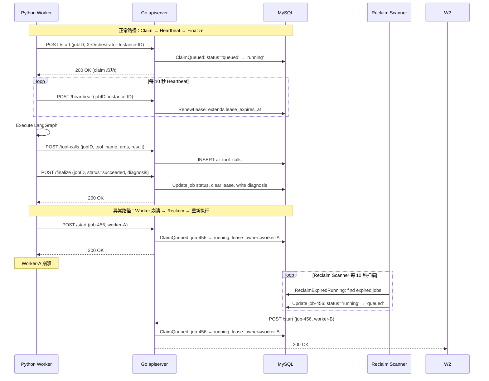

# ai_job 租约与 worker 运行时：如何让异步 AI 分析真正可扩展

> **系列导读**：这是 AI RCA 八篇系列的第 4 篇。第 1 篇解释了 AI RCA 的价值定位（辅助决策），第 2 篇讲解了主链路全貌，第 3 篇解释了控制面与执行面为什么必须拆开。**本篇要深入一个更具体的问题：在多实例 worker 环境下，如何保证同一个 AIJob 只被一个 worker 执行，且 worker 崩溃后 job 能被自动恢复？**

---

## 一、问题的起点：如果只有一个队列，会发生什么？

假设我们用最简单的"队列模型"来管理 AIJob：

```python
# ❌ 简单队列模型
while True:
    job = queue.pop()  # 从队列取一个 job
    execute(job)       # 执行
```

这个模型在单实例 worker 下工作良好。但当我们启动第二个 worker 实例时，问题出现了：

### 问题 1：重复执行

```
T0: Worker-A 从队列取出 job-123
T1: Worker-B 从队列取出 job-124
T2: Worker-A 执行到一半，进程崩溃
T3: job-123 永远停留在"执行中"状态（但实际没人执行）
```

队列模型假设"取出=执行完成"，但**执行是可能失败的**。崩溃的 worker 取出的 job 怎么办？

### 问题 2：无法恢复

```
T0: Worker-A 取出 job-123，开始执行
T1: Worker-A 崩溃
T2: Worker-B 启动
T3: Worker-B 无法知道 job-123 已经被取走（队列里没有）
T4: job-123 永远丢失
```

**队列模型的致命缺陷**：一旦 job 离开队列，它就"消失"了。如果执行失败，没有机制可以恢复。

### 问题 3：无法协调多实例

```
T0: Worker-A 和 Worker-B 同时看到 job-123 在队列中
T1: Worker-A 执行 pop()
T2: Worker-B 也执行 pop()（竞争条件）
T3: job-123 被两个 worker 同时执行
```

即使队列是原子的，**网络延迟和时钟不同步**也可能导致两个 worker 认为"自己是第一个"。

---

## 二、租约模型：为什么队列不够，需要数据库？

**租约模型的核心洞察**：执行状态必须持久化，不能只存在于内存或队列中。

### 2.1 AIJob 的状态机

AIJob 不是"队列消息"，而是一个**有状态机的持久化对象**：

```go
// internal/apiserver/model/ai_job.go:16-30
type AIJobM struct {
    Status            string     `gorm:"column:status;type:varchar(32);not null"`
    LeaseOwner        *string    `gorm:"column:lease_owner;type:varchar(128)"`
    LeaseExpiresAt    *time.Time `gorm:"column:lease_expires_at"`
    LeaseVersion      int64      `gorm:"column:lease_version;not null;default:0"`
    HeartbeatAt       *time.Time `gorm:"column:heartbeat_at"`
    // ...
}
```

**状态机**：

```
queued ──claim──→ running ──finalize──→ succeeded
                        │                  │
                        │                  ├──→ failed
                        │                  │
                        └──reclaim──→ queued (租约过期)
```

**关键区别**：
- 队列模型："取出=消失"
- 租约模型："状态变更是持久的，可追溯的，可恢复的"

### 2.2 租约三要素

租约由三个字段共同管理：

| 字段 | 用途 | 为什么需要 |
|------|------|-----------|
| `lease_owner` | 标识当前执行者 | 多实例下保证单 owner 语义 |
| `lease_expires_at` | 租约过期时间 | 崩溃后自动释放，允许其他实例 reclaim |
| `heartbeat_at` | 最后心跳时间 | 审计用途，判断 worker 是否存活 |

**这三个字段必须一起理解，不能单独存在**。

---

## 三、正常路径：一个 job 是如何被执行的？

让我们跟着一个 job 走完完整生命周期。

### 3.1 Claim：认领工作

```
┌─────────────────────────────────────────────────────────────┐
│  初始状态：job-123                                          │
│  status = 'queued'                                          │
│  lease_owner = NULL                                         │
│  lease_expires_at = NULL                                    │
└─────────────────────────────────────────────────────────────┘
```

Worker 启动后，通过长轮询或轮询找到 queued 状态的 job：

```python
# tools/ai-orchestrator/orchestrator/daemon/job_fetcher.py
def fetch_job(self) -> Optional[AIJob]:
    # 长轮询：等待 control plane 通知有新 job
    # 或者降级为轮询：每隔 5 秒查询一次
    response = self.client.claim_queued(self.instance_id)
    if response.success:
        return response.job
    return None
```

Go 控制面的 ClaimQueued 操作：

```go
// internal/apiserver/store/ai_job.go:159-189
func (a *aiJobStore) ClaimQueued(
    ctx context.Context,
    jobID string,
    leaseOwner string,
    now time.Time,
    leaseTTL time.Duration,
) (int64, error) {
    
    owner := strings.TrimSpace(leaseOwner)
    if owner == "" {
        return 0, nil  // owner 为空，拒绝 claim
    }
    
    now = normalizeLeaseNow(now)
    leaseTTL = normalizeLeaseTTL(leaseTTL)
    expiresAt := now.Add(leaseTTL)  // 默认 30 秒
    
    res := a.s.DB(ctx).Model(&model.AIJobM{}).
        Where("job_id = ? AND status = ?", jobID, "queued").
        Updates(map[string]any{
            "status":           "running",
            "started_at":       now,
            "lease_owner":      owner,
            "lease_expires_at": expiresAt,
            "heartbeat_at":     now,
            "lease_version":    gorm.Expr("lease_version + 1"),
        })
    if res.Error != nil {
        return 0, res.Error
    }
    return res.RowsAffected, nil
}
```

**关键点**：
1. 查询条件 `status = 'queued'` 保证只有 queued 状态的 job 能被 claim
2. `lease_owner` 设置为 worker 实例 ID，实现单 owner 语义
3. `lease_expires_at` 设置为 now + 30 秒，给 worker 一个"执行时间窗口"
4. `lease_version` 自增，用于乐观锁检测并发

**Claim 后的状态**：

```
┌─────────────────────────────────────────────────────────────┐
│  Claim 后：job-123                                          │
│  status = 'running'                                         │
│  lease_owner = 'worker-instance-001'                        │
│  lease_expires_at = 2026-04-02 10:00:30  (30 秒后过期)       │
│  heartbeat_at = 2026-04-02 10:00:00                         │
└─────────────────────────────────────────────────────────────┘
```

### 3.2 Heartbeat：续租

Claim 成功后，worker 必须在租约过期前续租，否则 job 会被其他实例 reclaim。

```python
# tools/ai-orchestrator/orchestrator/runtime/lease.py
class LeaseManager:
    def __init__(self, job_id: str, instance_id: str):
        self.job_id = job_id
        self.instance_id = instance_id
        self.lease_ttl = 30  # 秒
    
    def start_heartbeat(self):
        # 每 10 秒续租一次（lease_ttl 的 1/3）
        interval = self.lease_ttl // 3
        while self.running:
            self._renew()
            time.sleep(interval)
    
    def _renew(self):
        try:
            self.client.renew_heartbeat(self.job_id, self.instance_id)
        except Exception as e:
            logger.warning(f"Heartbeat failed: {e}")
            self.running = False  # 停止 heartbeat，让其他实例 reclaim
```

Go 控制面的 RenewLease 操作：

```go
// internal/apiserver/store/ai_job.go:191-218
func (a *aiJobStore) RenewLease(
    ctx context.Context,
    jobID string,
    leaseOwner string,
    now time.Time,
    leaseTTL time.Duration,
) (int64, error) {
    
    owner := strings.TrimSpace(leaseOwner)
    if owner == "" {
        return 0, nil
    }
    
    now = normalizeLeaseNow(now)
    leaseTTL = normalizeLeaseTTL(leaseTTL)
    expiresAt := now.Add(leaseTTL)
    
    res := a.s.DB(ctx).Model(&model.AIJobM{}).
        Where("job_id = ? AND status = ? AND lease_owner = ?", jobID, "running", owner).
        Updates(map[string]any{
            "lease_expires_at": expiresAt,
            "heartbeat_at":     now,
            "lease_version":    gorm.Expr("lease_version + 1"),
        })
    if res.Error != nil {
        return 0, res.Error
    }
    return res.RowsAffected, nil
}
```

**关键点**：
1. 查询条件包含 `lease_owner = ?`，保证只有当前 owner 能续租
2. 如果 owner 不匹配（比如 worker 重启后实例 ID 变化），续租失败
3. 续租失败后，worker 应该停止执行，因为 job 可能已被 reclaim

### 3.3 Finalize：交卷

执行完成后，worker 调用 Finalize 回写结果：

```python
# tools/ai-orchestrator/orchestrator/daemon/job_handler.py
def handle_job(self, job: AIJob):
    try:
        result = self.execute_lang_graph(job)
        self.finalize(job.id, "succeeded", result)
    except Exception as e:
        # 失败也要回写状态
        self.finalize(job.id, "failed", {"error": str(e)})
```

Go 控制面的 Finalize 操作：

```go
// internal/apiserver/biz/v1/ai_job/ai_job.go:586-818
func (b *aiJobBiz) Finalize(ctx context.Context, rq *v1.FinalizeAIJobRequest) (
    *v1.FinalizeAIJobResponse, error) {
    
    // 1. 验证当前状态
    if job.Status != "running" {
        return nil, errors.New("job is not running, cannot finalize")
    }
    
    // 2. 验证 owner
    if job.LeaseOwner != rq.LeaseOwner {
        return nil, errors.New("lease owner mismatch")
    }
    
    // 3. 验证终态转移
    if rq.Status != "succeeded" && rq.Status != "failed" {
        return nil, errors.New("invalid final status")
    }
    
    // 4. 事务内执行所有变更
    return b.store.Transaction(func(tx store.IStore) error {
        // 更新 job 状态
        tx.AIJob().UpdateStatus(jobID, []string{"running"}, map[string]any{
            "status":       rq.Status,
            "finished_at":  now,
            "output_json":  diagnosisJSON,
        })
        
        // 清租约
        tx.AIJob().ClearLease(jobID)
        
        // 回写 diagnosis 到 Incident
        tx.Incident().UpdateDiagnosis(incidentID, rq.Diagnosis)
        
        // 触发 notice
        noticepkg.DispatchBestEffort(tx, rq.NoticeRequest)
        
        return nil
    })
}
```

**Finalize 后的状态**：

```
┌─────────────────────────────────────────────────────────────┐
│  Finalize 后：job-123                                       │
│  status = 'succeeded'                                       │
│  lease_owner = NULL                                         │
│  lease_expires_at = NULL                                    │
│  output_json = {"root_cause": "...", "confidence": 0.87}   │
└─────────────────────────────────────────────────────────────┘
```

---

## 四、异常路径：当一切都不按计划进行时

正常路径很简单。但生产环境的核心法是：**墨菲定律**。

### 4.1 场景 1：Worker 崩溃

```
T0: Worker-A claim job-123, lease_expires_at = T0 + 30s
T10: Worker-A heartbeat, lease_expires_at = T10 + 30s
T15: Worker-A 崩溃（进程 panic、机器宕机、网络断了）
T45: lease_expires_at 到达
T46: Reclaim 扫描发现 job-123 过期
T47: job-123 状态回滚到 queued
T48: Worker-B claim job-123，重新执行
```

**Reclaim 操作**：

```go
// internal/apiserver/store/ai_job.go:220-263
func (a *aiJobStore) ReclaimExpiredRunning(ctx context.Context, now time.Time, limit int) (int64, error) {
    now = normalizeLeaseNow(now)
    if limit <= 0 {
        limit = 100
    }
    
    var reclaimed int64
    err := a.s.DB(ctx).WithContext(ctx).Transaction(func(tx *gorm.DB) error {
        var candidateIDs []int64
        // 找到所有过期的 running jobs
        if err := tx.Model(&model.AIJobM{}).
            Where("status = ? AND lease_expires_at IS NOT NULL AND lease_expires_at < ?", "running", now).
            Order("lease_expires_at ASC").
            Order("id ASC").
            Limit(limit).
            Pluck("id", &candidateIDs).Error; err != nil {
            return err
        }
        
        // 逐个 reclaim（事务内乐观锁）
        for _, id := range candidateIDs {
            res := tx.Model(&model.AIJobM{}).
                Where("id = ? AND status = ? AND lease_expires_at IS NOT NULL AND lease_expires_at < ?", id, "running", now).
                Updates(map[string]any{
                    "status":           "queued",
                    "started_at":       nil,
                    "lease_owner":      nil,
                    "lease_expires_at": nil,
                    "heartbeat_at":     nil,
                    "lease_version":    gorm.Expr("lease_version + 1"),
                })
            if res.Error != nil {
                return res.Error
            }
            if res.RowsAffected == 1 {
                reclaimed++
            }
        }
        return nil
    })
    if err != nil {
        return 0, err
    }
    return reclaimed, nil
}
```

**关键点**：
1. Reclaim 是后台定时任务（默认每 10 秒扫描一次）
2. 每次最多 reclaim 100 个 job，避免大事务
3. 逐个 reclaim 是乐观锁模式：如果另一个 worker 刚好 claim 了这个 job，Reclaim 会失败（因为 status 不再是 running）

**这就是生产级容错**：不假设 worker 永远活着，而是假设 worker 随时会挂，但系统能自动恢复。

### 4.2 场景 2：Owner 丢失（Worker 重启）

```
T0: Worker-A (instance-id=worker-1) claim job-123
T10: Worker-A 重启，新 instance-id=worker-2
T15: Worker-2 尝试 heartbeat，但 lease_owner=worker-1 不匹配
T16: Heartbeat 返回 0 行影响
T17: Worker-2 重新 claim job-123（此时 status=running，claim 失败）
T18: Worker-2 等待 reclaim（因为 lease_expires_at 还没过期）
T45: Reclaim 扫描发现 job-123 过期，回滚到 queued
T46: Worker-2 claim job-123 成功，重新执行
```

**关键洞察**：worker 重启后，旧的 lease_owner 不再有效。必须等待 reclaim 恢复。

### 4.3 场景 3：并发 Claim（多实例竞争）

```
T0: Worker-A 和 Worker-B 同时看到 job-123 (status=queued)
T1: Worker-A 发送 claim: status='queued'
T1: Worker-B 发送 claim: status='queued'
T2: MySQL 处理 Worker-A 的请求：UPDATE ... WHERE status='queued' → 1 行影响
T3: MySQL 处理 Worker-B 的请求：UPDATE ... WHERE status='running' → 0 行影响
```

**为什么 Worker-B 失败**？

因为 ClaimQueued 的查询条件是 `status = 'queued'`。当 Worker-A 的 claim 成功后，job-123 的 status 变成 'running'。Worker-B 的 claim 请求到达时，条件不再满足，返回 0 行影响。

**这就是数据库的原子性保证**：即使两个请求同时到达，MySQL 也会串行化处理，第二个请求看到的状态已经是第一个请求修改后的状态。

### 4.4 场景 4：Finalize 时 owner 不匹配

```
T0: Worker-A claim job-123, lease_owner=worker-1
T10: Worker-A 执行到一半，网络抖动
T15: Worker-A 的 heartbeat 失败（控制面返回 owner 不匹配）
T16: Worker-A 停止执行（知道自己可能不是合法 owner 了）
T20: Worker-A 尝试 finalize，控制面拒绝
```

**Finalize 的 owner 校验**：

```go
// 验证 owner
if job.LeaseOwner != rq.LeaseOwner {
    return nil, errors.New("lease owner mismatch")
}
```

**为什么拒绝**？因为如果 owner 不匹配，说明：
1. 原 worker 崩溃了，job 被 reclaim 并重新 claim
2. 原 worker 现在尝试 finalize 一个不属于自己的 job

拒绝是为了防止**重复写诊断**：job-123 可能已经被新 worker finalize 过了。

---

## 五、DB 是真相来源：为什么不是队列或 Redis？

### 5.1 为什么队列不够？

队列（如 Kafka、RabbitMQ、Redis Stream）适合"至少投递一次"场景，但不适合需要**精确状态控制**的场景：

| 需求 | 队列 | DB |
|------|------|----|
| 状态可查询 | ❌ 消息出队后消失 | ✅ 随时可查 |
| 状态可追溯 | ❌ 历史记录需额外存储 | ✅ 天然历史 |
| 精确状态转移 | ❌ 只有"消费/未消费" | ✅ 多状态机 |
| 租约管理 | ❌ 需要额外组件 | ✅ 原生支持 |
| 事务 | ❌ 跨队列事务复杂 | ✅ 原生支持 |

**关键区别**：队列是"推送模型"（消息出队后消失），DB 是"状态模型"（记录始终存在）。

### 5.2 为什么 Redis 不够？

Redis 常被用作分布式锁或协调设施，但不适合作为主状态真源：

| 需求 | Redis | MySQL |
|------|-------|-------|
| 持久化 | ⚠️ RDB/AOF 可能丢数据 | ✅ WAL 保证不丢 |
| 事务 | ⚠️ Lua 脚本有限 | ✅ ACID 完整 |
| 复杂查询 | ❌ 只支持简单 key 查询 | ✅ 索引 + 联表 |
| 审计追溯 | ❌ 需要额外设计 | ✅ 天然支持 |

**当前架构中 Redis 的用途**：
- 长轮询唤醒（减少轮询延迟）
- 限流（rate limiter）
- Template Registry 缓存

**Redis 不是主状态真源**，只是辅助协调设施。

---

## 六、扩展性：租约模型带来什么收益？

### 6.1 独立伸缩

```
控制面：3 个实例（处理 HTTP API）
执行面：10 个实例（处理 AIJob 执行）
交付面：2 个实例（处理 Notice 投递）
```

每个平面可以独立伸缩，因为状态在 DB，不在进程内存中。

### 6.2 故障恢复

```
崩溃前：10 个 worker 实例，100 个 queued jobs
崩溃后：9 个 worker 实例，100 个 queued jobs（包含 reclaim 的）
恢复后：10 个 worker 实例（重启一个），jobs 全部执行完成
```

**没有数据丢失，没有重复执行**。

### 6.3 审计追溯

```sql
-- 查询某个 Incident 的所有 AIJob 历史
SELECT * FROM ai_jobs WHERE incident_id = 'INC-001' ORDER BY created_at;

-- 查询某个 worker 的执行历史
SELECT * FROM ai_jobs WHERE lease_owner = 'worker-001' ORDER BY created_at;

-- 查询所有被 reclaim 的 jobs
SELECT * FROM ai_jobs WHERE status = 'succeeded' AND run_trace_json LIKE '%"reclaimed":true%';
```

**所有状态变更都有据可查**，这是队列模型无法提供的。

---

## 七、设计备选方案对比：为什么选择了租约模型？

在实现之初，我们评估过多种方案。了解"为什么不用"比"为什么用"更有启发性。

### 7.1 方案 1：纯队列模型（❌ 被放弃）

**思路**：用 Kafka 或 RabbitMQ 管理所有 jobs，worker 消费队列消息。

```python
while True:
    msg = kafka.poll(timeout=1000)
    if msg is None:
        continue
    job = deserialize(msg.value)
    execute(job)
    # 没有显式回写结果的步骤（消息被消费即完成）
```

**为什么放弃**：

| 问题 | 影响 | 解决成本 |
|------|------|----------|
| **状态不可追溯** | 执行失败后无法重试，无法查询历史 | 高（需引入额外状态存储） |
| **无法精确控制** | 只有"消费/未消费"，没有多状态机 | 高（需设计状态扩展机制） |
| **无法处理中断** | 执行到一半崩溃，消息要么重放（重复执行），要么丢失 | 无法解决（Kafka 语义限制） |
| **调试困难** | 无法查询某个 job 当前状态 | 高（需引入外部查询系统） |

**关键洞见**：队列是**事件驱动**模型，适合"处理完就扔"的场景；AIJob 是**状态驱动**模型，需要精确的状态控制和追溯。

### 7.2 方案 2：队列 + DB 双写模型（⚠️ 权衡过）

**思路**：队列用于通知，DB 用于状态存储。Worker 从队列消费，同时更新 DB。

```
┌──────────┐      ┌──────────┐      ┌──────────┐
│  Queue   │      │   DB     │      │  Worker  │
│  (Kafka) │      │ (MySQL)  │      │  (Python)│
└──────────┘      └──────────┘      └──────────┘
     │                  │                  │
     │ 1. 生产 job      │                  │
     │─────────────────>│                  │
     │                  │                  │
     │ 2. 消费 job      │                  │
     │<─────────────────│                  │
     │                  │ 3. claim job     │
     │                  │<─────────────────│
     │                  │ 4. 更新状态      │
     │                  │─────────────────>│
```

**优点**：
- 队列提供即时通知（减少轮询延迟）
- DB 提供状态持久化

**致命问题**：

| 问题 | 具体表现 |
|------|----------|
| **双写一致性** | Worker 消费了队列消息，但 claim DB 失败，导致消息丢失 |
| **重复消费** | Kafka rebalance 导致同一个消息被多个 worker 消费，claim 竞争 |
| **调试复杂** | 需要同时排查队列和 DB，问题定位困难 |
| **运维成本** | 维护两个系统，需要处理 Kafka 偏移、分区、rebalance |

**为什么放弃**：**一致性保证太复杂**。分布式系统的原则是"尽量少依赖外部系统做关键决策"。

### 7.3 方案 3：Redis + Lua 脚本分布式锁（⚠️ 考虑过）

**思路**：用 Redis 的 `SET key value NX EX ttl` 命令实现分布式锁，DB 只用于最终持久化。

```lua
-- Redis Lua 脚本
local lock_key = "aijob:" .. ARGV[1]
local owner = ARGV[2]
local ttl = ARGV[3]

if redis.call("SET", lock_key, owner, "NX", "EX", ttl) then
    return 1  -- 加锁成功
else
    return 0  -- 加锁失败
end
```

**优点**：
- 性能高（Redis 单线程处理）
- 原子性保证（Lua 脚本原子执行）

**致命问题**：

| 问题 | 影响 |
|------|------|
| **持久化不可靠** | Redis 可能丢数据（RDB/AOF 有延迟），锁状态可能丢失 |
| **状态追溯困难** | 需要同时查询 Redis 和 DB，查询逻辑复杂 |
| **监控困难** | 需要监控 Redis 和 DB 两个系统 |
| **单点故障** | Redis 集群故障会导致整个系统不可用 |

**为什么放弃**：**Redis 不适合作为真相来源**。它的设计目标是高性能缓存，而不是强一致性状态存储。

### 7.4 最终方案：纯 DB 租约模型（✅ 采用）

**核心思路**：状态存储 + 租约管理都由 MySQL 完成。

```
┌─────────────────────────────────────────────────────────────┐
│  DB = 单一真相来源                                           │
│  - 状态查询：SELECT status FROM ai_jobs WHERE job_id = ?   │
│  - 状态变更：UPDATE ai_jobs SET status = ? WHERE ...       │
│  - 租约管理：lease_owner + lease_expires_at + version      │
└─────────────────────────────────────────────────────────────┘
```

**为什么选择它**：

| 优势 | 具体表现 |
|------|----------|
| **单一真相来源** | 所有状态变更在 DB，查询简单、调试容易 |
| **强一致性** | MySQL 事务保证状态转移的原子性 |
| **天然持久化** | WAL 保证数据不丢失 |
| **审计追溯** | 所有历史记录都在同一张表 |
| **运维简单** | 只需要维护一个数据库（我们已经在用了） |
| **调试友好** | 一条 SQL 就能查出 job 的完整状态 |

**代价**：
- 略高的延迟（DB 比 Redis 慢，但对 AIJob 场景可接受）
- 需要 Reclaim 扫描（但这是必要的，且成本可控）

**权衡结论**：对于"状态驱动"的场景，**简单性比性能更重要**。

---

## 八、踩坑记录与解决方案：我们踩过的坑，希望你不用再踩

### 8.1 坑 1：Heartbeat 间隔设置不合理

**现象**：
- Lease TTL = 30 秒
- Heartbeat 间隔 = 20 秒
- 结果：经常因为网络抖动导致 heartbeat 失败，worker 被误判为"已崩溃"，job 被 reclaim

**分析**：
```
T0: Claim job-123, lease_expires_at = T0 + 30s
T20: 第一次 heartbeat, lease_expires_at = T20 + 30s
T40: 第二次 heartbeat, lease_expires_at = T40 + 30s
...
```

如果 T20 的 heartbeat 因为网络延迟或瞬时抖动失败（比如延迟了 25 秒），那么：
```
T20+25 = T45: heartbeat 到达控制面
但此时 lease_expires_at = T0 + 30s = T30 已经过期！
Reclaim Scanner 在 T35 时已经 reclaim 了 job-123
```

**解决方案**：**Heartbeat 间隔 ≤ Lease TTL 的 1/3**

- Lease TTL = 30 秒
- Heartbeat 间隔 = 10 秒（30 / 3）
- 容错窗口：即使错过 2 次 heartbeat，第 3 次仍能续上

```python
# tools/ai-orchestrator/orchestrator/runtime/lease.py
class LeaseManager:
    def __init__(self, job_id: str, instance_id: str):
        self.job_id = job_id
        self.instance_id = instance_id
        self.lease_ttl = 30  # 秒
        # 间隔 = TTL 的 1/3
        self.heartbeat_interval = self.lease_ttl // 3  # 10 秒
```

**原理**：3 次容错（miss 2 次，第 3 次必须成功）。网络抖动通常不会连续 3 次失败。

### 8.2 坑 2：Worker 重启后 instance-id 变化

**现象**：
```
T0: Worker-A (instance-id=worker-1) claim job-123
T10: Worker-A 重启，新 instance-id=worker-2
T15: Worker-2 尝试 heartbeat，失败（owner 不匹配）
T16: Worker-2 停止执行（因为 heartbeat 失败）
T45: Reclaim 恢复 job-123
T46: Worker-2 claim job-123 成功
```

**问题**：执行到一半的 job 被中断，重新执行浪费资源。

**根本原因**：Kubernetes Deployment 重启时，Pod 名称变化，导致 instance-id 变化。

**解决方案**：

#### 方案 1：使用稳定的 instance-id（推荐）

```python
# tools/ai-orchestrator/orchestrator/config/__init__.py
def get_instance_id() -> str:
    # 方案 1：使用 hostname（Kubernetes 中是 Pod 名称）
    # hostname 在 Pod 重启后会变化
    # hostname = socket.gethostname()
    
    # ✅ 推荐：使用环境变量 ORCHESTRATOR_INSTANCE_ID
    instance_id = os.getenv("ORCHESTRATOR_INSTANCE_ID")
    if instance_id:
        return instance_id
    
    # 方案 2：使用 UUID（但每次启动都会变）
    # instance_id = str(uuid.uuid4())
    
    # 降级方案
    return socket.gethostname()
```

**Kubernetes 部署配置**：

```yaml
apiVersion: apps/v1
kind: Deployment
metadata:
  name: ai-orchestrator
spec:
  template:
    spec:
      containers:
      - name: orchestrator
        env:
        - name: ORCHESTRATOR_INSTANCE_ID
          valueFrom:
            fieldRef:
              fieldPath: metadata.uid  # 使用 Pod UID，重启不变
```

#### 方案 2：Heartbeat 失败时优雅降级

```python
# tools/ai-orchestrator/orchestrator/daemon/job_handler.py
class JobHandler:
    def _handle_job_internal(self, job: AIJob):
        try:
            # 执行 LangGraph
            self._execute_lang_graph(job)
        except LeaseOwnerMismatchError:
            # owner 不匹配，说明 worker 重启了
            # 停止执行，等待 reclaim 后重新 claim
            logger.info(
                f"Lease owner mismatch, stopping job {job.id}"
                f"(expected: {job.lease_owner}, got: {self.instance_id})"
            )
            return
        except Exception as e:
            # 其他错误
            raise
```

**核心原则**：**Instance-id 必须稳定**。如果不稳定，必须有优雅降级策略。

### 8.3 坑 3：Reclaim 扫描频率设置不合理

**现象**：
- Reclaim 扫描间隔 = 30 秒
- Lease TTL = 30 秒
- 结果：Worker 崩溃后，job 最多需要 30 秒才能被 reclaim，响应延迟高

**分析**：

```
T0: Worker claim job-123, lease_expires_at = T0 + 30s
T15: Worker 崩溃
T30: lease_expires_at 到达
T31~T60: Reclaim Scanner 还没扫描到（间隔 30 秒）
T60: Reclaim Scanner 扫描，发现 job-123 过期
T61: job-123 状态回滚到 queued
```

**最坏延迟**：lease_expires_at 到达后，还要等一个完整的扫描间隔。

**解决方案**：**Reclaim 扫描间隔 ≤ Lease TTL 的 1/3**

- Lease TTL = 30 秒
- Reclaim 扫描间隔 = 10 秒（30 / 3）
- 最坏延迟：10 秒（可接受）

**Go 控制面 Reclaim 定时任务**：

```go
// internal/apiserver/cron/cron.go:84-94
func (c *cron) StartReclaimExpiredRunningJobScan() {
    // 每 10 秒扫描一次
    c.cron.AddJob("@every 10s", job.Func(func() {
        now := time.Now()
        // 扫描过期的 running jobs
        count, err := c.store.AIJob().ReclaimExpiredRunning(c.ctx, now, 100)
        if err != nil {
            c.logger.Errorf("reclaim expired running jobs error: %v", err)
            return
        }
        if count > 0 {
            c.logger.Infof("reclaimed %d expired running jobs", count)
        }
    }))
}
```

**为什么是 1/3**：与 heartbeat 间隔保持一致，保证整个系统的时序协调性。

### 8.4 坑 4：工具调用的幂等性问题

**现象**：
```
T0: Worker-A claim job-123
T5: Worker-A 调用 get_logs 工具
T6: Worker-A 收到 500 错误（网络抖动）
T7: Worker-A 重试 get_logs 工具
T8: Worker-A 收到成功响应，但实际第一次调用已经成功
结果：工具被调用了两次，返回重复数据
```

**问题**：工具调用没有幂等性保证，重试会导致重复执行。

**解决方案**：**工具调用请求包含 idempotency_key**

#### 第一步：控制面存储工具调用记录

```go
// internal/apiserver/store/ai_tool_call.go
func (a *aiToolCallStore) CreateIfNotExists(
    ctx context.Context,
    jobID string,
    idempotencyKey string,  // 工具调用的唯一标识
    toolName string,
    argsJSON string,
    resultJSON string,
) (*model.AIToolCallM, error) {
    
    // 尝试插入
    call := &model.AIToolCallM{
        JobID:          jobID,
        IdempotencyKey: idempotencyKey,
        ToolName:       toolName,
        ArgsJSON:       argsJSON,
        ResultJSON:     resultJSON,
    }
    
    err := a.s.DB(ctx).Create(call).Error
    if err != nil {
        if errors.Is(err, gorm.ErrDuplicatedKey) {
            // 已存在，返回已有记录
            var existing model.AIToolCallM
            a.s.DB(ctx).Where("job_id = ? AND idempotency_key = ?", jobID, idempotencyKey).
                First(&existing)
            return &existing, nil
        }
        return nil, err
    }
    
    return call, nil
}
```

#### 第二步：Worker 生成 idempotency_key

```python
# tools/ai-orchestrator/orchestrator/runtime/tool_caller.py
class ToolCaller:
    def __init__(self, job_id: str):
        self.job_id = job_id
        self.call_count = 0
    
    def call_tool(self, tool_name: str, args: dict) -> dict:
        # 生成幂等键：job_id + tool_name + call_count
        self.call_count += 1
        idempotency_key = f"{self.job_id}:{tool_name}:{self.call_count}"
        
        # 调用控制面
        response = self.client.call_tool(
            job_id=self.job_id,
            tool_name=tool_name,
            args=args,
            idempotency_key=idempotency_key,
        )
        
        return response.result
```

**效果**：
- 第一次调用：插入新记录
- 重试调用：返回已有记录，不再重复执行
- **幂等性保证**：同一个 idempotency_key 只会执行一次

**延伸问题**：工具本身的幂等性

即使控制面保证了幂等，工具实现本身也需要幂等：

```python
# tools/get-logs-skill/main.py
def get_logs(timestamp: str, service: str, cluster: str) -> list:
    # 工具本身应该是幂等的
    # 同样的输入，应该返回同样的输出
    # （假设日志系统本身是只读的）
    logs = query_logs(timestamp, service, cluster)
    return logs
```

**最佳实践**：
1. **控制面保证请求幂等**（idempotency_key）
2. **工具实现本身幂等**（只读操作天然幂等）
3. **写操作需要额外设计**（如数据库插入需要去重）

---

## 九、生命周期时序图



---

## 十、可观测性与监控：如何知道系统是否健康？

租约模型的核心价值之一是**可观测性**。所有状态变更都有据可查，但需要正确的指标和告警。

### 10.1 关键指标

#### 10.1.1 租约相关指标

| 指标 | 说明 | 重要性 |
|------|------|--------|
| `ai_jobs_claimed_total` | 成功 claim 的 job 总数 | 高 |
| `ai_jobs_reclaimed_total` | 被 reclaim 的 job 总数 | 高 |
| `ai_jobs_reclaim_rate` | reclaim 率 = reclaimed / claimed | 高 |
| `ai_jobs_heartbeat_failures_total` | heartbeat 失败次数 | 高 |
| `ai_jobs_running_count` | 当前 running 状态的 job 数 | 中 |
| `ai_jobs_queued_count` | 当前 queued 状态的 job 数 | 中 |

#### 10.1.2 Worker 健康指标

| 指标 | 说明 | 重要性 |
|------|------|--------|
| `worker_instance_count` | 当前活跃的 worker 实例数 | 高 |
| `worker_avg_execution_time_seconds` | 平均执行时间 | 中 |
| `worker_max_execution_time_seconds` | 最长执行时间（可能卡住） | 高 |
| `worker_tool_call_failures_total` | 工具调用失败次数 | 中 |

#### 10.1.3 异常指标

| 指标 | 说明 | 重要性 |
|------|------|--------|
| `ai_jobs_owner_mismatch_errors_total` | Finalize 时 owner 不匹配错误 | 高 |
| `ai_jobs_concurrent_claim_attempts_total` | 并发 claim 竞争次数 | 中 |
| `ai_jobs_reclaim_scan_errors_total` | Reclaim 扫描错误次数 | 高 |

### 10.2 告警规则

#### 规则 1：Worker 实例数异常

```yaml
# Prometheus Alert Rule
- alert: AIJobWorkerInstanceCountAnomaly
  expr: worker_instance_count < 2
  for: 5m
  annotations:
    summary: "AIJob Worker 实例数过少（当前: {{ $value }}）"
    description: "Worker 实例数少于 2，可能导致 job 处理延迟"
```

**为什么**：如果 worker 实例数太少，job 处理速度会下降。

#### 规则 2：Reclaim 率过高

```yaml
# Prometheus Alert Rule
- alert: AIJobReclaimRateTooHigh
  expr: rate(ai_jobs_reclaimed_total[5m]) / rate(ai_jobs_claimed_total[5m]) > 0.1
  for: 10m
  annotations:
    summary: "AIJob reclaim 率过高（当前: {{ $value | humanizePercentage }}）"
    description: "超过 10% 的 jobs 被 reclaim，可能表示 worker 健康状况不佳"
```

**为什么**：正常情况下，reclaim 率应该很低（< 1%）。如果过高，说明：
- Worker 频繁崩溃
- Heartbeat 配置不合理
- 网络不稳定

#### 规则 3：Running Jobs 积压

```yaml
# Prometheus Alert Rule
- alert: AIJobRunningJobsBacklog
  expr: ai_jobs_running_count > 50
  for: 15m
  annotations:
    summary: "AIJob running 状态积压（当前: {{ $value }}）"
    description: "running 状态的 jobs 超过 50 个，可能表示 worker 执行缓慢或卡住"
```

**为什么**：如果 running 状态的 jobs 过多，说明：
- Worker 执行速度慢
- Worker 崩溃后没有及时 reclaim
- Job 执行逻辑有死锁

#### 规则 4：Heartbeat 失败率过高

```yaml
# Prometheus Alert Rule
- alert: AIJobHeartbeatFailureRateTooHigh
  expr: rate(ai_jobs_heartbeat_failures_total[5m]) / rate(ai_jobs_claimed_total[5m]) > 0.05
  for: 5m
  annotations:
    summary: "AIJob heartbeat 失败率过高（当前: {{ $value | humanizePercentage }}）"
    description: "超过 5% 的 heartbeats 失败，可能导致大量不必要的 reclaim"
```

**为什么**：heartbeat 失败会导致租约过期，触发 reclaim。

### 10.3 调试工具

#### 工具 1：查询 job 完整生命周期

```sql
-- 查看 job 的所有状态变更
SELECT
    job_id,
    status,
    lease_owner,
    lease_expires_at,
    heartbeat_at,
    created_at
FROM ai_jobs
WHERE job_id = 'AIJOB-001'
ORDER BY created_at;

-- 查看 job 的所有工具调用
SELECT
    tool_name,
    args_json,
    result_json,
    created_at
FROM ai_tool_calls
WHERE job_id = 'AIJOB-001'
ORDER BY created_at;
```

#### 工具 2：查看被 reclaim 的 jobs

```sql
-- 找出所有被 reclaim 的 jobs
SELECT
    job_id,
    incident_id,
    lease_owner,
    lease_expires_at,
    heartbeat_at,
    run_trace_json
FROM ai_jobs
WHERE status = 'succeeded'
  AND run_trace_json LIKE '%"reclaimed":true%'
ORDER BY finished_at DESC
LIMIT 100;
```

**run_trace_json** 字段包含完整的执行轨迹：

```json
{
  "claimed_at": "2026-04-02T10:00:00Z",
  "claimed_by": "worker-001",
  "heartbeat_count": 3,
  "heartbeat_failures": 1,
  "reclaimed": true,
  "reclaimed_at": "2026-04-02T10:00:45Z",
  "reclaimed_by": "worker-002",
  "finalized_at": "2026-04-02T10:01:15Z"
}
```

#### 工具 3：查看 Worker 执行历史

```sql
-- 查看某个 worker 的所有 jobs
SELECT
    job_id,
    status,
    incident_id,
    created_at,
    finished_at,
    TIMESTAMPDIFF(SECOND, created_at, finished_at) AS duration_seconds
FROM ai_jobs
WHERE lease_owner = 'worker-001'
  AND created_at > NOW() - INTERVAL 1 HOUR
ORDER BY created_at DESC;
```

#### 工具 4：实时监控 Reclaim 扫描

```sql
-- 查看最近 5 分钟的 reclaim 记录
SELECT
    job_id,
    status,
    lease_owner,
    lease_expires_at,
    created_at
FROM ai_jobs
WHERE status = 'queued'
  AND created_at > NOW() - INTERVAL 5 MINUTE
  AND run_trace_json LIKE '%"reclaimed":true%'
ORDER BY created_at DESC;
```

### 10.4 监控面板（Grafana）

建议创建以下面板：

| 面板 | 内容 |
|------|------|
| **Job 状态分布** | queued / running / succeeded / failed 的实时数量 |
| **Worker 实例健康** | 每个 worker 的活跃状态、心跳次数、执行时间 |
| **Reclaim 趋势** | reclaim 率随时间的变化 |
| **执行时间分布** | job 执行时间的分位数（P50/P90/P99） |
| **异常指标** | heartbeat 失败、owner mismatch 等错误的趋势 |

---

## 十一、设计原则提炼：可迁移的架构思想

租约模型的核心思想可以迁移到其他场景。

### 11.1 原则 1：状态必须持久化

**表述**：任何需要"恢复"的系统，状态必须持久化，不能只存在于内存或队列中。

**适用场景**：
- 分布式任务调度（如 Celery、Airflow）
- 长时间运行的工作流（如 LangGraph、Temporal）
- 异步作业处理（如 Sidekiq、Resque）

**反面教材**：队列模型假设"消息被消费即完成"，但如果消费失败，消息要么丢失，要么重复。

### 11.2 原则 2：租约是协调多实例的通用模式

**表述**：在多实例环境中，租约（lease）是保证"同一时间只有一个实例处理某个资源"的通用模式。

**关键要素**：
1. **Owner**：标识当前持有者
2. **Expiration**：租约过期时间（自动释放）
3. **Renewal**：定期续租（保持活跃）
4. **Reclaim**：过期后自动回收

**适用场景**：
- 分布式锁（如 etcd 的 lease）
- Leader Election（如 Raft 的 leader lease）
- 资源独占（如数据库连接池、文件锁）

### 11.3 原则 3：Reclaim 是容错的核心

**表述**：任何依赖"心跳"的系统，必须有 reclaim 机制。否则，崩溃的实例会导致资源永久锁定。

**Reclaim 的设计要点**：
1. **扫描频率**：必须 ≤ 租约 TTL 的 1/3
2. **乐观锁**：避免并发 reclaim 冲突
3. **批量处理**：避免大事务，但保证原子性

**适用场景**：
- 分布式锁过期回收
- Session 过期清理
- 临时文件清理

### 11.4 原则 4：单一真相来源

**表述**：对于状态驱动的系统，尽量使用单一真相来源（Single Source of Truth），避免双写一致性问题。

**为什么**：
- 双写需要保证两个系统的状态一致，复杂度高
- 查询需要同时查两个系统，调试困难
- 运维需要维护两个系统，成本高

**例外**：如果性能要求极高，且可以容忍最终一致性，可以考虑缓存（如 Redis）。但**缓存必须可失效**，且**真相仍在 DB**。

### 11.5 原则 5：幂等性是分布式系统的基石

**表述**：任何可能重试的操作，必须是幂等的。

**实现方式**：
1. **Idempotency Key**：请求包含唯一标识，服务端去重
2. **乐观锁**：版本号或条件更新，避免并发冲突
3. **天然幂等**：只读操作、等幂操作（如 SET 而不是 ADD）

**适用场景**：
- 工具调用（如本文的 `call_tool`）
- 支付接口（如支付宝的 out_trade_no）
- 消息处理（如 Kafka 的幂等生产者）

---

## 十二、架构设计哲学：租约模型的本质

### 12.1 分布式系统的核心问题

分布式系统的核心问题是：**如何在不可靠的网络和节点上，构建可靠的系统？**

租约模型提供了一种优雅的解决方案：

```
不可靠的节点 ──> 租约（lease_owner + lease_expires_at）
不可靠的网络 ──> 心跳（heartbeat） + Reclaim
不可靠的时钟 ──> 相对时间（TTL）而不是绝对时间
```

### 12.2 为什么是"租约"而不是"锁"？

| 对比 | 锁（Lock） | 租约（Lease） |
|------|-----------|---------------|
| **持有时间** | 无限期，直到显式释放 | 有限期（TTL），自动过期 |
| **容错能力** | 持有者崩溃，锁永远无法释放（死锁） | 持有者崩溃，租约自动过期（容错） |
| **网络分区** | 可能导致脑裂（split-brain） | 通过 TTL 自动解决 |
| **实现复杂度** | 简单（如 mutex） | 稍复杂（需要 heartbeat + reclaim） |

**租约的本质**：**用时间换容错**。通过设置过期时间，避免了"持有者崩溃导致资源永久锁定"的问题。

### 12.3 租约与分布式一致性

租约模型不追求强一致性（如 Raft、Paxos），而是追求**可用性 + 最终一致性**：

1. **可用性**：即使部分 worker 崩溃，系统仍能处理新 job
2. **最终一致性**：崩溃的 job 会被 reclaim 并重新执行
3. **不追求强一致性**：不要求所有 worker 看到完全一致的状态

**为什么选择最终一致性**：

| 场景 | 一致性要求 | 选择 |
|------|-----------|------|
| 数据库事务 | 强一致性 | Raft/Paxos |
| 分布式锁 | 强一致性 | etcd/zk |
| AIJob 执行 | 最终一致性 | 租约模型 |

**理由**：AIJob 执行的语义是"最终完成"，而不是"实时一致"。同一个 job 被多个 worker 同时执行是不可接受的（租约保证），但 job 被 reclaim 后重新执行是可接受的（最终一致性）。

### 12.4 租约与状态机

租约模型本质是一个**分布式状态机**：

```
queued ──claim──→ running ──finalize──→ succeeded
                        │                  │
                        │                  ├──→ failed
                        │                  │
                        └──reclaim──→ queued
```

每个状态转移都是**原子的**（由 DB 事务保证），且**可追溯的**（由 DB 记录保证）。

**状态机的价值**：
1. **清晰的语义**：每个状态代表什么，每个转移代表什么，一目了然
2. **可验证性**：可以通过状态转移验证系统是否按预期工作
3. **可恢复性**：崩溃后，可以通过当前状态恢复到正确路径

### 12.5 架构设计的权衡

任何架构设计都是权衡：

| 权衡 | 租约模型的选择 | 理由 |
|------|---------------|------|
| 一致性 | 最终一致性 | 性能和容错优先 |
| 性能 | 略低于纯队列 | 简单性和可维护性优先 |
| 复杂度 | 中等 | 避免双写一致性问题 |
| 运维成本 | 低 | 只需要维护一个 DB |

**核心思想**：**选择适合业务场景的权衡**。对于 AIJob 执行：
- 不需要强一致性（不要求所有 worker 看到一致状态）
- 需要高可用性（worker 崩溃不影响系统）
- 需要可追溯性（便于调试和审计）
- 性能要求中等（AIJob 本身执行慢，DB 延迟可接受）

---

## 十三、迁移指南：从队列模型迁移到租约模型

如果你的系统目前使用队列模型，以下是迁移建议。

### 13.1 迁移步骤

#### 第 1 步：添加状态表

```sql
CREATE TABLE ai_jobs (
    job_id VARCHAR(64) PRIMARY KEY,
    status VARCHAR(32) NOT NULL,
    lease_owner VARCHAR(128),
    lease_expires_at DATETIME,
    heartbeat_at DATETIME,
    lease_version BIGINT NOT NULL DEFAULT 0,
    -- 其他字段...
    created_at DATETIME NOT NULL,
    updated_at DATETIME NOT NULL
);

CREATE INDEX idx_status ON ai_jobs(status);
CREATE INDEX idx_lease_expires ON ai_jobs(lease_expires_at) WHERE status = 'running';
```

#### 第 2 步：保留队列，但只用于通知

```python
# 保留队列消费，但改为触发 claim
def consume_queue_message(msg):
    job_id = msg["job_id"]
    
    # 尝试 claim
    claimed = claim_job(job_id)
    if not claimed:
        # claim 失败（已被其他 worker claim）
        return
    
    # claim 成功，执行 job
    execute_job(job_id)
```

#### 第 3 步：实现 Claim / Heartbeat / Reclaim

参考本文的实现。

#### 第 4 步：逐步下线队列的双写逻辑

1. 先保留队列生产（作为通知机制）
2. 移除队列消费中的"直接执行"逻辑
3. 最终可以考虑移除队列（如果长轮询足够）

### 13.2 迁移风险

| 风险 | 缓解措施 |
|------|----------|
| 双写不一致 | 逐步迁移，先保留队列，验证租约模型稳定后再下线队列 |
| Reclaim 频率过高 | 先设置较长的 Lease TTL（如 60 秒），观察稳定后再调优 |
| Worker 重启频繁 | 确保 instance-id 稳定，避免不必要的 reclaim |
| 调试困难 | 保留详细的日志和 run_trace_json，便于问题定位 |

### 13.3 验证清单

迁移完成后，验证以下指标：

- [ ] `ai_jobs_claimed_total` 正常增长
- [ ] `ai_jobs_reclaimed_total` 很低（< 1%）
- [ ] `ai_jobs_heartbeat_failures_total` 很低（< 5%）
- [ ] `worker_instance_count` 稳定（没有频繁波动）
- [ ] `ai_jobs_running_count` 合理（没有积压）
- [ ] 所有 job 最终都能完成（succeeded 或 failed）

---

## 十四、系列后续文章预告

本文深入剖析了 AIJob 租约与运行时机制，但很多相关主题没有展开：

| 篇号 | 标题 | 核心主题 |
|------|------|----------|
| 05 | [告警治理前置条件](./05-alert-to-incident-governance.md) | 没有问题边界，就没有可信 RCA |
| 06 | [补充通知设计](./06-supplemental-notice-design.md) | 可信度、引用回复与 Incident 可回看 |
| 07 | [Skills、MCP 与 LangGraph](./07-skills-mcp-langgraph-runtime.md) | 知识/能力/流程三层装配 |
| 08 | [第一阶段复盘](./08-phase-one-retrospective.md) | 哪些问题解决了，哪些还只是开始 |

### 为什么这些主题重要？

- **文章 5** 解释了"告警去重 + 静默 + 风暴抑制"如何为 AI RCA 奠定可信的数据基础
- **文章 6** 讲解了如何设计"可回溯、可引用、可补充"的补充通知机制
- **文章 7** 深入 LangGraph 技能装配，以及 MCP 如何统一工具调用协议
- **文章 8** 复盘第一阶段的技术选型、架构决策和经验教训

**下一篇《[告警治理前置条件](./05-alert-to-incident-governance.md)》将解释 ingest 路径的幂等、静默、去重、风暴抑制和 fingerprint 聚合机制。**

---

*本文代码与实现基于 [aiopsre/rca-api](https://github.com/aiopsre/rca-api) 仓库（分支：`feature/skills-mcp-integration`）。*
