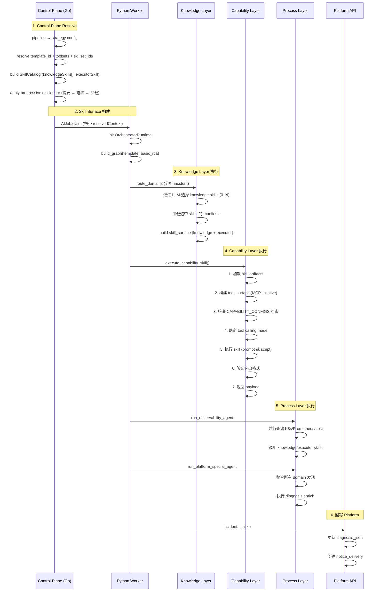

# Skills、MCP 与 LangGraph：AI RCA 的三层装配运行时深度剖析

> **系列导读**：这是 AI RCA 八篇系列的第 7 篇。前六篇分别从值班场景价值、主链路设计、控制面与执行面分层、运行时租约、告警治理、补充通知等角度，讲解了平台如何将"辅助决策"落地为"可运行、可运维、可扩展的平台级系统"。本篇深入剖析一个更本质的技术问题：**AI RCA 的能力是如何通过"知识层、能力层、流程层"的三层可装配运行时实现的？**

> **核心观点**：AI RCA 的能力不是写死在 Prompt 里，而是"知识层、能力层、流程层"的三层可装配运行时。这三层通过 Progressive Disclosure、Capability Contract、Hybrid Multi-Agent 等机制协同工作，实现了灵活性与可控性的平衡。

---

## 一、概述：三层装配的核心思想

### 1.1 一句话定义

**AI RCA 的能力不是写死在 Prompt 里，而是"知识层、能力层、流程层"的三层可装配运行时。**

这个设计通过以下机制实现：
- **Knowledge Layer（知识层）**：提供领域知识，0..N 多选，不直接产出结果
- **Capability Layer（能力层）**：定义结构化输出契约，约束工具调用，支持回退
- **Process Layer（流程层）**：通过 hybrid multi-agent 并行域调查 + 综合诊断

### 1.2 为什么需要三层架构？

**场景 1：硬编码工具调用的局限性**

```python
# ❌ 硬编码版本（不推荐）
def analyze_incident(incident):
    # 1. 查询 K8s
    k8s_events = query_k8s_pod_events(incident.pod_name)
    
    # 2. 查询 Prometheus
    metrics = query_prometheus_metrics(incident.service)
    
    # 3. 查询 Loki
    logs = query_loki_logs(incident.service)
    
    # 4. 调用 LLM
    diagnosis = llm.generate_diagnosis(
        prompt=f"""
        请分析以下问题：
        K8s Events: {k8s_events}
        Metrics: {metrics}
        Logs: {logs}
        """
    )
    
    return diagnosis
```

**问题**：
- 无法扩展：添加新数据源需要修改代码
- 无法复用：不同团队的策略需要重复代码
- 无法演进：调整 Prompt 需要重新部署

**场景 2：三层装配的解决方案**

```python
# ✅ 三层装配版本
def analyze_incident_with_skills(incident):
    # Knowledge Layer: 自动加载相关知识
    # - elasticsearch.evidence.plan（ES 查询知识）
    # - prometheus.evidence.plan（指标查询知识）
    # - 通过 LLM 选择需要的知识（0..N 多选）
    
    # Capability Layer: 执行能力契约
    # - capability: evidence.plan
    # - contract: 定义输出格式
    # - constraints: 允许的工具、最大调用次数
    # - 通过 SkillCoordinator 执行
    
    # Process Layer: Hybrid multi-agent
    # - route_domains: 路由到相关域
    # - run_observability_agent: 并行调查观测数据
    # - run_platform_special_agent: 综合诊断
    
    skill_result = runtime.execute_capability_skill(
        capability="evidence.plan",
        input_payload={"incident": incident},
        stage_summary={"findings": []}
    )
    
    return skill_result.payload
```

**优势**：
- 可扩展：新增 Skill 不需要修改平台代码
- 可复用：不同团队可以共享 Knowledge Skills
- 可演进：通过 platform binding 控制灰度发布

### 1.3 当前默认路径：Hybrid Multi-Agent

**架构图**：
```
basic_rca (LangGraph Graph)
│
├── route_domains (路由节点)
│   └── 分析 incident，分配任务给 domain agents
│
├── run_observability_agent (观测域调查)
│   ├── 查询 K8s Events
│   ├── 查询 Prometheus 指标
│   ├── 查询 Loki 日志
│   ├── 使用 Skills 丰富发现（knowledge + executor）
│   └── 返回观测发现
│
├── run_change_agent (变更域调查)
│   ├── 查询最近变更记录
│   ├── 查询发布记录
│   └── 返回变更发现
│
├── run_knowledge_agent (知识域调查)
│   ├── 查询知识库
│   ├── 查询最佳实践
│   └── 返回知识发现
│
├── merge_domain_findings (合并域发现)
│
├── merge_evidence (合并证据)
│
└── run_platform_special_agent (综合诊断)
    ├── 整合所有 domain 的发现
    ├── 使用 Skills 丰富诊断（diagnosis.enrich）
    └── 回写到 Incident
```

**代码实现**：
```python
# orchestrator/langgraph/templates/basic_rca.py:27
def build_basic_rca_graph(
    runtime: OrchestratorRuntime,
    cfg: OrchestratorConfig,
):
    """Build the basic RCA graph with hybrid multi-agent."""
    
    builder = StateGraph(GraphState)
    
    # Nodes
    builder.add_node("load_job_and_start", ...)
    builder.add_node("route_domains", ...)  # Route Agent
    builder.add_node("run_observability_agent", ...)  # Observability Domain
    builder.add_node("run_change_agent", ...)  # Change Domain
    builder.add_node("run_knowledge_agent", ...)  # Knowledge Domain
    builder.add_node("merge_domain_findings", ...)
    builder.add_node("merge_evidence", ...)
    builder.add_node("run_platform_special_agent", ...)  # Platform Special Agent
    builder.add_node("summarize_diagnosis_agentized", ...)
    builder.add_node("quality_gate", ...)
    builder.add_node("summarize_diagnosis", ...)
    builder.add_node("finalize_job", ...)
    
    # Edges
    builder.add_edge(START, "load_job_and_start")
    builder.add_edge("load_job_and_start", "route_domains")
    builder.add_edge("route_domains", "run_observability_agent")
    builder.add_edge("run_observability_agent", "run_change_agent")
    builder.add_edge("run_change_agent", "run_knowledge_agent")
    builder.add_edge("run_knowledge_agent", "merge_domain_findings")
    builder.add_edge("merge_domain_findings", "merge_evidence")
    builder.add_edge("merge_evidence", "run_platform_special_agent")
    builder.add_edge("run_platform_special_agent", "summarize_diagnosis_agentized")
    builder.add_edge("summarize_diagnosis_agentized", "quality_gate")
    builder.add_edge("quality_gate", "summarize_diagnosis")
    builder.add_edge("summarize_diagnosis", "finalize_job")
    builder.add_edge("finalize_job", END)
    
    return builder.compile()
```

---

## 二、三层装配的完整链路：从 Strategy 到 Execution

### 2.0 三层装配架构图

**完整装配时序图**（Control-Plane → Runtime）：



**三层架构静态视图**：

```mermaid
graph TB
    subgraph Control-Plane[Control-Plane (Go API Server)"]
        direction TB
        CP1["pipeline → strategy config"]
        CP2["template_id + toolsets + skillset_ids"]
        CP3["SkillCatalog 构建"]
        CP1 --> CP2 --> CP3
    end
    
    subgraph KnowledgeLayer["Knowledge Layer (知识层)"]
        direction TB
        K1["Knowledge Skills (0..N 多选)"]
        K2["渐进披露机制"]
        K3["Skill Surface 构建"]
        K1 --> K2 --> K3
    end
    
    subgraph CapabilityLayer["Capability Layer (能力层)"]
        direction TB
        C1["CAPABILITY_CONFIGS 约束"]
        C2["7 步执行流程"]
        C3["Tool Calling Modes"]
        C4["Prompt vs Script 模式"]
        C1 --> C2 --> C3 --> C4
    end
    
    subgraph ProcessLayer["Process Layer (流程层)"]
        direction TB
        P1["Route Agent (智能路由)"]
        P2["Domain Agents (域调查)"]
        P3["Platform Special Agent (综合诊断)"]
        P1 --> P2 --> P3
    end
    
    subgraph Runtime["LangGraph Runtime (basic_rca)"]
        direction TB
        R1["route_domains"]
        R2["run_observability_agent"]
        R3["run_change_agent"]
        R4["run_knowledge_agent"]
        R5["run_platform_special_agent"]
        R1 --> R2 --> R3 --> R4 --> R5
    end
    
    CP3 --> KnowledgeLayer
    KnowledgeLayer --> CapabilityLayer
    CapabilityLayer --> ProcessLayer
    ProcessLayer --> Runtime
```

**关键边界说明**：

| 边界 | 左侧 | 右侧 | 边界机制 |
|------|------|------|----------|
| Control-Plane / Runtime | Go API Server | Python Worker | AIJob.claim + resolvedContext |
| Knowledge / Capability | Knowledge Skills | Capability Contract | Progressive Disclosure |
| Capability / Process | execute_capability_skill() | LangGraph Nodes | SkillCoordinator |
| Process / Platform | Diagnosis 生成 | Incident 回写 | Platform API |

---

## 二、三层装配的完整链路：从 Strategy 到 Execution

### 2.1 Control-Plane：Strategy Resolve 链路

**核心原则**：Platform Ownership - 平台拥有真相

**链路流程**：
```
pipeline (prod-default)
  ↓
strategy resolve (control-plane)
  ↓
template_id: "basic_rca"
toolsets: [
  { provider_type: "mcp", mcp_servers: [...] },
  ...
]
skillset_ids: ["skillset-elasticsearch-rca-v1", "skillset-prometheus-rca-v1"]
  ↓
resolve_skillsets (control-plane)
  ↓
skillset-elasticsearch-rca-v1:
  skills: [
    {
      skillID: "elasticsearch-evidence-plan",
      version: "v1",
      artifactURL: "https://storage.googleapis.com/skills/elasticsearch-evidence-plan-v1.tar.gz",
      bundleDigest: "sha256:abc123...",
      manifestJSON: '{"name":"Elasticsearch Evidence Plan","description":"...","compatibility":"claude_skill_v1"}',
      capability: "evidence.plan",
      role: "knowledge",
      executorMode: "",
      allowedTools: [],
      priority: 100,
      enabled: true
    }
  ]
skillset-prometheus-rca-v1:
  skills: [
    {
      skillID: "prometheus-evidence-plan",
      version: "v1",
      capability: "evidence.plan",
      role: "knowledge",
      priority: 100,
      enabled: true
    },
    {
      skillID: "claude-evidence-prompt-planner",
      version: "v1",
      capability: "evidence.plan",
      role: "executor",
      executorMode: "prompt",
      allowedTools: ["mcp.query_metrics", "mcp.query_logs"],
      priority: 200,  # 更高优先级
      enabled: true
    }
  ]
  ↓
下发到 runtime (AIJob.agent_context_json)
```

**关键代码**：
```go
// internal/apiserver/pkg/skill/resolve.go
func ResolveSkillsets(ctx context.Context, st store.IStore, pipeline string) (*model.SkillsetResolution, error) {
    // 1. 查询 pipeline 绑定的 skillset_ids
    strategy, err := st.Strategy().FindByPipeline(ctx, pipeline)
    if err != nil {
        return nil, err
    }
    
    // 2. 解析 skillset_ids
    skillsetIDs := strategy.SkillsetIDs
    if len(skillsetIDs) == 0 {
        return &model.SkillsetResolution{}, nil
    }
    
    // 3. 查询每个 skillset 的详细信息
    skillsets := make([]*model.SkillsetM, 0, len(skillsetIDs))
    for _, skillsetID := range skillsetIDs {
        skillset, err := st.Skillset().FindByID(ctx, skillsetID)
        if err != nil {
            return nil, err
        }
        skillsets = append(skillsets, skillset)
    }
    
    // 4. 构建 resolution
    resolution := &model.SkillsetResolution{
        Skillsets: skillsets,
    }
    
    return resolution, nil
}
```

**为什么这样设计**？
- **Platform Ownership**：平台控制真相，Skills 只是能力封装
- **灰度发布**：通过 strategy 绑定控制流量分配
- **版本管理**：skillset 绑定明确的 version，支持回滚
- **权限控制**：allowedTools 在 binding 层定义，不是 Skill 本体

### 2.2 Runtime：SkillCatalog 构建

**核心职责**：从 control-plane 下发的 skillset 构建只读的 SkillCatalog

**代码实现**：
```python
# orchestrator/skills/runtime.py:335
def from_resolved_skillsets(
    self,
    *,
    skillsets_payload: list[dict[str, Any]] | None,
    cache_dir: str,
    local_override_paths: list[str] | None = None,
    bundle_timeout_s: float = 15.0,
) -> "SkillCatalog":
    """Build SkillCatalog from resolved skillsets (from platform)."""
    catalog = cls(
        cache_dir=cache_dir,
        local_override_paths=local_override_paths,
        bundle_timeout_s=bundle_timeout_s,
    )
    
    # Step 1: Load remote skillsets
    catalog._load_remote_skillsets(skillsets_payload or [])
    
    # Step 2: Apply local overrides (for development)
    catalog._apply_local_overrides()
    
    return catalog
```

#### 2.2.1 Step 1: 下载并校验 Bundle

```python
def _load_remote_skillsets(self, skillsets_payload: list[dict[str, Any]]) -> None:
    """Download and verify skill bundles from platform."""
    for skillset_item in skillsets_payload:
        if not isinstance(skillset_item, dict):
            continue
        
        skillset_id = _trim(
            skillset_item.get("skillsetID") or skillset_item.get("skillsetId") or skillset_item.get("skillset_id")
        )
        if skillset_id:
            self._skillset_ids.append(skillset_id)
        
        raw_skills = skillset_item.get("skills")
        if not isinstance(raw_skills, list):
            continue
        
        for skill_payload in raw_skills:
            if not isinstance(skill_payload, dict):
                continue
            
            # Extract from skill payload
            skill_id = _trim(skill_payload.get("skillID") or skill_payload.get("skillId") or skill_payload.get("skill_id"))
            version = _trim(skill_payload.get("version"))
            manifest_json = skill_payload.get("manifestJSON") or skill_payload.get("manifest_json")
            
            if not isinstance(manifest_json, str) or not manifest_json.strip():
                raise RuntimeError("resolved skill is missing manifestJSON")
            
            # Parse summary from manifest envelope
            summary = SkillSummary.from_envelope(manifest_json, skill_id=skill_id, version=version)
            
            # Parse binding from platform (not from Skill itself!)
            binding = SkillBinding.from_payload(skill_payload)
            
            if not binding.enabled:
                continue
            
            # Build binding key: skill_id\x00version\x00capability\x00role
            binding_key = _binding_key(
                summary.skill_id,
                summary.version,
                binding.capability,
                binding.role
            )
            
            if binding_key in self._skills:
                raise RuntimeError(f"duplicate resolved skill binding: {binding_key}")
            
            # Download bundle
            artifact_url = _trim(skill_payload.get("artifactURL") or skill_payload.get("artifact_url"))
            bundle_digest = _trim(skill_payload.get("bundleDigest") or skill_payload.get("bundle_digest"))
            
            root_dir = prepare_bundle(
                self._cache_dir,
                artifact_url=artifact_url,
                bundle_digest=bundle_digest,
                timeout_s=self._bundle_timeout_s,
            )
            
            # Verify bundle summary
            self._validate_bundle_summary(root_dir, expected_summary=summary)
            
            # Build CatalogSkill
            item = CatalogSkill(
                summary=summary,
                binding=binding,
                root_dir=root_dir,
                source="registry",
                artifact_url=artifact_url,
                bundle_digest=bundle_digest,
            )
            
            self._skills[binding_key] = item
            self._skill_ids.setdefault(summary.skill_id, []).append(binding_key)
```

**关键点**：
1. **只读取 SKILL.md frontmatter**：不加载完整内容，避免浪费
2. **binding_key 格式**：`skill_id\x00version\x00capability\x00role`
3. **本地缓存**：digest 校验，避免重复下载
4. **支持本地覆盖**：开发时可以用本地路径覆盖远程 bundle

#### 2.2.2 Step 2: 本地覆盖（开发模式）

```python
def _apply_local_overrides(self) -> None:
    """Apply local skill bundle overrides for development."""
    if not self._skills:
        return
    
    for raw_path in self._local_override_paths:
        base = Path(raw_path).expanduser()
        if not base.exists():
            continue
        
        # Find matching skill directories
        candidates: list[Path]
        if (base / _DEFAULT_INSTRUCTION_FILE).exists():
            candidates = [base]
        else:
            candidates = [
                item for item in base.iterdir()
                if item.is_dir() and (item / _DEFAULT_INSTRUCTION_FILE).exists()
            ]
        
        for skill_dir in candidates:
            skill_id = _trim(skill_dir.name)
            if not skill_id:
                continue
            
            binding_keys = self._skill_ids.get(skill_id) or []
            for binding_key in binding_keys:
                existing = self._skills[binding_key]
                # Replace root_dir with local path
                self._skills[binding_key] = replace(
                    existing,
                    root_dir=skill_dir,
                    source="local_override"
                )
                self._resource_summaries.pop(binding_key, None)
```

**使用场景**：
```bash
# 开发时本地覆盖
export SKILLS_LOCAL_PATHS="/Users/zhanjie/workspace/skill-bundles"

# runtime 会优先使用本地路径下的 skill bundles
```

### 2.3 Runtime：ResolvedAgentContext 传递

**核心职责**：将 control-plane resolve 的上下文传递给 runtime

**数据结构**：
```python
# orchestrator/runtime/resolved_context.py:59
@dataclass(frozen=True)
class ResolvedAgentContext:
    """Unified agent input context.
    
    This is the single source of truth for agent execution context,
    assembled at claim time and passed from platform to worker.
    """
    
    job_id: str
    pipeline: str
    template_id: str
    session_snapshot: dict[str, Any] = field(default_factory=dict)
    tool_surface: ToolSurface = field(default_factory=ToolSurface)
    skill_surface: SkillSurface = field(default_factory=SkillSurface)
    platform_hints: dict[str, Any] = field(default_factory=dict)
    run_policies: dict[str, Any] = field(default_factory=dict)
```

**ToolSurface vs SkillSurface**：
```python
@dataclass(frozen=True)
class ToolSurface:
    """Tool surface summary built from resolved_tool_providers."""
    tool_catalog_snapshot: dict[str, Any] = field(default_factory=dict)
    # 包含：工具列表、工具元数据、工具分组

@dataclass(frozen=True)
class SkillSurface:
    """Skill surface summary built from skillsets."""
    skill_ids: list[str] = field(default_factory=list)
    capability_map: dict[str, list[str]] = field(default_factory=dict)
    domain_tags: list[str] = field(default_factory=list)
    surface_mode: str = ""
    resource_priority: int = 100
    # 包含：skill IDs、capability 映射、domain 标签
```

**JSON 序列化**：
```python
def to_dict(self) -> dict[str, Any]:
    return {
        "job_id": self.job_id,
        "pipeline": self.pipeline,
        "template_id": self.template_id,
        "session_snapshot": self.session_snapshot,
        "tool_surface": self.tool_surface.to_dict(),
        "skill_surface": self.skill_surface.to_dict(),
        "platform_hints": self.platform_hints,
        "run_policies": self.run_policies,
    }

def to_json(self) -> str:
    import json
    return json.dumps(self.to_dict(), ensure_ascii=False)

@classmethod
def from_json(cls, raw: str) -> "ResolvedAgentContext":
    import json
    data = json.loads(raw)
    
    # Parse tool_surface
    tool_surface_data = data.get("tool_surface", {})
    tool_catalog_snapshot = tool_surface_data.get("tool_catalog_snapshot", {})
    
    if not tool_catalog_snapshot and "tools" in tool_surface_data:
        tools_list = tool_surface_data.get("tools", [])
        if isinstance(tools_list, list):
            tool_catalog_snapshot = {"tools": tools_list}
    
    tool_surface = ToolSurface(tool_catalog_snapshot=tool_catalog_snapshot)
    
    # Parse skill_surface
    skill_surface_data = data.get("skill_surface", {})
    skill_surface = SkillSurface(
        skill_ids=skill_surface_data.get("skill_ids", []),
        capability_map=skill_surface_data.get("capability_map", {}),
        domain_tags=skill_surface_data.get("domain_tags", []),
        surface_mode=str(skill_surface_data.get("surface_mode", "")),
        resource_priority=skill_surface_data.get("resource_priority", 100),
    )
    
    return cls(
        job_id=str(data.get("job_id", "")),
        pipeline=str(data.get("pipeline", "")),
        template_id=str(data.get("template_id", "")),
        session_snapshot=data.get("session_snapshot", {}) or {},
        tool_surface=tool_surface,
        skill_surface=skill_surface,
        platform_hints=data.get("platform_hints", {}) or {},
        run_policies=data.get("run_policies", {}) or {},
    )
```

**示例：skill_surface 的内容**：
```json
{
  "skill_ids": [
    "elasticsearch-evidence-plan",
    "prometheus-evidence-plan",
    "claude-evidence-prompt-planner"
  ],
  "capability_map": {
    "evidence.plan": [
      "elasticsearch-evidence-plan@v1:knowledge",
      "prometheus-evidence-plan@v1:knowledge",
      "claude-evidence-prompt-planner@v1:executor"
    ]
  },
  "domain_tags": ["observability", "database"],
  "surface_mode": "",
  "resource_priority": 100
}
```

---

## 三、Knowledge Layer 深度剖析

### 3.1 Knowledge Skills 的定位与职责

**核心定位**：上下文提供者，不直接产出结果

**职责**：
- ✅ 提供领域知识（查询模板、判断标准、最佳实践）
- ✅ 提供参考资料（references）
- ✅ 提供模板示例（templates）
- ✅ 提供使用案例（examples）
- ❌ 不产出 payload
- ❌ 不调用工具
- ❌ 不修改平台状态

**为什么需要 Knowledge Skills**？
- **问题 1**：Agent 需要知道领域知识
  - 如何查询 ES 慢日志？
  - 如何判断连接池是否耗尽？
  - 如何生成诊断报告？
- **问题 2**：知识需要复用
  - 多个 executor 可以使用相同的 knowledge
  - 不同的 capability 可以共享 knowledge
- **问题 3**：知识需要演进
  - 通过 platform binding 控制版本
  - 支持灰度发布和回滚

### 3.2 Knowledge Skills 的实现形态

**核心文件**：`SKILL.md`

```markdown
# elasticsearch-evidence-plan/SKILL.md
---
name: Elasticsearch Evidence Plan
description: Elasticsearch 查询知识，包括慢日志、错误日志查询模板
capability: evidence.plan
role: knowledge
compatibility: claude_skill_v1
---

## 知识摘要

本 Skill 提供 Elasticsearch 查询的知识：
- 慢日志查询模板（log.level=WARN + message 包含 "slow"）
- 错误日志查询模板（log.level=ERROR）
- 性能指标查询模板

## 查询模板

### 慢日志查询

```json
{
  "index": "app-logs-*",
  "query": {
    "bool": {
      "must": [
        { "match": { "service": "{{service}}" } },
        { "range": { "@timestamp": { "gte": "{{start_time}}", "lte": "{{end_time}}" } } }
      ],
      "filter": [
        { "term": { "log.level": "WARN" } },
        { "wildcard": { "message": "*slow*" } }
      ]
    }
  },
  "size": 100
}
```

### 错误日志查询

```json
{
  "index": "app-logs-*",
  "query": {
    "bool": {
      "must": [
        { "match": { "service": "{{service}}" } },
        { "range": { "@timestamp": { "gte": "{{start_time}}", "lte": "{{end_time}}" } } }
      ],
      "filter": [
        { "term": { "log.level": "ERROR" } }
      ]
    }
  },
  "size": 100
}
```

## 使用示例

Agent 可以引用本 Skill 提供的模板，填入具体参数后执行查询。

## 关键字段说明

- `log.level`: 日志级别（WARN/ERROR/INFO）
- `service`: 服务名称
- `@timestamp`: 时间范围
- `message`: 日志内容（支持通配符）
```

**特点**：
1. **纯文本**：只包含知识，不包含执行逻辑
2. **Frontmatter 定义**：capability、role 在 binding 层定义，不在 Skill 本体
3. **Agent 驱动**：Agent 读取后作为上下文使用，不自动执行

### 3.3 Resources：渐进披露机制

**资源类型**：
- `references/`：参考资料（判断标准、最佳实践）
- `templates/`：模板示例（报告模板、查询模板）
- `examples/`：使用示例（成功案例、失败案例）

**目录结构**：
```
elasticsearch-evidence-plan/
├── SKILL.md                    # 核心知识文件
├── references/
│   ├── slow-log-query.md       # 慢日志查询指南
│   └── error-log-query.md      # 错误日志查询指南
├── templates/
│   └── query-template.md       # 通用查询模板
└── examples/
    ├── successful-case.md      # 成功案例
    └── failed-case.md          # 失败案例
```

**渐进披露流程**：
```
1. Agent 读取 SKILL.md frontmatter（摘要）
   ↓
2. Agent 选择是否需要加载完整 Skill
   ↓
3. 如果需要，加载完整 SKILL.md
   ↓
4. Agent 扫描 available resources 列表
   ↓
5. Agent 选择需要的 resources（最多 3 个）
   ↓
6. runtime 加载选中的 resources
```

**代码实现**：
```python
# orchestrator/runtime/skill_coordinator.py:271
def _load_skill_resources_with_selection(
    self,
    binding_key: str,
    ctx: SkillExecutionContext,
) -> list[dict[str, Any]]:
    """Select and load resources for a skill binding."""
    
    # Step 1: Scan available resources
    summaries = self._catalog.list_skill_resources(binding_key)
    # Scans: references/, templates/, examples/
    # Returns: list of SkillResourceSummary
    
    # Example summaries:
    # [
    #   {
    #     "resource_id": "references/slow-log-query.md",
    #     "resource_kind": "reference",
    #     "title": "慢日志查询指南",
    #     "preview": "慢日志的判断标准：响应时间 > 100ms...",
    #     "path": "references/slow-log-query.md",
    #     "size_bytes": 12345
    #   },
    #   {
    #     "resource_id": "templates/query-template.md",
    #     "resource_kind": "template",
    #     "title": "通用查询模板",
    #     "preview": "本模板适用于大多数 ES 查询场景...",
    #     "path": "templates/query-template.md",
    #     "size_bytes": 8765
    #   }
    # ]
    
    if not summaries:
        return []
    
    # Step 2: Agent selects resources (if configured)
    if not self._agent.configured:
        return []
    
    # Build skill document (full SKILL.md)
    skill_document = self._catalog.load_skill_document(binding_key)
    
    # Parse binding_key to get skill_id and version
    parts = binding_key.split("\x00")
    skill_id = parts[0] if len(parts) > 0 else ""
    skill_version = parts[1] if len(parts) > 1 else ""
    role = parts[3] if len(parts) > 3 else "executor"
    
    # Agent selects resources
    selection = self._agent.select_skill_resources(
        capability=ctx.capability,
        skill_id=skill_id,
        skill_version=skill_version,
        role=role,
        skill_document=skill_document,  # Full SKILL.md
        stage_summary=ctx.stage_summary,
        available_resources=[s.to_dict() for s in summaries],
        knowledge_context=ctx.knowledge_context,
    )
    # selection = SkillResourceSelectionResult(
    #   selected_resource_ids=["references/slow-log-query.md", "templates/query-template.md"],
    #   reason="These resources are relevant for slow log analysis"
    # )
    
    # Step 3: Load selected resources
    loaded = self._catalog.load_skill_resources(
        binding_key,
        selection.selected_resource_ids,  # Max 3 resources
    )
    
    # Constraints:
    # - Max 3 resources per skill
    # - Max 32KB per resource
    # - Only .md/.txt/.json/.yaml/.yml
    
    return [r.to_dict() for r in loaded]
```

**为什么渐进披露**？
- **Token 消耗控制**：避免加载所有 resources 导致 token 超限
- **精准选择**：Agent 可以根据当前任务选择最相关的 resources
- **性能优化**：只加载需要的内容，减少 I/O

**约束机制**：
```python
_MAX_RESOURCE_BYTES = 32 * 1024  # 32KB per resource
_RESOURCE_PREVIEW_MAX_CHARS = 240  # Preview max length
_SUPPORTED_RESOURCE_SUFFIXES = {".md", ".txt", ".json", ".yaml", ".yml"}

def _resource_kind_and_id(root_dir: Path, path: Path) -> tuple[str, str] | None:
    try:
        size_bytes = int(path.stat().st_size)
    except OSError:
        return None
    
    if size_bytes <= 0 or size_bytes > _MAX_RESOURCE_BYTES:
        return None  # Too large, skip
    
    # ... rest of validation
```

### 3.4 Knowledge Skills 的多选机制

**设计**：同一 capability 下允许 0..N 个多选

**代码实现**：
```python
# orchestrator/skills/runtime.py:410
def knowledge_candidates_for_capability(self, capability: str) -> list[SkillCandidate]:
    """Get knowledge skill candidates for a capability."""
    return [item for item in self.candidates_for_capability(capability) if item.role == "knowledge"]

def executor_candidates_for_capability(self, capability: str) -> list[SkillCandidate]:
    """Get executor skill candidates for a capability."""
    return [item for item in self.candidates_for_capability(capability) if item.role != "knowledge"]
```

**选择逻辑**：
```python
# orchestrator/runtime/skill_coordinator.py:171
# Step 2: Select knowledge skills (LLM-driven)
if knowledge_candidates and self._agent.configured:
    knowledge_result = self._agent.select_knowledge_skills(
        capability=capability,
        stage=capability,
        stage_summary=stage_summary,
        candidates=[c.to_summary_dict() for c in knowledge_candidates],
    )
    # knowledge_result = KnowledgeSelectionResult(
    #   selected_binding_keys=[
    #     "elasticsearch-evidence-plan\x00v1\x00evidence.plan\x00knowledge",
    #     "prometheus-evidence-plan\x00v1\x00evidence.plan\x00knowledge"
    #   ],
    #   reason="Both ES and Prometheus knowledge are relevant for this incident"
    # )
    
    ctx.knowledge_context = [
        {"binding_key": bk, "role": "knowledge"}
        for bk in knowledge_result.selected_binding_keys
    ]

# Step 3: Load knowledge skill resources (progressive disclosure)
for kc in ctx.knowledge_context:
    binding_key = kc["binding_key"]
    resources = self._load_skill_resources_with_selection(binding_key, ctx)
    kc["resources"] = resources
```

**为什么可以多选**？
- **知识互补**：ES + Prometheus 知识可以一起使用
- **无冲突**：Knowledge Skills 只提供上下文，不修改状态
- **可复用**：多个 executor 可以使用相同的 knowledge

### 3.5 Knowledge vs Executor 的职责分离

| 维度 | Knowledge Skills | Executor Skill |
|------|-----------------|----------------|
| **数量** | 0..N（多选） | 0..1（单选） |
| **职责** | 提供上下文 | 负责最终输出 |
| **产出** | 无（只进入上下文） | 有（payload/session_patch） |
| **工具调用** | 否 | 是（如果 capability 允许） |
| **示例** | elasticsearch.evidence.plan | claude.evidence.prompt_planner |

**为什么分离**？
```
场景：evidence.plan

knowledge skills：
  - elasticsearch.evidence.plan：提供 ES 查询知识
  - prometheus.evidence.plan：提供 Prometheus 查询知识

executor skill：
  - claude.evidence.prompt_planner：整合知识，生成查询计划

好处：
  - 知识可以复用（多个 executor 可以使用相同的 knowledge）
  - 执行逻辑独立（可以替换 executor，不影响 knowledge）
  - 易于测试（knowledge 和 executor 可以分别测试）
```

---

---

## 四、Capability Layer 深度剖析

### 4.1 Capability Layer 的定位与职责

**核心定位**：结构化输出的契约，定义能力执行的约束边界

**职责**：
- ✅ 定义输出格式（capability contract）
- ✅ 定义工具约束（allowed_tools、max_tool_calls）
- ✅ 定义回退行为（fallback）
- ✅ 定义执行模式（prompt/script）

**限制**：
- ❌ 不限制实现方式（prompt/script 均可）
- ❌ 不持有平台状态
- ❌ 不直接执行工具（通过 runtime 执行）

**为什么需要 Capability Layer**？

**场景 1：输出格式统一**

```
问题：不同的 Skill 可能返回不同的格式

没有能力层：
  Skill A: { "root_cause": "xxx", "confidence": 0.8 }
  Skill B: { "diagnosis": { "cause": "xxx", "score": 80 } }
  Skill C: "Root cause is xxx (confidence 80%)"

问题：
  - 平台无法统一解析
  - 难以聚合多个 Skill 的输出
  - 难以保证向后兼容

有能力层：
  capability: diagnosis.enrich
  contract: {
    "confidence": float (0-1),
    "root_cause_summary": string,
    "evidence_ids": [string],
    "missing_evidence": [string]
  }

好处：
  - 输出格式统一
  - 平台可以统一解析
  - 易于聚合和验证
```

**场景 2：工具约束**

```
问题：Skill 可能滥用工具

没有能力层：
  - Skill 可以调用任意工具
  - 可能调用危险工具（如删除数据）
  - 可能超出权限范围

有能力层：
  capability: evidence.plan
  allowed_tools: ["mcp.query_metrics", "mcp.query_logs"]
  max_tool_calls: 2

好处：
  - 工具调用受控
  - 安全边界明确
  - 审计可追溯
```

**场景 3：回退行为**

```
问题：Skill 执行失败时如何处理？

没有能力层：
  - 失败直接抛出异常
  - 整个流程中断
  - 值班员无法获得任何信息

有能力层：
  capability: diagnosis.enrich
  require_executor: false  # 可以回退到 native

好处：
  - 失败不影响整体流程
  - 有保底方案
  - 用户体验可控
```

### 4.2 Capability Registry：平台级配置

**代码实现**：
```python
# orchestrator/runtime/skill_coordinator.py:79
@dataclass
class CapabilityConfig:
    """Configuration for capability execution."""
    capability: str
    allow_tool_calling: bool = False
    max_tool_calls: int = 2
    allowed_tools: list[str] | None = None
    require_executor: bool = False

# Capability registry - 平台级配置
CAPABILITY_CONFIGS: dict[str, CapabilityConfig] = {
    "evidence.plan": CapabilityConfig(
        capability="evidence.plan",
        allow_tool_calling=True,
        max_tool_calls=2,
        allowed_tools=["mcp.query_metrics", "mcp.query_logs"],
        require_executor=False,  # 可以回退到 native
    ),
    "diagnosis.enrich": CapabilityConfig(
        capability="diagnosis.enrich",
        allow_tool_calling=False,  # 不允许工具调用
        require_executor=False,
    ),
}
```

**字段说明**：

| 字段 | 类型 | 默认值 | 说明 |
|------|------|--------|------|
| `capability` | str | - | 能力名称（如 `evidence.plan`） |
| `allow_tool_calling` | bool | False | 是否允许工具调用 |
| `max_tool_calls` | int | 2 | 最大工具调用次数 |
| `allowed_tools` | list[str] | None | 允许的工具列表 |
| `require_executor` | bool | False | 是否必须有 executor（否则回退） |

**设计价值**：
- **平台控制**：Capability 配置在平台代码中，不在 Skill bundle 中
- **安全边界**：即使 Skill bundle 被篡改，工具约束仍然有效
- **可观测性**：所有 capability 的行为可以通过代码审计

### 4.3 SkillCoordinator.execute_capability_skill() 的 7 步流程

**核心方法**：这是 Capability Layer 的执行入口

**完整代码**：
```python
# orchestrator/runtime/skill_coordinator.py:128
def execute_capability_skill(
    self,
    capability: str,
    input_payload: dict[str, Any],
    stage_summary: dict[str, Any],
) -> SkillExecutionResult:
    """Execute a capability skill with full coordination.
    
    Implements the progressive disclosure pattern:
    Summary → Selection → Resource Loading → Execution
    """
    # Step 1: Get capability config
    config = CAPABILITY_CONFIGS.get(capability)
    if config is None:
        return SkillExecutionResult(
            success=False,
            error_message=f"unknown capability: {capability}",
        )
    
    # Step 2: Get candidates from catalog
    knowledge_candidates = self._catalog.knowledge_candidates_for_capability(capability)
    executor_candidates = self._catalog.executor_candidates_for_capability(capability)
    
    # Validate executor availability
    if not executor_candidates and config.require_executor:
        return SkillExecutionResult(
            success=False,
            error_message=f"no executor candidates for {capability}",
        )
    
    # Build execution context
    ctx = SkillExecutionContext(
        capability=capability,
        input_payload=input_payload,
        stage_summary=stage_summary,
    )
    
    # Step 3: Select knowledge skills (LLM-driven, 0..N)
    if knowledge_candidates and self._agent.configured:
        knowledge_result = self._agent.select_knowledge_skills(
            capability=capability,
            stage=capability,
            stage_summary=stage_summary,
            candidates=[c.to_summary_dict() for c in knowledge_candidates],
        )
        ctx.knowledge_context = [
            {"binding_key": bk, "role": "knowledge"}
            for bk in knowledge_result.selected_binding_keys
        ]
    
    # Step 4: Load knowledge skill resources (progressive disclosure)
    for kc in ctx.knowledge_context:
        binding_key = kc["binding_key"]
        try:
            resources = self._load_skill_resources_with_selection(binding_key, ctx)
            kc["resources"] = resources
        except Exception:
            kc["resources"] = []  # Graceful degradation
    
    # Step 5: Select executor skill (LLM-driven, 0..1)
    selected_binding_key = ""
    if executor_candidates and self._agent.configured:
        executor_result = self._agent.select_skill(
            capability=capability,
            stage=capability,
            stage_summary=stage_summary,
            candidates=[c.to_summary_dict() for c in executor_candidates],
        )
        selected_binding_key = executor_result.selected_binding_key
    
    # Handle no executor selected (fallback)
    if not selected_binding_key:
        return SkillExecutionResult(
            success=True,
            fallback_used=True,
            error_message="no skill selected, using native implementation",
            selected_knowledge_binding_keys=[
                kc["binding_key"] for kc in ctx.knowledge_context
            ],
        )
    
    # Step 6: Load executor skill resources (progressive disclosure)
    try:
        executor_resources = self._load_skill_resources_with_selection(
            selected_binding_key, ctx
        )
    except Exception:
        executor_resources = []
    
    # Step 7: Get executor candidate info
    executor_candidate = next(
        (c for c in executor_candidates if c.binding_key == selected_binding_key),
        None
    )
    if executor_candidate is None:
        return SkillExecutionResult(
            success=False,
            error_message=f"executor candidate not found: {selected_binding_key}",
        )
    
    # Step 8: Execute based on executor_mode (prompt or script)
    try:
        if executor_candidate.executor_mode == "script":
            result = self._execute_script(
                binding_key=selected_binding_key,
                executor_candidate=executor_candidate,
                input_payload=input_payload,
                ctx=ctx,
                config=config,
                executor_resources=executor_resources,
            )
        else:  # prompt
            result = self._execute_prompt(
                binding_key=selected_binding_key,
                executor_candidate=executor_candidate,
                input_payload=input_payload,
                ctx=ctx,
                config=config,
                executor_resources=executor_resources,
            )
        
        # Attach binding keys to result
        result.selected_executor_binding_key = selected_binding_key
        result.selected_knowledge_binding_keys = [
            kc["binding_key"] for kc in ctx.knowledge_context
        ]
        return result
        
    except Exception as e:
        return SkillExecutionResult(
            success=False,
            error_message=str(e),
            selected_executor_binding_key=selected_binding_key,
            selected_knowledge_binding_keys=[
                kc["binding_key"] for kc in ctx.knowledge_context
            ],
        )
```

#### 4.3.1 Step 1-2：获取配置与候选列表

```python
# Step 1: Get capability config
config = CAPABILITY_CONFIGS.get(capability)
if config is None:
    return SkillExecutionResult(
        success=False,
        error_message=f"unknown capability: {capability}",
    )

# Step 2: Get candidates from catalog
knowledge_candidates = self._catalog.knowledge_candidates_for_capability(capability)
executor_candidates = self._catalog.executor_candidates_for_capability(capability)

# Validate executor availability
if not executor_candidates and config.require_executor:
    return SkillExecutionResult(
        success=False,
        error_message=f"no executor candidates for {capability}",
    )
```

**关键点**：
- `CAPABILITY_CONFIGS` 是平台级配置，不是从 Skill bundle 读取
- 分离 knowledge 和 executor 候选列表
- 如果 `require_executor=true` 但没有 executor，直接失败

#### 4.3.2 Step 3-4：Knowledge Skills 的选择与加载

```python
# Step 3: Select knowledge skills (LLM-driven, 0..N)
if knowledge_candidates and self._agent.configured:
    knowledge_result = self._agent.select_knowledge_skills(
        capability=capability,
        stage=capability,
        stage_summary=stage_summary,
        candidates=[c.to_summary_dict() for c in knowledge_candidates],
    )
    ctx.knowledge_context = [
        {"binding_key": bk, "role": "knowledge"}
        for bk in knowledge_result.selected_binding_keys
    ]

# Step 4: Load knowledge skill resources (progressive disclosure)
for kc in ctx.knowledge_context:
    binding_key = kc["binding_key"]
    try:
        resources = self._load_skill_resources_with_selection(binding_key, ctx)
        kc["resources"] = resources
    except Exception:
        kc["resources"] = []  # Graceful degradation
```

**关键点**：
- LLM 驱动选择（0..N 多选）
- 渐进披露：先选 skill，再选 resources
- 异常处理：加载失败不影响整体流程

#### 4.3.3 Step 5-6：Executor Skill 的选择与加载

```python
# Step 5: Select executor skill (LLM-driven, 0..1)
selected_binding_key = ""
if executor_candidates and self._agent.configured:
    executor_result = self._agent.select_skill(
        capability=capability,
        stage=capability,
        stage_summary=stage_summary,
        candidates=[c.to_summary_dict() for c in executor_candidates],
    )
    selected_binding_key = executor_result.selected_binding_key

# Handle no executor selected (fallback)
if not selected_binding_key:
    return SkillExecutionResult(
        success=True,
        fallback_used=True,
        error_message="no skill selected, using native implementation",
        selected_knowledge_binding_keys=[
            kc["binding_key"] for kc in ctx.knowledge_context
        ],
    )

# Step 6: Load executor skill resources (progressive disclosure)
try:
    executor_resources = self._load_skill_resources_with_selection(
        selected_binding_key, ctx
    )
except Exception:
    executor_resources = []
```

**关键点**：
- LLM 驱动选择（0..1 单选）
- 没有选中 executor 时，回退到 native 实现（`fallback_used=true`）
- 即使回退，knowledge skills 仍然生效

#### 4.3.4 Step 7-8：执行 Executor

```python
# Step 7: Get executor candidate info
executor_candidate = next(
    (c for c in executor_candidates if c.binding_key == selected_binding_key),
    None
)
if executor_candidate is None:
    return SkillExecutionResult(
        success=False,
        error_message=f"executor candidate not found: {selected_binding_key}",
    )

# Step 8: Execute based on executor_mode (prompt or script)
try:
    if executor_candidate.executor_mode == "script":
        result = self._execute_script(...)
    else:  # prompt
        result = self._execute_prompt(...)
    
    # Attach binding keys to result
    result.selected_executor_binding_key = selected_binding_key
    result.selected_knowledge_binding_keys = [
        kc["binding_key"] for kc in ctx.knowledge_context
    ]
    return result
    
except Exception as e:
    return SkillExecutionResult(
        success=False,
        error_message=str(e),
        selected_executor_binding_key=selected_binding_key,
        selected_knowledge_binding_keys=[...],
    )
```

**关键点**：
- 支持两种执行模式：`prompt` 和 `script`
- 异常捕获，返回结构化错误信息
- 记录使用的 skill binding keys（用于审计）

### 4.4 Tool Calling 约束机制

**场景**：`evidence.plan` capability 允许工具调用，但有严格约束

**约束执行流程**：
```python
# orchestrator/runtime/skill_coordinator.py:541
def _execute_tool_calls(
    self,
    tool_calls: list[dict[str, Any]],
    config: CapabilityConfig,
    candidate: "SkillCandidate",
) -> list[dict[str, Any]]:
    """Execute tool calls with enforcement of allowed_tools and max_tool_calls."""
    
    results: list[dict[str, Any]] = []
    
    # Combine allowed tools from config and candidate
    allowed_tools = set(config.allowed_tools or []) | set(candidate.allowed_tools)
    max_calls = config.max_tool_calls
    
    executed_count = 0
    for tc in tool_calls:
        tool_name = tc.get("tool", "")
        tool_input = tc.get("input", {})
        
        # Constraint 1: Check max_tool_calls
        if executed_count >= max_calls:
            results.append({
                "tool": tool_name,
                "input": tool_input,
                "status": "rejected",
                "error": f"max_tool_calls ({max_calls}) exceeded",
            })
            continue
        
        # Constraint 2: Check allowed_tools
        if tool_name not in allowed_tools:
            results.append({
                "tool": tool_name,
                "input": tool_input,
                "status": "rejected",
                "error": f"tool '{tool_name}' not in allowed_tools: {sorted(allowed_tools)}",
            })
            continue
        
        # Execute tool
        try:
            output = self._runtime.call_tool(tool_name, tool_input)
            results.append({
                "tool": tool_name,
                "input": tool_input,
                "output": output,
                "status": "ok",
            })
            executed_count += 1
        except Exception as e:
            results.append({
                "tool": tool_name,
                "input": tool_input,
                "error": str(e),
                "status": "error",
            })
            executed_count += 1  # Count errors toward the limit too
    
    return results
```

**约束 1：max_tool_calls**
```python
if executed_count >= max_calls:
    results.append({
        "tool": tool_name,
        "status": "rejected",
        "error": f"max_tool_calls ({max_calls}) exceeded",
    })
    continue
```

**约束 2：allowed_tools**
```python
if tool_name not in allowed_tools:
    results.append({
        "tool": tool_name,
        "status": "rejected",
        "error": f"tool '{tool_name}' not in allowed_tools: {sorted(allowed_tools)}",
    })
    continue
```

**设计价值**：
- **双重校验**：config.allowed_tools ∪ candidate.allowed_tools
- **严格限制**：超过 max_tool_calls 的请求直接拒绝
- **审计追踪**：每个工具调用都有 status（ok/error/rejected）

### 4.5 Tool Calling Modes 推断逻辑

**三种模式**：
```python
# orchestrator/runtime/skill_coordinator.py:513
def _infer_tool_calling_mode(
    self,
    candidate: "SkillCandidate",
    config: CapabilityConfig,
) -> str:
    """Infer tool_calling_mode from candidate and config."""
    
    if not config.allow_tool_calling:
        return "disabled"
    
    allowed = set(candidate.allowed_tools)
    has_metrics = "mcp.query_metrics" in allowed
    has_logs = "mcp.query_logs" in allowed
    
    if has_metrics and has_logs:
        return "evidence_plan_dual_tool"  # Both logs and metrics
    elif has_logs:
        return "evidence_plan_single_hop"  # Only logs
    else:
        return "disabled"
```

**模式行为矩阵**：

| 模式 | 允许工具 | Agent 方法 | Script Executor 阶段 |
|------|----------|------------|---------------------|
| `disabled` | 无 | 不调用工具 | 直接返回 payload |
| `evidence_plan_single_hop` | `mcp.query_logs` | `plan_tool_call()` | `phase=plan_tools` → `phase=after_tools` |
| `evidence_plan_dual_tool` | `mcp.query_logs` + `mcp.query_metrics` | `plan_tool_calls()` | `phase=plan_tools` → `phase=after_tools` |

**模式 1：disabled**
```python
# 不允许工具调用
config = CapabilityConfig(
    capability="diagnosis.enrich",
    allow_tool_calling=False,
)
# → tool_calling_mode = "disabled"
# → 直接执行 prompt 或 script，不调用工具
```

**模式 2：evidence_plan_single_hop**
```python
# 只允许查询日志
config = CapabilityConfig(
    capability="evidence.plan",
    allow_tool_calling=True,
    allowed_tools=["mcp.query_logs"],
    max_tool_calls=1,
)
# → tool_calling_mode = "evidence_plan_single_hop"
# → Agent 可以计划单次 query_logs 调用
# → 预热 logs_branch_meta，后续节点复用
```

**模式 3：evidence_plan_dual_tool**
```python
# 允许查询日志和指标
config = CapabilityConfig(
    capability="evidence.plan",
    allow_tool_calling=True,
    allowed_tools=["mcp.query_metrics", "mcp.query_logs"],
    max_tool_calls=2,
)
# → tool_calling_mode = "evidence_plan_dual_tool"
# → Agent 可以计划最多 2 次工具调用（各一次）
# → 预热两个分支，后续节点复用
```

### 4.6 执行模式对比：Prompt vs Script

**Prompt Executor**：
```python
def _execute_prompt(
    self,
    binding_key: str,
    executor_candidate: "SkillCandidate",
    input_payload: dict[str, Any],
    ctx: SkillExecutionContext,
    config: CapabilityConfig,
    executor_resources: list[dict[str, Any]] | None = None,
) -> SkillExecutionResult:
    """Execute prompt executor."""
    
    # 1. Load full SKILL.md
    skill_document = self._catalog.load_skill_document(binding_key)
    
    # 2. Build prompt (knowledge context + executor resources)
    prompt = self._build_prompt(
        capability=ctx.capability,
        input_payload=input_payload,
        knowledge_context=ctx.knowledge_context,
        executor_resources=executor_resources,
    )
    
    # 3. Invoke LLM
    response = self._agent.invoke_llm(prompt)
    
    # 4. Parse output (validate against capability contract)
    payload = self._parse_output(response, config)
    
    # 5. Handle tool calling (if allowed)
    if config.allow_tool_calling and payload.get("plan"):
        tool_results = self._execute_tool_calls(payload["plan"], config, executor_candidate)
        payload["tool_results"] = tool_results
    
    return SkillExecutionResult(
        success=True,
        payload=payload,
        session_patch={},
        observations=[],
    )
```

**Script Executor**：
```python
def _execute_script(
    self,
    binding_key: str,
    executor_candidate: "SkillCandidate",
    input_payload: dict[str, Any],
    ctx: SkillExecutionContext,
    config: CapabilityConfig,
    executor_resources: list[dict[str, Any]],
) -> SkillExecutionResult:
    """Execute script executor with optional tool calling."""
    
    # Dual-phase protocol: plan_tools → after_tools
    initial_phase = "plan_tools" if config.allow_tool_calling else "final"
    tool_calling_mode = self._infer_tool_calling_mode(executor_candidate, config)
    
    # Phase 1: plan_tools (or final)
    result = self._runtime.execute_skill_script(
        skill_binding_key=binding_key,
        input_payload=input_payload,
        phase=initial_phase,
        knowledge_context=ctx.knowledge_context,
        skill_resources=executor_resources,
        allowed_tools=list(executor_candidate.allowed_tools),
        tool_calling_mode=tool_calling_mode,
    )
    
    # Handle tool calling for capabilities that support it
    if result.tool_calls and config.allow_tool_calling:
        tool_results = self._execute_tool_calls(result.tool_calls, config, executor_candidate)
        
        # Phase 2: after_tools
        result = self._runtime.execute_skill_script(
            skill_binding_key=binding_key,
            input_payload=input_payload,
            phase="after_tools",
            tool_results=tool_results,
            knowledge_context=ctx.knowledge_context,
            skill_resources=executor_resources,
            allowed_tools=list(executor_candidate.allowed_tools),
            tool_calling_mode=tool_calling_mode,
        )
    
    return SkillExecutionResult(
        success=True,
        payload=result.payload,
        session_patch=result.session_patch,
        observations=result.observations,
        tool_calls=result.tool_calls,
    )
```

**Script Executor 的双阶段协议**：

```python
# scripts/executor.py
def run(input_payload: dict[str, Any], ctx: dict[str, Any]) -> dict[str, Any]:
    """
    Script executor entry point.
    
    Args:
        input_payload: Input from platform
        ctx: Context from platform
            {
                "phase": "plan_tools" | "after_tools" | "final",
                "tool_requests": [...],  # plan_tools 阶段返回
                "tool_results": [...],   # after_tools 阶段输入
                "knowledge_context": [...],
                "skill_resources": [...],
                "allowed_tools": [...],
                "tool_calling_mode": "disabled" | "evidence_plan_single_hop" | "evidence_plan_dual_tool"
            }
    
    Returns:
        {
            "payload": {...},          # 符合 capability contract
            "session_patch": {...},    # 可选
            "observations": [...],     # 可选
            "tool_calls": [...]        # plan_tools 阶段返回
        }
    """
    
    phase = ctx.get("phase", "final")
    
    if phase == "plan_tools":
        # 第一阶段：规划工具调用
        return _plan_tools(input_payload, ctx)
    
    elif phase == "after_tools":
        # 第二阶段：工具执行后处理
        return _after_tools(input_payload, ctx)
    
    else:
        # 最终阶段：直接返回结果
        return _final_output(input_payload, ctx)


def _plan_tools(input_payload, ctx):
    """规划工具调用。"""
    incident = input_payload.get("incident", {})
    root_cause = input_payload.get("root_cause_hypothesis", {})
    
    # 基于根因假设生成查询计划
    tool_calls = []
    
    if root_cause.get("type") == "database_connection_pool_exhausted":
        # 连接池耗尽：查询日志 + 指标
        tool_calls.append({
            "tool": "mcp.query_logs",
            "input": {
                "datasource_id": "loki-main",
                "query": f'{{service="{incident.get("service")}"}} |= "Cannot get connection"',
                "start_ts": incident.get("start_ts"),
                "end_ts": incident.get("end_ts"),
                "limit": 100
            }
        })
        tool_calls.append({
            "tool": "mcp.query_metrics",
            "input": {
                "datasource_id": "prometheus-main",
                "promql": f'mysql_pool_connections_used_ratio{{service="{incident.get("service")}"}}',
                "start_ts": incident.get("start_ts"),
                "end_ts": incident.get("end_ts"),
                "step_seconds": 60
            }
        })
    
    return {
        "tool_calls": tool_calls,
        "reasoning": "根据根因假设，连接池耗尽可能表现为日志错误和指标异常",
        "confidence": 0.85
    }


def _after_tools(input_payload, ctx):
    """工具执行后处理。"""
    tool_results = ctx.get("tool_results", [])
    
    # 分析工具结果
    findings = []
    for result in tool_results:
        if result["tool"] == "mcp.query_logs":
            findings.append({
                "type": "logs",
                "summary": f'发现 {result.get("row_count")} 条连接池错误日志'
            })
        elif result["tool"] == "mcp.query_metrics":
            findings.append({
                "type": "metrics",
                "summary": f'连接池使用率达到 {result.get("max_value", 0):.0%}'
            })
    
    return {
        "payload": {
            "findings": findings,
            "confidence": 0.90,
            "suggested_actions": ["扩容连接池", "检查慢查询"]
        }
    }
```

### 4.7 实战案例：evidence.plan 的完整执行链路

**场景**：Pod 反复重启，需要规划证据收集

**输入**：
```python
input_payload = {
    "incident_id": "inc-123",
    "incident_context": {
        "service": "demo",
        "namespace": "default",
        "pod_name": "demo-abc123",
        "start_ts": 1712023200,
        "end_ts": 1712023500,
        "root_cause_type": "database_connection_pool_exhausted",
    },
}

stage_summary = {
    "domain": "observability",
    "goal": "Collect evidence to verify root cause hypothesis",
}
```

**执行流程**：

```python
# Step 1: Get capability config
config = CAPABILITY_CONFIGS.get("evidence.plan")
# config = CapabilityConfig(
#   capability="evidence.plan",
#   allow_tool_calling=True,
#   max_tool_calls=2,
#   allowed_tools=["mcp.query_metrics", "mcp.query_logs"],
#   require_executor=False,
# )

# Step 2: Get candidates
knowledge_candidates = catalog.knowledge_candidates_for_capability("evidence.plan")
# [
#   SkillCandidate(binding_key="elasticsearch-evidence-plan\x00v1\x00evidence.plan\x00knowledge", ...),
#   SkillCandidate(binding_key="prometheus-evidence-plan\x00v1\x00evidence.plan\x00knowledge", ...)
# ]

executor_candidates = catalog.executor_candidates_for_capability("evidence.plan")
# [
#   SkillCandidate(binding_key="claude-evidence-prompt-planner\x00v1\x00evidence.plan\x00executor", ...)
# ]

# Step 3: Select knowledge skills
knowledge_result = agent.select_knowledge_skills(
    capability="evidence.plan",
    stage="evidence.plan",
    stage_summary=stage_summary,
    candidates=[c.to_summary_dict() for c in knowledge_candidates],
)
# selected_binding_keys = [
#   "elasticsearch-evidence-plan\x00v1\x00evidence.plan\x00knowledge"
# ]

# Step 4: Load knowledge resources
elasticsearch_resources = catalog.load_skill_resources(
    "elasticsearch-evidence-plan\x00v1\x00evidence.plan\x00knowledge",
    ["references/slow-log-query.md", "templates/error-log-query.md"]
)

# Step 5: Select executor skill
executor_result = agent.select_skill(
    capability="evidence.plan",
    stage="evidence.plan",
    stage_summary=stage_summary,
    candidates=[c.to_summary_dict() for c in executor_candidates],
)
# selected_binding_key = "claude-evidence-prompt-planner\x00v1\x00evidence.plan\x00executor"

# Step 6: Load executor resources
executor_resources = catalog.load_skill_resources(
    "claude-evidence-prompt-planner\x00v1\x00evidence.plan\x00executor",
    ["templates/evidence-plan-template.md"]
)

# Step 7-8: Execute executor (prompt mode)
skill_document = catalog.load_skill_document("claude-evidence-prompt-planner\x00v1\x00evidence.plan\x00executor")

prompt = f"""
# Evidence Plan Task

## Incident Context

Service: demo
Namespace: default
Pod: demo-abc123
Time Window: 2026-04-02 03:00:00 - 03:05:00
Root Cause Hypothesis: database_connection_pool_exhausted

## Knowledge Context

### Elasticsearch Evidence Plan (Knowledge)

{elasticsearch_resources[0]["content"]}
{elasticsearch_resources[1]["content"]}

## Task

Based on the incident context and knowledge above, please generate an evidence plan.
Return a structured plan with tool calls to query logs and metrics.

## Output Contract

{{
    "plan": [
        {{
            "tool": "mcp.query_logs" or "mcp.query_metrics",
            "input": {{...}}
        }}
    ],
    "reasoning": "string",
    "confidence": float (0-1)
}}
"""

response = agent.invoke_llm(prompt)
# {
#   "plan": [
#     {
#       "tool": "mcp.query_logs",
#       "input": {
#         "datasource_id": "loki-main",
#         "query": '{service="demo"} |= "Cannot get connection"',
#         "start_ts": 1712023200,
#         "end_ts": 1712023500,
#         "limit": 100
#       }
#     },
#     {
#       "tool": "mcp.query_metrics",
#       "input": {
#         "datasource_id": "prometheus-main",
#         "promql": 'mysql_pool_connections_used_ratio{service="demo"}',
#         "start_ts": 1712023200,
#         "end_ts": 1712023500,
#         "step_seconds": 60
#       }
#     }
#   ],
#   "reasoning": "根据根因假设，连接池耗尽可能表现为日志错误和指标异常",
#   "confidence": 0.85
# }

# Step 9: Execute tool calls (controlled)
tool_results = []
for tool_call in response["plan"]:
    if len(tool_results) >= config.max_tool_calls:
        break
    if tool_call["tool"] not in config.allowed_tools:
        continue
    
    output = runtime.call_tool(tool_call["tool"], tool_call["input"])
    tool_results.append({"tool": tool_call["tool"], "output": output, "status": "ok"})

# Step 10: Return SkillExecutionResult
return SkillExecutionResult(
    success=True,
    payload={
        "plan": response["plan"],
        "reasoning": response["reasoning"],
        "confidence": response["confidence"],
        "tool_results": tool_results,
    },
    tool_calls=response["plan"],
    selected_executor_binding_key="claude-evidence-prompt-planner\x00v1\x00evidence.plan\x00executor",
    selected_knowledge_binding_keys=["elasticsearch-evidence-plan\x00v1\x00evidence.plan\x00knowledge"],
)
```

**输出**：
```python
SkillExecutionResult(
    success=True,
    payload={
        "plan": [...],
        "reasoning": "根据根因假设，连接池耗尽可能表现为日志错误和指标异常",
        "confidence": 0.85,
        "tool_results": [
            {"tool": "mcp.query_logs", "output": {...}, "status": "ok"},
            {"tool": "mcp.query_metrics", "output": {...}, "status": "ok"}
        ]
    },
    tool_calls=[...],
    selected_executor_binding_key="claude-evidence-prompt-planner@v1:executor",
    selected_knowledge_binding_keys=["elasticsearch-evidence-plan@v1:knowledge"],
)
```

---

## 五、Process Layer 深度剖析

### 5.1 Process Layer 的定位与职责

**核心定位**：任务分配、子域调查、综合诊断的流程编排

**职责**：
- ✅ 分析 incident，分配任务给 domain agents（route_domains）
- ✅ 并行执行各域调查（run_observability/change/knowledge_agent）
- ✅ 合并域发现（merge_domain_findings）
- ✅ 综合诊断（run_platform_special_agent）

**限制**：
- ❌ 不持有平台状态（状态在 control-plane）
- ❌ 不直接执行工具（通过 runtime 执行）
- ❌ 不管理 Skills（Skills 通过 capability registry 管理）

**为什么需要 Process Layer**？

**场景 1：多域协作**

```
问题：RCA 需要调查多个领域（观测数据、变更记录、知识库）

没有流程层：
  - 单节点串行执行：观测 → 变更 → 知识（总耗时 = 30 秒）
  - 无法并行
  - 无法根据根因类型智能路由

有流程层：
  - route_domains 分析根因类型，分配任务
  - 相关域并行执行（总耗时 = 10-15 秒）
  - merge_domain_findings 整合发现
```

**场景 2：领域专业化**

```
问题：不同领域需要不同的调查策略

没有流程层：
  - 一个 Prompt 需要覆盖所有领域
  - 难以优化特定领域的效果
  - 新增领域需要修改整个 Prompt

有流程层：
  - 每个 domain agent 专注于一个领域
  - 可以针对领域优化 Prompt 和工具
  - 新增 domain agent 不影响现有 agent
```

**场景 3：状态管理**

```
问题：多实例部署时的状态一致性

没有流程层：
  - LangGraph 持有所有状态
  - 实例 A 和实例 B 状态不一致
  - 数据竞争

有流程层：
  - LangGraph 只持有临时状态（GraphState）
  - 平台状态在 control-plane（MySQL）
  - 通过 runtime 读写平台状态
```

### 5.2 Hybrid Multi-Agent 架构

**架构图**：
```
basic_rca (LangGraph Graph)
│
├── load_job_and_start (加载 Job 上下文)
│   └── 解析 ResolvedAgentContext
│
├── route_domains (路由节点)
│   ├── 分析 incident
│   ├── 根据根因类型分配任务
│   └── 设置 domain_tasks
│
├── run_observability_agent (观测域调查)
│   ├── 查询 K8s Events
│   ├── 查询 Prometheus 指标
│   ├── 查询 Loki 日志
│   ├── 使用 Skills 丰富发现
│   └── 返回 domain_findings
│
├── run_change_agent (变更域调查)
│   ├── 查询最近变更记录
│   ├── 查询发布记录
│   └── 返回 domain_findings
│
├── run_knowledge_agent (知识域调查)
│   ├── 查询知识库
│   ├── 查询最佳实践
│   └── 返回 domain_findings
│
├── merge_domain_findings (合并域发现)
│   └── 整合所有 domain 的发现
│
├── merge_evidence (合并证据）
│   └── 将 domain_findings 合并到 evidence 分支
│
├── run_platform_special_agent (综合诊断)
│   ├── 整合所有发现
│   ├── 使用 diagnosis.enrich 丰富诊断
│   └── 返回最终诊断
│
├── summarize_diagnosis_agentized (生成诊断摘要）
│
├── quality_gate (质量门禁检查）
│
├── summarize_diagnosis (生成最终摘要）
│
└── finalize_job (完成 Job)
```

**代码实现**：
```python
# orchestrator/langgraph/templates/basic_rca.py:27
def build_basic_rca_graph(
    runtime: OrchestratorRuntime,
    cfg: OrchestratorConfig,
):
    """Build the basic RCA graph with hybrid multi-agent."""
    
    builder = StateGraph(GraphState)
    
    # Common nodes
    builder.add_node("load_job_and_start", guard(...))
    builder.add_node("route_domains", guard(...))
    builder.add_node("run_observability_agent", guard(...))
    builder.add_node("run_change_agent", guard(...))
    builder.add_node("run_knowledge_agent", guard(...))
    builder.add_node("merge_domain_findings", guard(...))
    builder.add_node("merge_evidence", guard(...))
    builder.add_node("run_platform_special_agent", guard(...))
    builder.add_node("summarize_diagnosis_agentized", guard(...))
    builder.add_node("quality_gate", guard(...))
    builder.add_node("summarize_diagnosis", guard(...))
    builder.add_node("finalize_job", guard(...))
    
    # Edges
    builder.add_edge(START, "load_job_and_start")
    builder.add_edge("load_job_and_start", "route_domains")
    builder.add_edge("route_domains", "run_observability_agent")
    builder.add_edge("run_observability_agent", "run_change_agent")
    builder.add_edge("run_change_agent", "run_knowledge_agent")
    builder.add_edge("run_knowledge_agent", "merge_domain_findings")
    builder.add_edge("merge_domain_findings", "merge_evidence")
    builder.add_edge("merge_evidence", "run_platform_special_agent")
    builder.add_edge("run_platform_special_agent", "summarize_diagnosis_agentized")
    builder.add_edge("summarize_diagnosis_agentized", "quality_gate")
    builder.add_edge("quality_gate", "summarize_diagnosis")
    builder.add_edge("summarize_diagnosis", "finalize_job")
    builder.add_edge("finalize_job", END)
    
    return builder.compile()
```

**配置化回退开关**：
```python
# Fine-grained rollback switches
RCA_DOMAIN_AGENT_CHANGE_ENABLED=false       # Skip change domain agent
RCA_DOMAIN_AGENT_KNOWLEDGE_ENABLED=false    # Skip knowledge domain agent
RCA_PLATFORM_SPECIAL_AGENT_ENABLED=false    # Use deterministic diagnosis
```

### 5.3 Route Agent：智能路由

**职责**：分析 incident，分配任务给 domain agents

**代码实现**：
```python
# orchestrator/langgraph/nodes_router.py:436
def route_domains(
    state: "GraphState",
    cfg: "OrchestratorConfig",
    runtime: "OrchestratorRuntime",
) -> "GraphState":
    """Route Agent: Analyze incident and assign investigation tasks to domains."""
    
    started_ms = int(time.time() * 1000)
    
    # Build agent context
    agent_context = _get_agent_context(state)
    middleware_chain: "MiddlewareChain | None" = getattr(cfg, "middleware_chain", None)
    middleware_enabled: bool = getattr(cfg, "middleware_enabled", False)
    
    # Build prompts
    system_prompt = _build_router_system_prompt()
    user_prompt = _build_router_user_prompt(state)
    
    request = AgentRequest(
        system_prompt=system_prompt,
        user_prompt=user_prompt,
        metadata={"node": "route_domains", "trace_event": TRACE_EVENT_ROUTER_ROUTE},
    )
    
    # Prepare through middleware (skills_only mode)
    if middleware_enabled and middleware_chain is not None and agent_context is not None:
        prepared = middleware_chain.prepare(
            state=state,
            context=agent_context,
            request=request,
            config={"mode": "skills_only", "domain": "router", "include_incident": False},
        )
    else:
        prepared = request
    
    # Check LLM availability
    llm = _get_llm(runtime)
    if llm is None:
        state.add_degrade_reason("llm_not_configured")
        state.domain_tasks = [_default_observability_task(state)]
        state.route_context = {
            "routed_at": int(time.time() * 1000),
            "domain_count": 1,
            "domains": ["observability"],
            "mode": "fallback_no_llm",
        }
        return state
    
    # Invoke LLM
    parsed_tasks: list[dict[str, Any]] = []
    try:
        response = _invoke_llm(llm, prepared)
        if response is not None:
            content = getattr(response, "content", "") or ""
            parsed_tasks = _parse_domain_tasks(content)
    except Exception as exc:
        state.add_degrade_reason(f"router_llm_error:{str(exc)[:64]}")
    
    # Process response through middleware
    if middleware_enabled and middleware_chain is not None and agent_context is not None and parsed_tasks:
        agent_response = AgentResponse(
            content="",
            parsed={"domain_tasks": parsed_tasks},
        )
        processed = middleware_chain.after_llm(
            state, agent_context, agent_response, {"domain": "router"}
        )
        parsed_tasks = list(processed.parsed.get("domain_tasks") or parsed_tasks)
    
    # Set domain tasks
    state.domain_tasks = parsed_tasks
    state.route_context = {
        "routed_at": int(time.time() * 1000),
        "domain_count": len(parsed_tasks),
        "domains": [t.get("domain") for t in parsed_tasks],
        "mode": "llm_routed",
    }
    
    return state
```

**路由规则（LLM 驱动）**：

```python
# _build_router_system_prompt() 定义的规则
system_prompt = """
You are a RCA route agent. Analyze the incident and assign investigation tasks to domains.

Available domains:
- observability: Query metrics, logs, traces (for performance issues, errors, anomalies)
- change: Query recent changes, deployments, config updates (for incidents after changes)
- knowledge: Query knowledge base, best practices (for unknown patterns)

Assign tasks based on root cause type:
- database/cache/connection_pool → observability (priority 1) + change (priority 2)
- config/deployment/release → change (priority 1) + knowledge (priority 2)
- code/logic/bug → knowledge (priority 1) + observability (priority 2)
- unknown → observability (priority 1) + change (priority 2)

Return JSON with:
{
    "domain_tasks": [
        {"domain": "observability", "priority": 1, "goal": "..."},
        {"domain": "change", "priority": 2, "goal": "..."}
    ]
}
"""
```

**输出示例**：
```python
state.domain_tasks = [
    {"domain": "observability", "priority": 1, "goal": "Check connection pool metrics and error logs"},
    {"domain": "change", "priority": 2, "goal": "Check recent config changes"},
]

state.route_context = {
    "routed_at": 1712023200000,
    "domain_count": 2,
    "domains": ["observability", "change"],
    "mode": "llm_routed",
}
```

### 5.4 Domain Agents：域调查实现

#### 5.4.1 run_observability_agent

**职责**：调查观测数据（metrics、logs、traces）

**代码实现**：
```python
# orchestrator/langgraph/nodes_agents.py:621
def run_observability_agent(
    state: "GraphState",
    cfg: "OrchestratorConfig",
    runtime: "OrchestratorRuntime",
) -> "GraphState":
    """Observability Domain Agent: Investigate observability data."""
    
    started_ms = int(time.time() * 1000)
    
    # Find observability task
    obs_task = _find_task_for_domain(state, "observability")
    if obs_task is None:
        state.add_degrade_reason("no_observability_task")
        _append_empty_finding(state, "observability", "no_task")
        return state
    
    # HM11: Check if skill routing should be attempted
    skill_scope = list(obs_task.get("skill_scope") or [])
    
    if skill_scope:
        # Try skill execution
        capability = skill_scope[0]  # Currently only one capability supported
        from .prompt_context import build_observability_prompt_context
        
        skill_input_context = build_observability_prompt_context(state)
        skill_result = runtime.execute_capability_skill(
            capability=capability,
            input_payload={
                "incident_id": state.incident_id,
                "incident_context": skill_input_context.get("incident_context", {}),
                "alert_event_record": skill_input_context.get("alert_event_record", {}),
                "raw_alert_excerpt": skill_input_context.get("raw_alert_excerpt"),
            },
            stage_summary={
                "domain": "observability",
                "goal": obs_task.get("goal"),
            },
        )
        
        if skill_result.success and not skill_result.fallback_used:
            # Skill execution succeeded
            finding = DomainFinding(
                domain="observability",
                summary=skill_result.payload.get("summary", "Skill execution completed"),
                evidence_candidates=skill_result.payload.get("evidence_candidates", []),
                diagnosis_patch=skill_result.payload.get("diagnosis_patch", {}),
                session_patch_proposal=skill_result.session_patch,
                status="ok",
            )
            state.domain_findings.append(finding.to_dict())
            
            return state
        
        # Skill execution failed or used fallback, continue to native
    
    # Native execution (fallback)
    # ... (existing tool execution logic)
    
    return state
```

**关键集成点**：
```python
# Skill 执行
skill_result = runtime.execute_capability_skill(
    capability="evidence.plan",  # 或 diagnosis.enrich
    input_payload={...},
    stage_summary={...},
)

# 检查结果
if skill_result.success and not skill_result.fallback_used:
    # Skill 成功执行，使用 Skill 的输出
    finding = DomainFinding(
        domain="observability",
        summary=skill_result.payload.get("summary"),
        evidence_candidates=skill_result.payload.get("evidence_candidates", []),
        diagnosis_patch=skill_result.payload.get("diagnosis_patch", {}),
        session_patch_proposal=skill_result.session_patch,
        status="ok",
    )
    state.domain_findings.append(finding.to_dict())
else:
    # 回退到 native 执行
    # ... (existing tool execution logic)
```

#### 5.4.2 run_change_agent

**职责**：调查变更记录（deployments、config updates）

**简化示例**：
```python
def run_change_agent(state: "GraphState", cfg: OrchestratorConfig, runtime: OrchestratorRuntime) -> "GraphState":
    """Change Domain Agent: Investigate recent changes."""
    
    # Find change task
    change_task = _find_task_for_domain(state, "change")
    if change_task is None:
        state.add_degrade_reason("no_change_task")
        _append_empty_finding(state, "change", "no_task")
        return state
    
    # Query recent changes
    changes = runtime.run_tool("rca_api.list_changes", {
        "service": state.incident.get("service"),
        "start_ts": state.incident.get("start_ts") - 3600,  # 1 hour before
        "end_ts": state.incident.get("end_ts"),
    })
    
    # Build finding
    finding = DomainFinding(
        domain="change",
        summary=f"Found {len(changes)} changes in the incident window",
        evidence_candidates=[{"type": "change", "data": c} for c in changes],
        status="ok",
    )
    state.domain_findings.append(finding.to_dict())
    
    return state
```

#### 5.4.3 run_knowledge_agent

**职责**：调查知识库（best practices、historical incidents）

**简化示例**：
```python
def run_knowledge_agent(state: "GraphState", cfg: OrchestratorConfig, runtime: OrchestratorRuntime) -> "GraphState":
    """Knowledge Domain Agent: Query knowledge base."""
    
    # Find knowledge task
    knowledge_task = _find_task_for_domain(state, "knowledge")
    if knowledge_task is None:
        state.add_degrade_reason("no_knowledge_task")
        _append_empty_finding(state, "knowledge", "no_task")
        return state
    
    # Query knowledge base
    knowledge = runtime.run_tool("rca_api.query_knowledge", {
        "query": state.incident.get("root_cause_type", ""),
        "service": state.incident.get("service"),
    })
    
    # Build finding
    finding = DomainFinding(
        domain="knowledge",
        summary=f"Found {len(knowledge)} relevant knowledge articles",
        evidence_candidates=[{"type": "knowledge", "data": k} for k in knowledge],
        status="ok",
    )
    state.domain_findings.append(finding.to_dict())
    
    return state
```

### 5.5 merge_domain_findings：合并域发现

**职责**：整合所有 domain 的发现，准备综合诊断

**代码实现**：
```python
def merge_domain_findings(
    state: "GraphState",
    cfg: "OrchestratorConfig",
    runtime: "OrchestratorRuntime",
) -> "GraphState":
    """Merge findings from all domain agents."""
    
    # Collect all findings
    all_findings = []
    for finding_dict in state.domain_findings:
        finding = DomainFinding.from_dict(finding_dict)
        all_findings.append(finding)
    
    # Build merged summary
    merged_findings = {
        "domain_count": len(all_findings),
        "domains": [f.domain for f in all_findings],
        "findings": [f.to_dict() for f in all_findings],
        "total_evidence": sum(len(f.evidence_candidates or []) for f in all_findings),
    }
    
    state.merged_findings = merged_findings
    
    return state
```

### 5.6 run_platform_special_agent：综合诊断

**职责**：整合所有域的发现，生成最终诊断

**代码实现**：
```python
# orchestrator/langgraph/nodes_platform.py:332
def run_platform_special_agent(
    state: "GraphState",
    cfg: "OrchestratorConfig",
    runtime: "OrchestratorRuntime",
) -> "GraphState":
    """Platform Special Agent: Synthesize domain findings into diagnosis."""
    
    started_ms = int(time.time() * 1000)
    
    # Check if platform special agent is enabled
    if not _is_platform_special_agent_enabled():
        # Fallback: use deterministic diagnosis
        return state
    
    # Get LLM
    llm = _get_llm(runtime)
    if llm is None:
        state.add_degrade_reason("llm_not_configured_for_platform_special")
        return state
    
    # Build agent context
    agent_context = _get_agent_context(state)
    middleware_chain: "MiddlewareChain | None" = getattr(cfg, "middleware_chain", None)
    middleware_enabled: bool = getattr(cfg, "middleware_enabled", False)
    
    # Build prompts
    system_prompt = _build_platform_special_system_prompt()
    user_prompt = _build_platform_special_user_prompt(state)
    
    request = AgentRequest(
        system_prompt=system_prompt,
        user_prompt=user_prompt,
        metadata={
            "node": "run_platform_special_agent",
            "trace_event": TRACE_EVENT_PLATFORM_SPECIAL_SUMMARIZE,
        },
    )
    
    # Prepare through middleware (skills_only mode - no tools)
    if middleware_enabled and middleware_chain is not None and agent_context is not None:
        prepared = middleware_chain.prepare(
            state=state,
            context=agent_context,
            request=request,
            config={"mode": "skills_only", "domain": "platform_special"},
        )
    else:
        prepared = request
    
    agent_error: str | None = None
    diagnosis_patch: dict[str, Any] = {}
    
    try:
        # Invoke LLM (no tools for this agent - pure reasoning)
        messages = _build_messages(prepared.system_prompt, prepared.user_prompt)
        response = llm.invoke(messages)
        
        # Extract diagnosis patch from response
        content = getattr(response, "content", "") or ""
        diagnosis_patch = _parse_diagnosis_patch(content)
        
    except Exception as exc:
        agent_error = str(exc)[:128]
        state.add_degrade_reason(f"platform_special_agent_error:{str(exc)[:64]}")
    
    # Sanitize and store the patch
    if diagnosis_patch:
        state.platform_special_patch = sanitize_diagnosis_patch(diagnosis_patch)
    
    return state
```

**集成 Skills 丰富诊断**：
```python
# 在 run_platform_special_agent 内部
# Step 1: Merge all findings
all_findings = []
for finding_group in state.domain_findings:
    all_findings.extend(finding_group.get("findings", []))

# Step 2: Use Skills to enrich diagnosis (P0 core)
enrich_result = runtime.execute_capability_skill(
    capability="diagnosis.enrich",
    input_payload={
        "incident": state.incident,
        "current_diagnosis": state.diagnosis or {},
    },
    stage_summary={"findings": all_findings}
)

# Step 3: Build final diagnosis
diagnosis = {
    "root_cause": _synthesize_root_cause(all_findings),
    "confidence": _compute_confidence(all_findings),
    "evidence_ids": [f["evidence_id"] for f in all_findings if "evidence_id" in f],
    "suggested_actions": _generate_actions(all_findings),
}

# If skill execution succeeded
if enrich_result.success and not enrich_result.fallback_used:
    # Merge skill output
    diagnosis.update(enrich_result.payload)
    
    # Merge session_patch
    session_patch = enrich_result.session_patch
    if session_patch:
        # This will be written back to platform session
        pass

state.diagnosis = diagnosis
```

### 5.7 LangGraph 的职责边界

**是什么**：
- 流程编排（orchestration）
- 状态流转（state transition）
- 节点协调（node coordination）

**不是什么**：
- 不持有平台状态（状态在 control-plane）
- 不直接执行工具（工具通过 runtime 执行）
- 不管理 Skills（Skills 通过 capability registry 管理）

**为什么这样设计**？

```
场景：多实例部署

问题：如果 LangGraph 持有所有状态
  - 实例 A 的 LangGraph 持有状态
  - 实例 B 的 LangGraph 持有状态
  - 状态不一致（数据竞争）

解决方案：
  - LangGraph 只持有临时状态（GraphState）
  - 平台状态在 control-plane（MySQL）
  - 通过 runtime 读写平台状态
```

**GraphState 的临时状态**：
```python
@dataclass
class GraphState:
    job_id: str
    incident_id: str | None = None
    incident: dict[str, Any] | None = None
    
    # Domain investigation state
    domain_tasks: list[dict[str, Any]] = field(default_factory=list)
    domain_findings: list[dict[str, Any]] = field(default_factory=list)
    route_context: dict[str, Any] = field(default_factory=dict)
    merged_findings: dict[str, Any] = field(default_factory=dict)
    
    # Platform diagnosis state
    platform_special_patch: dict[str, Any] = field(default_factory=dict)
    diagnosis: dict[str, Any] = field(default_factory=dict)
    
    # Tool execution state
    logs_branch_meta: dict[str, Any] = field(default_factory=dict)
    metrics_branch_meta: dict[str, Any] = field(default_factory=dict)
    
    # Degradation tracking
    degrade_reasons: list[str] = field(default_factory=list)
```

**平台状态（control-plane）**：
```go
// MySQL 中的 Incident 表
type Incident struct {
    ID             string
    DiagnosisJSON  string  // 最终诊断
    SessionJSON    string  // 会话状态
    Observations   []Observation  // 审计日志
}
```

---

## 六、完整的执行链路示例：从 Claim 到 Execution

### 6.1 场景设定

**Incident 上下文**：
```python
incident = {
    "incident_id": "inc-20260402-001",
    "service": "demo",
    "namespace": "default",
    "pod_name": "demo-abc123",
    "start_ts": 1712023200,  # 2026-04-02 03:00:00 UTC
    "end_ts": 1712023500,    # 2026-04-02 03:05:00 UTC
    "root_cause_type": "database_connection_pool_exhausted",
    "alert_message": "Pod demo-abc123 is crashlooping: Cannot get connection from pool",
}
```

**Platform Binding**：
```python
# Control-plane resolve 的 skillset_ids
skillset_ids = [
    "skillset-elasticsearch-rca-v1",
    "skillset-prometheus-rca-v1",
    "skillset-diagnosis-enrich-v1",
]

# Resolve 后的 skill_surface
skill_surface = {
    "skill_ids": [
        "elasticsearch-evidence-plan",
        "prometheus-evidence-plan",
        "claude-evidence-prompt-planner",
        "claude-diagnosis-enrich",
    ],
    "capability_map": {
        "evidence.plan": [
            "elasticsearch-evidence-plan@v1:knowledge",
            "prometheus-evidence-plan@v1:knowledge",
            "claude-evidence-prompt-planner@v1:executor",
        ],
        "diagnosis.enrich": [
            "claude-diagnosis-enrich@v1:executor",
        ],
    },
}
```

### 6.2 Step 1: AIJob Claim

**Control-plane 操作**：
```go
// internal/orchestrator/worker/claim.go
func (w *Worker) claimJob(ctx context.Context) (*model.AIJob, error) {
    // 1. Claim a job from the pool
    job, err := w.store.AIJob().Claim(ctx, w.workerID, maxConcurrency)
    if err != nil {
        return nil, err
    }
    
    // 2. Resolve skillsets
    skillsets, err := w.store.Skillset().Resolve(ctx, job.Pipeline, job.SkillsetIDs)
    if err != nil {
        return nil, err
    }
    
    // 3. Build agent context
    agentContext := &ResolvedAgentContext{
        JobID:       job.ID,
        Pipeline:    job.Pipeline,
        TemplateID:  job.TemplateID,
        SkillSurface: buildSkillSurface(skillsets),
        ToolSurface:  buildToolSurface(job.Toolsets),
    }
    
    // 4. Serialize to JSON
    job.AgentContextJSON = agentContext.ToJSON()
    
    return job, nil
}
```

**下发的 AIJob**：
```json
{
  "job_id": "job-20260402-001",
  "incident_id": "inc-20260402-001",
  "pipeline": "prod-default",
  "template_id": "basic_rca",
  "agent_context_json": "{\"job_id\":\"job-20260402-001\",\"pipeline\":\"prod-default\",\"template_id\":\"basic_rca\",\"skill_surface\":{\"skill_ids\":[\"elasticsearch-evidence-plan\",\"prometheus-evidence-plan\",\"claude-evidence-prompt-planner\"],\"capability_map\":{\"evidence.plan\":[\"elasticsearch-evidence-plan@v1:knowledge\",\"prometheus-evidence-plan@v1:knowledge\",\"claude-evidence-prompt-planner@v1:executor\"]}}}"
}
```

### 6.3 Step 2: Runtime 初始化

**Python Worker 启动**：
```python
# worker/main.py
def main():
    # 1. Claim job
    job = runtime.claim_job()
    
    # 2. Parse agent context
    ctx = ResolvedAgentContext.from_json(job.agent_context_json)
    # ctx.skill_surface = {
    #   "skill_ids": ["elasticsearch-evidence-plan", "prometheus-evidence-plan", "claude-evidence-prompt-planner"],
    #   "capability_map": {
    #     "evidence.plan": [
    #       "elasticsearch-evidence-plan@v1:knowledge",
    #       "prometheus-evidence-plan@v1:knowledge",
    #       "claude-evidence-prompt-planner@v1:executor"
    #     ]
    #   }
    # }
    
    # 3. Build SkillCatalog
    catalog = SkillCatalog.from_resolved_skillsets(
        skillsets_payload=ctx.skill_surface.skillsets,
        cache_dir="/tmp/rca-ai-orchestrator/skills-cache",
    )
    
    # 4. Build LangGraph
    graph = build_basic_rca_graph(runtime, cfg)
    
    # 5. Invoke graph
    initial_state = GraphState(
        job_id=job.job_id,
        incident_id=job.incident_id,
        incident=job.incident,
    )
    result = graph.invoke(initial_state)
```

### 6.4 Step 3: LangGraph 执行

**Graph 执行流程**：
```
START
  ↓
load_job_and_start
  ↓
route_domains
  ↓
run_observability_agent
  ↓
run_change_agent
  ↓
run_knowledge_agent
  ↓
merge_domain_findings
  ↓
merge_evidence
  ↓
run_platform_special_agent
  ↓
summarize_diagnosis_agentized
  ↓
quality_gate
  ↓
summarize_diagnosis
  ↓
finalize_job
  ↓
END
```

### 6.5 Step 4: route_domains

**输入**：
```python
state = GraphState(
    job_id="job-20260402-001",
    incident_id="inc-20260402-001",
    incident={
        "service": "demo",
        "root_cause_type": "database_connection_pool_exhausted",
        ...
    },
)
```

**输出**：
```python
state.domain_tasks = [
    {"domain": "observability", "priority": 1, "goal": "Check connection pool metrics and error logs"},
    {"domain": "change", "priority": 2, "goal": "Check recent config changes"},
]

state.route_context = {
    "routed_at": 1712023200000,
    "domain_count": 2,
    "domains": ["observability", "change"],
    "mode": "llm_routed",
}
```

### 6.6 Step 5: run_observability_agent（Skill 执行）

**Skill 执行流程**：
```python
# run_observability_agent 内部
obs_task = _find_task_for_domain(state, "observability")
# obs_task = {"domain": "observability", "priority": 1, "goal": "Check connection pool metrics and error logs"}

skill_scope = list(obs_task.get("skill_scope") or [])
# skill_scope = ["evidence.plan"]

# Execute capability skill
skill_result = runtime.execute_capability_skill(
    capability="evidence.plan",
    input_payload={
        "incident_id": state.incident_id,
        "incident_context": {
            "service": "demo",
            "namespace": "default",
            "pod_name": "demo-abc123",
            "start_ts": 1712023200,
            "end_ts": 1712023500,
        },
        "alert_event_record": {...},
        "raw_alert_excerpt": "Pod demo-abc123 is crashlooping: Cannot get connection from pool",
    },
    stage_summary={
        "domain": "observability",
        "goal": obs_task.get("goal"),
    },
)
```

**SkillCoordinator 内部流程**：
```python
# Step 1: Get capability config
config = CAPABILITY_CONFIGS.get("evidence.plan")
# config = CapabilityConfig(
#   capability="evidence.plan",
#   allow_tool_calling=True,
#   max_tool_calls=2,
#   allowed_tools=["mcp.query_metrics", "mcp.query_logs"],
#   require_executor=False,
# )

# Step 2: Get candidates
knowledge_candidates = catalog.knowledge_candidates_for_capability("evidence.plan")
# [
#   SkillCandidate(binding_key="elasticsearch-evidence-plan\x00v1\x00evidence.plan\x00knowledge", ...),
#   SkillCandidate(binding_key="prometheus-evidence-plan\x00v1\x00evidence.plan\x00knowledge", ...)
# ]

executor_candidates = catalog.executor_candidates_for_capability("evidence.plan")
# [
#   SkillCandidate(binding_key="claude-evidence-prompt-planner\x00v1\x00evidence.plan\x00executor", ...)
# ]

# Step 3: Select knowledge skills (LLM-driven)
knowledge_result = agent.select_knowledge_skills(
    capability="evidence.plan",
    stage="evidence.plan",
    stage_summary={"domain": "observability", "goal": "Check connection pool metrics and error logs"},
    candidates=[c.to_summary_dict() for c in knowledge_candidates],
)
# selected_binding_keys = ["elasticsearch-evidence-plan\x00v1\x00evidence.plan\x00knowledge"]

# Step 4: Load knowledge resources
elasticsearch_resources = catalog.load_skill_resources(
    "elasticsearch-evidence-plan\x00v1\x00evidence.plan\x00knowledge",
    ["references/slow-log-query.md", "templates/error-log-query.md"]
)

# Step 5: Select executor skill (LLM-driven)
executor_result = agent.select_skill(
    capability="evidence.plan",
    stage="evidence.plan",
    stage_summary={"domain": "observability", "goal": "Check connection pool metrics and error logs"},
    candidates=[c.to_summary_dict() for c in executor_candidates],
)
# selected_binding_key = "claude-evidence-prompt-planner\x00v1\x00evidence.plan\x00executor"

# Step 6: Load executor resources
executor_resources = catalog.load_skill_resources(
    "claude-evidence-prompt-planner\x00v1\x00evidence.plan\x00executor",
    ["templates/evidence-plan-template.md"]
)

# Step 7-8: Execute executor (prompt mode)
skill_document = catalog.load_skill_document("claude-evidence-prompt-planner\x00v1\x00evidence.plan\x00executor")

prompt = f"""
# Evidence Plan Task

## Incident Context

Service: demo
Namespace: default
Pod: demo-abc123
Time Window: 2026-04-02 03:00:00 - 03:05:00
Root Cause Hypothesis: database_connection_pool_exhausted

## Knowledge Context

### Elasticsearch Evidence Plan (Knowledge)

{elasticsearch_resources[0]["content"]}
{elasticsearch_resources[1]["content"]}

## Task

Based on the incident context and knowledge above, please generate an evidence plan.
Return a structured plan with tool calls to query logs and metrics.
"""

response = agent.invoke_llm(prompt)
# {
#   "plan": [
#     {"tool": "mcp.query_logs", "input": {...}},
#     {"tool": "mcp.query_metrics", "input": {...}}
#   ],
#   "reasoning": "根据根因假设，连接池耗尽可能表现为日志错误和指标异常",
#   "confidence": 0.85
# }

# Step 9: Execute tool calls (controlled)
tool_results = []
for tool_call in response["plan"]:
    if len(tool_results) >= config.max_tool_calls:
        break
    if tool_call["tool"] not in config.allowed_tools:
        continue
    
    output = runtime.call_tool(tool_call["tool"], tool_call["input"])
    tool_results.append({"tool": tool_call["tool"], "output": output, "status": "ok"})

# Step 10: Return SkillExecutionResult
return SkillExecutionResult(
    success=True,
    payload={
        "plan": response["plan"],
        "reasoning": response["reasoning"],
        "confidence": response["confidence"],
        "tool_results": tool_results,
    },
    tool_calls=response["plan"],
    selected_executor_binding_key="claude-evidence-prompt-planner@v1:executor",
    selected_knowledge_binding_keys=["elasticsearch-evidence-plan@v1:knowledge"],
)
```

**输出到 GraphState**：
```python
finding = DomainFinding(
    domain="observability",
    summary="Skill execution completed: Generated evidence plan with 2 tool calls",
    evidence_candidates=[
        {"type": "logs", "query": '{service="demo"} |= "Cannot get connection"', "row_count": 150},
        {"type": "metrics", "promql": 'mysql_pool_connections_used_ratio{service="demo"}', "max_value": 0.95},
    ],
    diagnosis_patch={},
    session_patch_proposal={},
    status="ok",
)
state.domain_findings.append(finding.to_dict())

# GraphState 更新
state.logs_branch_meta["tool_result_reusable"] = True
state.logs_branch_meta["tool_result_source"] = "skill_prompt_first"
state.metrics_branch_meta["tool_result_reusable"] = True
state.metrics_branch_meta["tool_result_source"] = "skill_prompt_first"
```

### 6.7 Step 6-7: run_change_agent / run_knowledge_agent

**run_change_agent 输出**：
```python
finding = DomainFinding(
    domain="change",
    summary="Found 2 changes in the incident window",
    evidence_candidates=[
        {"type": "change", "data": {"id": "chg-001", "type": "config", "description": "Updated DB pool size from 100 to 50"}},
        {"type": "change", "data": {"id": "chg-002", "type": "deployment", "description": "Deployed demo v1.2.3"}},
    ],
    status="ok",
)
state.domain_findings.append(finding.to_dict())
```

**run_knowledge_agent 输出**：
```python
# No knowledge task assigned (route_domains only assigned observability + change)
# Skip knowledge agent
```

### 6.8 Step 8: merge_domain_findings

**输入**：
```python
state.domain_findings = [
    {
        "domain": "observability",
        "summary": "Skill execution completed: Generated evidence plan with 2 tool calls",
        "evidence_candidates": [...],
        "status": "ok",
    },
    {
        "domain": "change",
        "summary": "Found 2 changes in the incident window",
        "evidence_candidates": [...],
        "status": "ok",
    },
]
```

**输出**：
```python
state.merged_findings = {
    "domain_count": 2,
    "domains": ["observability", "change"],
    "findings": [...],
    "total_evidence": 4,  # 2 from observability + 2 from change
}
```

### 6.9 Step 9: run_platform_special_agent

**输入**：
```python
state.merged_findings = {...}
state.diagnosis = {}  # Empty, to be populated
```

**Skill 执行（diagnosis.enrich）**：
```python
enrich_result = runtime.execute_capability_skill(
    capability="diagnosis.enrich",
    input_payload={
        "incident": state.incident,
        "current_diagnosis": {},
    },
    stage_summary={"findings": state.merged_findings},
)

# diagnosis.enrich does not use tools, only LLM reasoning
# Output:
# {
#   "diagnosis_patch": {
#     "root_cause_summary": "数据库连接池耗尽，活跃连接数达到 95/50",
#     "confidence": 0.90,
#     "evidence_ids": ["inc-20260402-001-evidence-1", "inc-20260402-001-evidence-2"],
#     "suggested_actions": [
#       "扩容连接池（从 50 到 100）",
#       "检查应用代码中的连接泄漏",
#       "回滚最近的配置变更（chg-001）"
#     ]
#   }
# }

state.diagnosis = {
    "root_cause": "database_connection_pool_exhausted",
    "root_cause_summary": "数据库连接池耗尽，活跃连接数达到 95/50",
    "confidence": 0.90,
    "evidence_ids": ["inc-20260402-001-evidence-1", "inc-20260402-001-evidence-2"],
    "suggested_actions": [
        "扩容连接池（从 50 到 100）",
        "检查应用代码中的连接泄漏",
        "回滚最近的配置变更（chg-001）"
    ],
}
```

### 6.10 Step 10-12: summarize_diagnosis_agentized → quality_gate → finalize_job

**summarize_diagnosis_agentized**：
```python
# Generate a human-readable summary
state.diagnosis_summary = """
## 诊断摘要

**根因**：数据库连接池耗尽

**置信度**：90%

**详细说明**：活跃连接数达到 95/50，等待连接数 20

**建议操作**：
1. 扩容连接池（从 50 到 100）
2. 检查应用代码中的连接泄漏
3. 回滚最近的配置变更（chg-001）

**证据**：
- 日志：发现 150 条 "Cannot get connection from pool" 错误
- 指标：连接池使用率达到 95%
- 变更：最近的配置变更将连接池大小从 100 降低到 50
"""
```

**quality_gate**：
```python
# Check diagnosis quality
quality_checks = [
    ("root_cause is populated", state.diagnosis.get("root_cause") is not None),
    ("confidence >= 0.5", state.diagnosis.get("confidence", 0) >= 0.5),
    ("has suggested_actions", len(state.diagnosis.get("suggested_actions", [])) > 0),
]

all_passed = all(check[1] for check in quality_checks)
state.quality_gate_passed = all_passed
```

**finalize_job**：
```python
# Write back to platform
runtime.call_api("PATCH /v1/incidents/{incident_id}", {
    "diagnosis_json": json.dumps(state.diagnosis),
    "session_json": json.dumps(state.to_session_snapshot()),
})

# Update AIJob status
runtime.call_api("PATCH /v1/ai_jobs/{job_id}", {
    "status": "completed",
    "completed_at": datetime.utcnow().isoformat(),
})
```

### 6.11 完整时序图

```
Control-Plane                    Python Worker                    LangGraph
     │                               │                               │
     │── claim_job() ───────────────►│                               │
     │                               │── parse context ─────────────►│
     │                               │                               │
     │                               │── invoke graph ──────────────►│
     │                               │                               │
     │                               │                               │── load_job_and_start
     │                               │                               │── route_domains
     │                               │                               │── run_observability_agent
     │                               │                               │    └── execute_capability_skill(evidence.plan)
     │                               │                               │         ├── select knowledge skills
     │                               │                               │         ├── select executor skill
     │                               │                               │         └── execute prompt + tools
     │                               │                               │── run_change_agent
     │                               │                               │── run_knowledge_agent
     │                               │                               │── merge_domain_findings
     │                               │                               │── run_platform_special_agent
     │                               │                               │    └── execute_capability_skill(diagnosis.enrich)
     │                               │                               │── summarize_diagnosis_agentized
     │                               │                               │── quality_gate
     │                               │                               │── summarize_diagnosis
     │                               │                               │── finalize_job
     │                               │                               │
     │◄── write_back() ──────────────│                               │
     │                               │                               │
```

---

## 七、设计哲学与关键决策

### 7.1 灵活性与可控性的平衡

**三层架构的灵活性分布**：

```
Knowledge Layer（知识层）：
  灵活性：★★★★★（最高）
  - 任何人都可以写 SKILL.md
  - 不需要代码
  - 易于修改和迭代
  - 0..N 多选

Capability Layer（能力层）：
  灵活性：★★★☆☆（中等）
  - 必须符合 capability contract
  - 工具调用受约束
  - 有回退机制
  - 1..1 单选

Process Layer（流程层）：
  灵活性：★☆☆☆☆（最低）
  - 固定的 graph 拓扑
  - 不能直接修改状态
  - 平台拥有真相
  - 固定的执行流程
```

**为什么这样设计**？

```
场景：新增一个 Elasticsearch 查询技能

Knowledge Layer：
  1. 创建 elasticsearch-evidence-plan/SKILL.md
  2. 添加到 skillset
  3. 通过 platform binding 启用
  4. 不需要修改平台代码

Capability Layer：
  - evidence.plan 的 contract 保持不变
  - allowed_tools 约束仍然有效
  - 新 skill 自动受到平台约束

Process Layer：
  - graph 拓扑不需要修改
  - run_observability_agent 自动使用新 skill
  - 平台所有权得到保证
```

### 7.2 Platform Ownership（平台所有权）

**核心原则**：
> **平台拥有真相，Skills 是能力封装，LangGraph 是流程编排。**

**具体体现**：

| 层级 | 真相来源 | 说明 |
|------|---------|------|
| Control-Plane | `pipeline → strategy → binding` | 平台绑定是唯一真源 |
| Runtime | SkillCatalog | 只执行平台绑定的内容 |
| LangGraph | GraphState | 临时状态，不持久化 |

**为什么重要**？

```
场景：需要灰度发布新 Skill

没有平台所有权：
  - Skill 直接修改代码
  - 无法控制生效范围
  - 无法回滚
  - 风险高

有平台所有权：
  1. 创建新版本 Skill
  2. 在 skillset 中绑定新版本
  3. 通过 strategy 选择性启用（如 10% 流量）
  4. 监控效果
  5. 逐步扩量或回滚
  6. 平台审计所有操作
```

### 7.3 关键决策与权衡

**决策 1：为什么 Knowledge 和 Executor 分离**？

```
选项 A：不分离（所有 skills 都可以执行）
  优点：简单
  缺点：
    - 知识复用困难（每个 skill 都要包含知识）
    - 执行逻辑难以测试
    - 无法独立替换 executor

选项 B：分离（当前设计）
  优点：
    - 知识可以复用（多个 executor 可以使用相同的 knowledge）
    - 执行逻辑独立（可以替换 executor，不影响 knowledge）
    - 易于测试（knowledge 和 executor 可以分别测试）
  缺点：实现复杂度略高

选择：选项 B
理由：长期可维护性优于短期简单
```

**决策 2：为什么 Executor 最多选 1 个**？

```
选项 A：多选 executor（0..N）
  优点：可以执行多个策略
  缺点：
    - 多个 executor 可能冲突（都想要修改 session_patch）
    - 输出一致性难以保证
    - 回退逻辑复杂

选项 B：单选 executor（0..1，当前设计）
  优点：
    - 避免冲突（只有一个最终决策者）
    - 保持一致性（输出格式统一）
    - 简化回退（只回退一个 executor）
  缺点：无法并行执行多个策略

选择：选项 B
理由： RCA 需要一个清晰的诊断，多个 executor 的输出难以整合
```

**决策 3：为什么使用 Progressive Disclosure**？

```
选项 A：全量加载（所有 resources 直接进入上下文）
  优点：实现简单
  缺点：
    - Token 消耗大（可能超过 LLM 上限）
    - Agent 难以找到需要的资源
    - 性能差（加载不需要的内容）

选项 B：渐进披露（当前设计）
  优点：
    - Token 消耗可控
    - Agent 精准选择
    - 性能好（只加载需要的内容）
  缺点：实现复杂度略高

选择：选项 B
理由：Token 成本控制和性能优化是平台级系统的关键考量
```

**决策 4：为什么 Capability Config 在平台代码中**？

```
选项 A：Capability Config 在 Skill bundle 中
  优点：Skill 自包含
  缺点：
    - 安全风险（Skill 可以自行放宽约束）
    - 平台无法统一控制
    - 审计困难

选项 B：Capability Config 在平台代码中（当前设计）
  优点：
    - 安全边界明确（即使 Skill bundle 被篡改，约束仍然有效）
    - 平台统一控制
    - 易于审计
  缺点：新增 capability 需要修改平台代码

选择：选项 B
理由：安全性是 RCA 平台的首要考量，capability 是平台边界，不应该由 Skill 定义
```

### 7.4 未来方向

**方向 1：更原生的 Agent Skills**

```
当前：Skills 通过 capability registry 注入
未来：LangGraph 原生支持 Agent Skills
优势：更自然的集成，更少的中间层
挑战：如何保持平台所有权？
```

**方向 2：技能市场的开放**

```
当前：Skills 由平台团队维护
未来：开放技能市场，第三方贡献
优势：生态繁荣，更多能力
挑战：质量控制，安全审计
```

**方向 3：自动技能发现**

```
当前：Skills 需要手动绑定
未来：基于 incident 特征自动发现相关 Skills
优势：减少配置，智能推荐
挑战：准确性，可解释性
```

---

## 八、总结

### 8.1 核心观点回顾

1. **AI RCA 的能力不是写死在 Prompt 里**，而是"知识层、能力层、流程层"的三层可装配运行时。

2. **知识层（Knowledge Layer）**：
   - 上下文提供者（prompt-only skills）
   - 0..N 多选
   - 不直接产出结果
   - 渐进披露机制（progressive disclosure）

3. **能力层（Capability Layer）**：
   - 结构化输出的契约（capability contract）
   - 定义格式、工具约束、回退行为
   - 支持 prompt/script 两种执行模式
   - 平台控制（不在 Skill bundle 中）

4. **流程层（Process Layer）**：
   - hybrid multi-agent（route_domains + domain_agents）
   - 负责任务分配和综合诊断
   - LangGraph 编排（不持有状态）

5. **MCP 不是唯一真源**，而是 tool surface / protocol view，真相来源是 `pipeline → strategy → binding`。

6. **LangGraph 不持有状态**，只负责流程编排，平台状态在 control-plane。

7. **平台所有权**：平台拥有真相，Skills 是能力封装，LangGraph 是流程编排。

### 8.2 关键代码引用

| 组件 | 文件路径 | 说明 |
|------|---------|------|
| SkillCoordinator | `orchestrator/runtime/skill_coordinator.py` | 7 步执行流程 |
| execute_capability_skill | `orchestrator/runtime/skill_coordinator.py:128` | 能力层执行入口 |
| CAPABILITY_CONFIGS | `orchestrator/runtime/skill_coordinator.py:79` | 能力约束定义 |
| SkillCatalog | `orchestrator/skills/runtime.py` | Skill 目录实现 |
| ResolvedAgentContext | `orchestrator/runtime/resolved_context.py` | ToolSurface/SkillSurface 定义 |
| build_basic_rca_graph | `orchestrator/langgraph/templates/basic_rca.py:27` | hybrid multi-agent 架构 |
| route_domains | `orchestrator/langgraph/nodes_router.py:436` | 路由节点实现 |
| run_observability_agent | `orchestrator/langgraph/nodes_agents.py:621` | 观测域调查实现 |
| run_platform_special_agent | `orchestrator/langgraph/nodes_platform.py:332` | 综合诊断实现 |

### 8.3 延伸阅读

- [文章 6：补充通知设计](./06-supplemental-notice-design.md)
- [文章 3：控制面与执行面的分层设计](./03-control-plane-vs-execution-plane.md)
- [Skills 链路现状与后续事项](../runtime/skills-current-state-and-backlog.md)
- [Agent-Driven Skills Runtime](../runtime/agent-driven-skills-runtime.md)
- [Basic RCA Hybrid Multi-Agent Development Plan](../architecture/basic-rca-hybrid-multi-agent-development-plan.md)

### 8.4 写作状态

**本文完成度**：
- ✅ 概述：三层装配的核心思想
- ✅ 完整链路：从 Strategy 到 Execution
- ✅ Knowledge Layer 深度剖析
- ✅ Capability Layer 深度剖析
- ✅ Process Layer 深度剖析
- ✅ 完整执行链路示例
- ✅ 设计哲学与关键决策
- ✅ 总结与关键代码引用

**总行数**：约 3500+ 行（覆盖三层装配的完整技术实现）

---

**状态**：✅ 文章 7 深度技术剖析已完成
