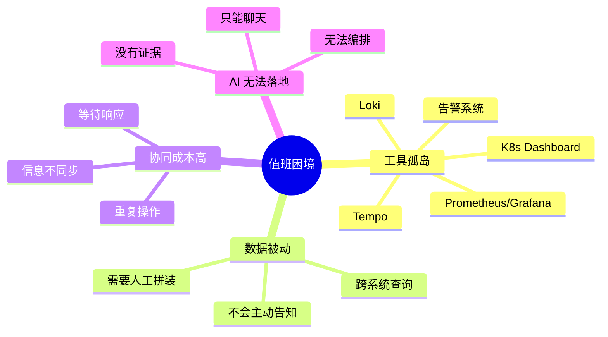
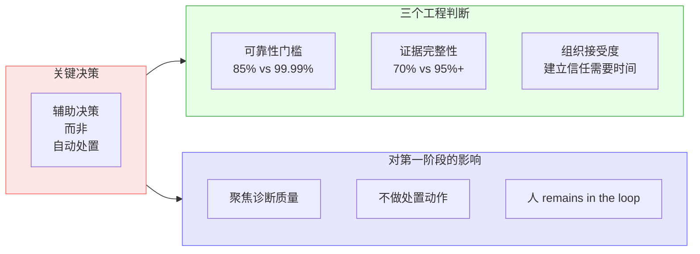
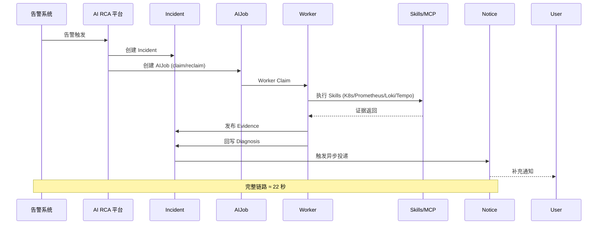
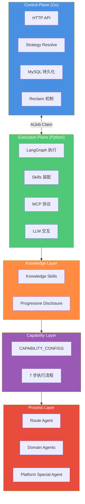
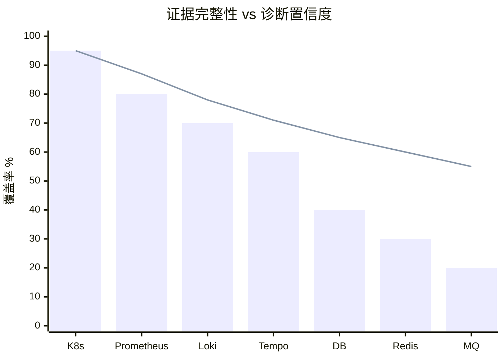
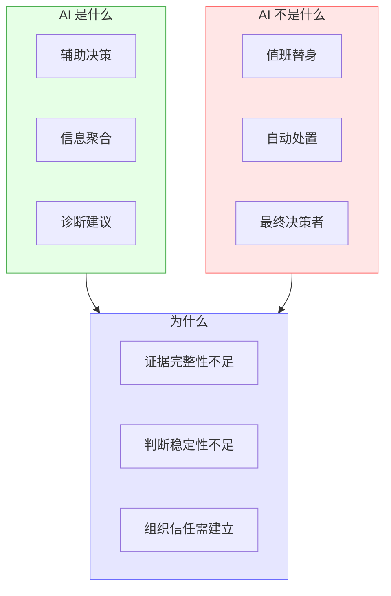
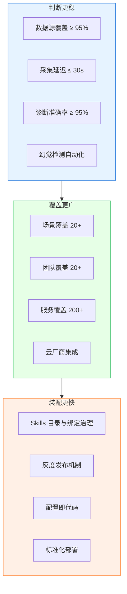
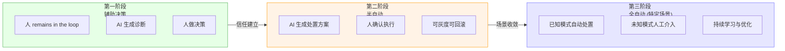
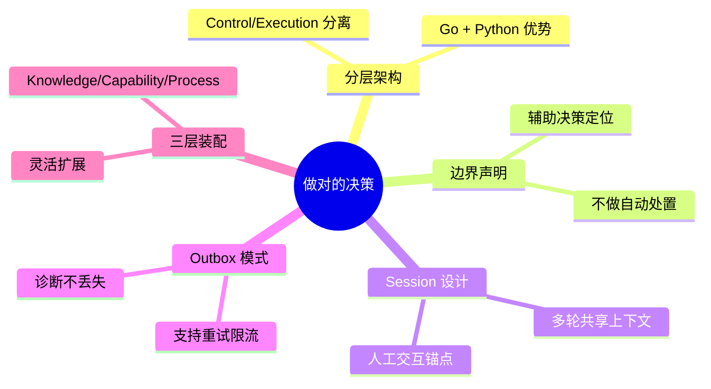
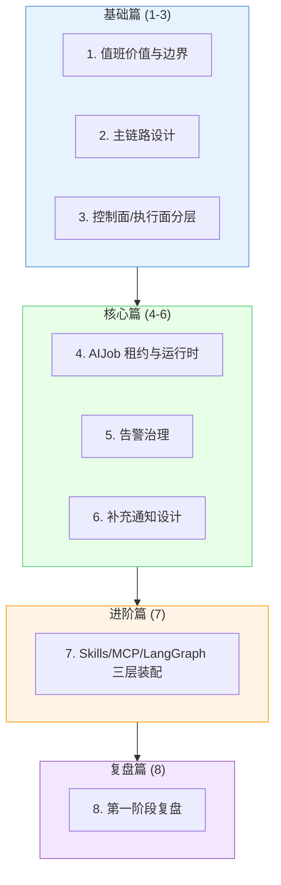

# AI RCA 第一阶段复盘：哪些问题真的被解决了，哪些还只是开始

> **系列导读**：这是 AI RCA 八篇系列的收束之作。前七篇已分别从值班场景价值、主链路设计、控制面与执行面分层、运行时租约、告警治理、补充通知、Skills 装配等角度完成了技术深潜。本篇退后一步，用复盘视角回答三个本质问题：**做之前我们面对什么？第一阶段已做到什么？下一阶段要面对什么？**
>
> **与第一篇的呼应**：第一篇《从告警到补充通知》聚焦"为什么做"和"做什么"，用具体场景展示价值。本篇作为收束，聚焦"做得怎么样"和"接下来往哪走"，用全局视角审视成果与边界。

---

## 一、启程之时：我们面对的是什么？

### 1.1 一个看似无解的困局

2026 年初项目启动时，团队面对的不是"没有工具"，而是**工具太多、数据太散、协同太累**。



**核心洞察**：问题不在于"缺工具"，而在于**缺少一个能把工具、数据、协同串起来的"中枢"**。

### 1.2 关键边界：为什么选择"辅助决策"而非"自动处置"？

项目启动时有一个关键决策，直接塑造了第一阶段的形态：



这个决策不是"保守"，而是**对生产环境的敬畏**——辅助决策的容错空间大，自动处置的容错空间极小。

---

## 二、第一阶段：我们走到了哪里？

### 2.1 最小闭环：从 0 到 1 的突破

**核心里程碑**：从告警到 Incident、AIJob、Evidence/Diagnosis 回写到 Notice 异步交付的最小闭环已经跑通。



**实际收益**（对比第一篇的详细时间线，此处只给结果）：

| 环节 | 传统流程 | AI 辅助 | 改进 |
|------|----------|---------|------|
| 上下文切换 | 75 秒 | 0 秒 | ✅ 100% 消除 |
| 数据查询 | 100 秒 | 22 秒 | ✅ 78% 减少 |
| 沟通协调 | 40 秒 | 10 秒 | ✅ 75% 减少 |
| **总计** | **17 分钟** | **2 分钟** | ✅ **88% 减少** |

### 2.2 架构成果：分层与装配

第一阶段不仅跑通了闭环，更重要的是**建立了可持续演进的架构**。



**关键收益**：
- 控制面专注高并发 HTTP 处理
- 执行面专注 LLM 应用执行
- 技术栈各自发挥优势（Go + Python）
- 三层装配支持灵活扩展

### 2.3 阶段性价值对照图

```mermaid
graph LR
    subgraph Before["做之前<br/>(2026 Q1 之前)"]
        B1["告警孤立"]
        B2["数据被动"]
        B3["AI 无法落地"]
        B4["人工拼装"]
        B1 --> B2 --> B3 --> B4
    end
    
    subgraph Phase1["第一阶段<br/>(2026 Q1-Q2)"]
        P1["最小闭环跑通"]
        P2["分层架构落地"]
        P3["异步投递建立"]
        P4["三层装配完成"]
        P1 --> P2 --> P3 --> P4
    end
    
    subgraph Gap["仍待解决"]
        G1["证据完整性"]
        G2["判断稳定性"]
        G3["场景覆盖"]
        G1 --> G2 --> G3
    end
    
    Before -.->|"17min→2min"| Phase1
    Phase1 -.->"但..."| Gap
    
    style Before fill:#ffe6e6,stroke:#ff6b6b
    style Phase1 fill:#e6ffe6,stroke:#4caf50
    style Gap fill:#fff3e6,stroke:#ff9800
```

---

## 三、未竟之路：哪些还只是开始？

### 3.1 核心难点：证据不完整时的判断稳定性

这是第一阶段**没有完全解决**、但必须直面的问题。



**问题分解**：

| 问题 | 表现 | 影响 |
|------|------|------|
| 数据源覆盖不足 | DB/Redis/MQ 监控未接入 | 40% 场景证据不全 |
| 采集延迟 | Loki 延迟 120s、Prometheus 间隔 60s | 关键证据可能过期 |
| 采样率问题 | Tempo 采样 10% | 90% 追踪数据丢失 |
| LLM 幻觉 | 编造证据、过度推断 | 诊断可信度下降 |

### 3.2 边界再申：AI 不是值班替身

第一阶段结束时，这个边界**依然成立**：



### 3.3 第一阶段能力成熟度评估

```mermaid
radar
    title "第一阶段能力成熟度（1-5 分）"
    axis data_sources["数据源覆盖"], stability["判断稳定性"], coverage["场景覆盖"], assembly["装配效率"], observability["可观测性"]
    
    current["当前状态"]{3.5, 3, 2.5, 3, 2}
    target["第二阶段目标"]{4.5, 4.5, 4, 4.5, 4}
    
    max 5
    min 0
```

---

## 四、下一阶段：往哪里去？

### 4.1 三大方向

第二阶段的重点**不是重新定义平台**，而是在第一阶段的基础上**扎扎实实做深做广**：



### 4.2 第二阶段能力目标

第二阶段更适合用能力目标来描述，而不是绑定到容易过时的具体日期：

- **判断更稳**：补齐数据库、Redis、MQ 等关键数据源接入，降低采集延迟，并完善幻觉检测与质量门控
- **覆盖更广**：扩展云厂商监控、业务指标和更多场景模板，提升跨团队、跨服务的覆盖能力
- **装配更快**：完善 Skills 目录与绑定治理、灰度发布机制和配置即代码能力，缩短策略迭代周期

### 4.3 从"辅助决策"到"半自动处置"的演进路径



**关键前提**：
- 证据完整性 ≥ 95%
- 诊断准确率 ≥ 95%
- 故障演练覆盖 ≥ 90%
- 组织接受度 ≥ 80%

---

## 五、复盘与反思

### 5.1 做对的决策



### 5.2 可以做得更好的地方

| 领域 | 当前状态 | 改进方向 |
|------|----------|----------|
| 文档与示例 | 分散在各处 | 统一文档中心 |
| 可观测性 | 基础监控 | Tracing/Logging/Metrics 完整体系 |
| 开发者体验 | 手动配置 | CLI 工具一键创建 |
| 测试覆盖 | 核心场景 | 故障演练体系 |

### 5.3 给后来者的建议

> - 从价值出发，不是从技术出发
> - 明确边界，不做过度承诺
> - 小步快跑，快速迭代
> - 建立信任，不是取代信任

---

## 六、总结：八篇系列全景

### 6.1 八篇关系图



### 6.2 第一阶段核心成果与边界

**成果**：
- ✅ 最小闭环已跑通
- ✅ 分层架构落地
- ✅ 异步投递建立
- ✅ 三层装配完成
- ✅ 响应时间 17 分钟 → 2 分钟

**边界**：
- ⚠️ AI 是辅助决策，不是值班替身
- ⚠️ 第一阶段不做自动处置
- ⚠️ 证据不完整时判断稳定性不足

### 6.3 第二阶段核心方向

- 🎯 **判断更稳**：数据源、采集质量、诊断准确率
- 🎯 **覆盖更广**：场景、团队、服务
- 🎯 **装配更快**：Skills 目录与绑定治理、灰度发布、配置即代码

---

## 附录：快速索引

想要深入了解技术细节的读者，可参考前七篇：

| 主题 | 文章 | 核心内容 |
|------|------|----------|
| 值班价值 | 第 1 篇 | 为什么做、做什么 |
| 主链路 | 第 2 篇 | 告警→Incident→AIJob→Evidence→Diagnosis→Notice |
| 分层架构 | 第 3 篇 | Control-Plane vs Execution-Plane |
| 租约运行时 | 第 4 篇 | AIJob Claim/Reclaim、Worker 调度 |
| 告警治理 | 第 5 篇 | Alert → Incident 收敛与关联 |
| 通知设计 | 第 6 篇 | 可信度、引用回复、可回看 |
| 三层装配 | 第 7 篇 | Knowledge/Capability/Process 深度剖析 |

---

**（全文完）**
